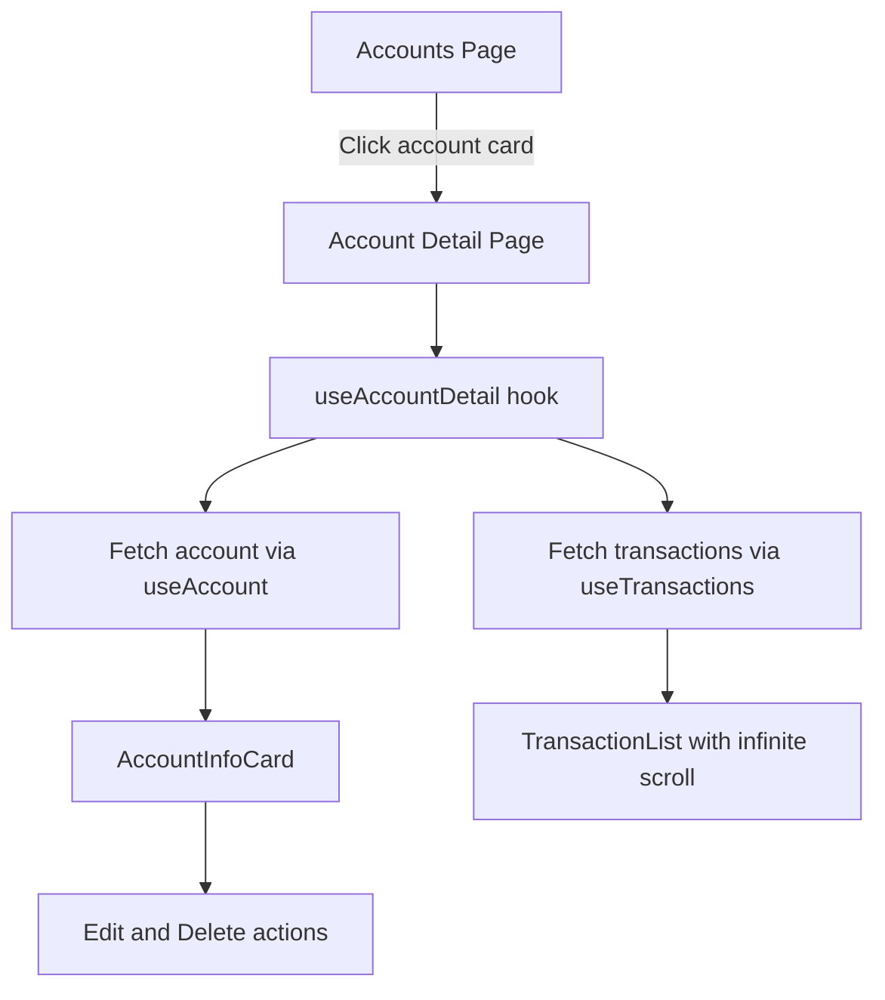
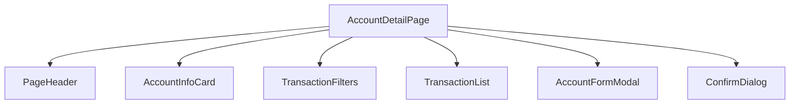
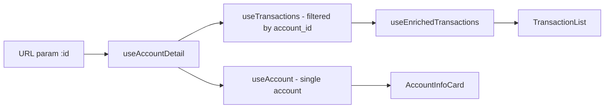

# Account Detail View — Design

**Requirements**: [requirements.md](./requirements.md)
**GitHub Issue**: [#43](https://github.com/abhijeet-reddy/master-of-coin/issues/43)
**Date**: 2026-03-01

## 1. Overview

This feature adds an Account Detail page at `/accounts/:id` that displays account information and its transactions with infinite scroll. The implementation is **frontend-only** — the backend already supports all required endpoints and filtering.

The approach reuses existing components and hooks, with a new custom hook `useAccountDetail` to manage the page's state and data fetching per React rules.

## 2. Architecture

### 2.1 Page Flow



### 2.2 Component Hierarchy



### 2.3 Data Flow



## 3. Database Changes

**None required.** The backend already has:

- `GET /accounts/:id` — returns account details
- `GET /transactions?account_id=<uuid>` — returns transactions filtered by account

## 4. API Changes

**None required.** The existing `TransactionFilter` struct in the backend already supports `account_id: Option<Uuid>` as a query parameter.

### 4.1 Frontend QueryParams Alignment

The frontend `QueryParams` type currently has `account?: string` but the backend expects `account_id`. We need to add `account_id?: string` to `QueryParams` so `getTransactions` correctly passes it as a query parameter to the backend.

## 5. Frontend Changes

### 5.1 New Custom Hook

- **`useAccountDetail`** — Located at `frontend/src/hooks/usecase/useAccountDetail.ts`. Manages all state and data fetching for the Account Detail page. This follows the React rule of extracting logic to hooks and keeping components focused on rendering.

```typescript
// Returns:
interface UseAccountDetailReturn {
  account: Account | undefined;
  enrichedTransactions: EnrichedTransaction[];
  isLoading: boolean;
  error: Error | null;
  fetchNextPage: function;
  hasNextPage: boolean;
  isFetchingNextPage: boolean;
  filters: TransactionFilterValues;
  setFilters: function;
  showFilters: boolean;
  toggleFilters: function;
  editModal: DisclosureReturn;
  deleteDialog: DeleteDialogState;
}
```

### 5.2 New Components

- **`AccountInfoCard`** — Located at `frontend/src/components/accounts/AccountInfoCard.tsx`. Displays account details in a card format with edit/delete actions.

```typescript
interface AccountInfoCardProps {
  account: Account;
  onEdit: function;
  onDelete: function;
}
```

### 5.3 New Pages

- **`AccountDetailPage`** — Located at `frontend/src/pages/AccountDetail.tsx`. Thin rendering component that uses `useAccountDetail` hook. Follows the React rule of max 1-2 useState — all state lives in the hook.

### 5.4 Modified Files

| File                                               | Change                                         |
| -------------------------------------------------- | ---------------------------------------------- |
| `frontend/src/App.tsx`                             | Add route `accounts/:id` for AccountDetailPage |
| `frontend/src/components/accounts/AccountCard.tsx` | Add `onClick` prop, make card clickable        |
| `frontend/src/components/accounts/AccountList.tsx` | Add `onAccountClick` prop, pass to AccountCard |
| `frontend/src/pages/Accounts.tsx`                  | Add navigate handler for account click         |
| `frontend/src/types/api.ts`                        | Add `account_id?: string` to QueryParams       |
| `frontend/src/components/accounts/index.ts`        | Export AccountInfoCard                         |
| `frontend/src/hooks/usecase/index.ts`              | Export useAccountDetail                        |

## 6. Error Handling

- **Account not found**: Show ErrorAlert with breadcrumb back to Accounts
- **Loading state**: Show LoadingSpinner while account data loads
- **Transaction loading**: TransactionList handles its own loading skeleton
- **Delete error**: Show ErrorAlert inline
- **Network errors**: Handled by React Query error state

## 7. Testing Strategy

- **Manual browser testing**: Navigate from Accounts page to detail, verify account info displays, transactions load with infinite scroll, filters work, edit/delete actions function
- **Frontend testing checklist**: Per `.agents/testing/testing-front-end.md`
- No backend changes needed, so no backend tests required
