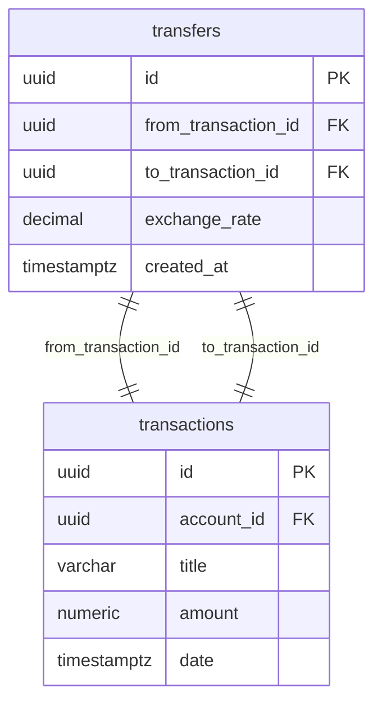
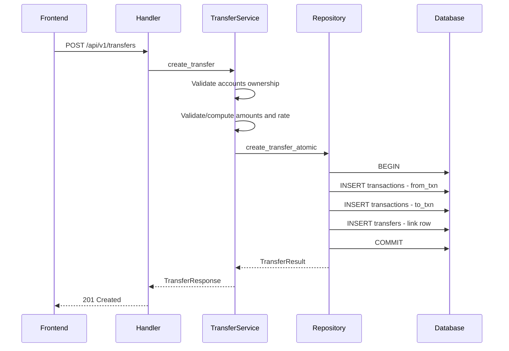

# Account-to-Account Transfers — Design

**Requirements**: [requirements.md](./requirements.md)
**Date**: 2026-02-23

## 1. Overview

Account-to-account transfers are implemented as a pair of linked transactions - a debit on the source account and a credit on the destination account - created atomically via a dedicated `POST /api/v1/transfers` endpoint. A new `transfers` table links the two transaction records together, storing the exchange rate for cross-currency transfers. The frontend adds a "Transfer" button/option on the Transactions page that opens a dedicated transfer form modal.

## 2. Architecture

### 2.1 Transfer as Linked Transactions

A transfer creates exactly two rows in the existing `transactions` table:

- **From-transaction**: negative amount on the source account (outflow)
- **To-transaction**: positive amount on the destination account (inflow)

These are linked by a row in a new `transfers` table that references both transaction IDs and stores the exchange rate.



### 2.2 Data Flow



## 3. Database Changes

### 3.1 New Table: `transfers`

```sql
CREATE TABLE transfers (
    id UUID PRIMARY KEY DEFAULT gen_random_uuid(),
    from_transaction_id UUID NOT NULL REFERENCES transactions(id) ON DELETE CASCADE,
    to_transaction_id UUID NOT NULL REFERENCES transactions(id) ON DELETE CASCADE,
    exchange_rate NUMERIC NOT NULL DEFAULT 1.0,
    created_at TIMESTAMPTZ NOT NULL DEFAULT NOW(),
    CONSTRAINT transfers_from_to_unique UNIQUE (from_transaction_id, to_transaction_id)
);

CREATE INDEX idx_transfers_from_transaction ON transfers(from_transaction_id);
CREATE INDEX idx_transfers_to_transaction ON transfers(to_transaction_id);
```

**Key design decisions:**

- `ON DELETE CASCADE` on both FKs: when either transaction is deleted, the transfer link row is automatically removed by the database.
- `exchange_rate` stores the rate as `from_currency / to_currency` (e.g., 1 EUR = 1.08 USD means rate = 1.08). For same-currency transfers, rate = 1.0.
- No `user_id` column needed - ownership is derived from the linked transactions.

### 3.2 Migration

Migration name: `2026-02-23-000000_create_transfers_table`

**up.sql**: Creates the `transfers` table with indexes.
**down.sql**: Drops the `transfers` table.

### 3.3 Models

```rust
// backend/src/models/transfer.rs

// Database model - maps directly to the transfers table row
#[derive(Debug, Clone, Serialize, Deserialize, Queryable, Selectable, Identifiable)]
#[diesel(table_name = transfers)]
pub struct Transfer {
    pub id: Uuid,
    pub from_transaction_id: Uuid,
    pub to_transaction_id: Uuid,
    pub exchange_rate: BigDecimal,
    pub created_at: DateTime<Utc>,
}

// Insertable struct for Diesel - used by the repository layer to insert
// a new row into the transfers table. Omits auto-generated fields (id, created_at).
// This follows the same pattern as NewTransaction, NewAccount, etc.
#[derive(Debug, Insertable)]
#[diesel(table_name = transfers)]
pub struct NewTransfer {
    pub from_transaction_id: Uuid,
    pub to_transaction_id: Uuid,
    pub exchange_rate: BigDecimal,
}

// Request DTO - what the API consumer sends
#[derive(Debug, Deserialize, Validate)]
pub struct CreateTransferRequest {
    pub from_account_id: Uuid,
    pub to_account_id: Uuid,
    #[validate(range(min = 0.01))]
    pub from_amount: f64,
    pub to_amount: Option<f64>,        // Required for cross-currency, optional for same-currency
    pub exchange_rate: Option<f64>,     // Alternative to to_amount for cross-currency
    #[validate(length(min = 1, max = 255))]
    pub title: Option<String>,         // Defaults to "Transfer to {account_name}"
    pub date: DateTime<Utc>,
    #[validate(length(max = 1000))]
    pub notes: Option<String>,
    pub category_id: Option<Uuid>,
}

// Response DTO - what the API returns
#[derive(Debug, Serialize)]
pub struct TransferResponse {
    pub id: Uuid,
    pub from_transaction: TransactionResponse,
    pub to_transaction: TransactionResponse,
    pub exchange_rate: String,
    pub created_at: DateTime<Utc>,
}
```

## 4. API Changes

### 4.1 New Endpoints

| Method | Path              | Description           | Auth Scope         |
| ------ | ----------------- | --------------------- | ------------------ |
| POST   | /api/v1/transfers | Create a new transfer | Transactions:Write |

> **No dedicated DELETE endpoint needed.** The existing `DELETE /api/v1/transactions/:id` is enhanced to detect if the transaction is part of a transfer and automatically delete the linked transaction too. The `transfers` row is cleaned up via `ON DELETE CASCADE`.

### 4.2 POST /api/v1/transfers

**Request Body:**

```json
{
  "from_account_id": "uuid",
  "to_account_id": "uuid",
  "from_amount": 100.0,
  "to_amount": 108.0,
  "exchange_rate": null,
  "title": "Transfer to Savings",
  "date": "2026-02-23T12:00:00Z",
  "notes": "Monthly savings",
  "category_id": null
}
```

**Amount/Rate Resolution Logic:**

1. If `from_amount` and `to_amount` are both provided: `exchange_rate = to_amount / from_amount`
2. If `from_amount` and `exchange_rate` are provided: `to_amount = from_amount * exchange_rate`
3. If same currency (detected from accounts): `to_amount = from_amount`, `exchange_rate = 1.0`
4. If cross-currency and neither `to_amount` nor `exchange_rate` provided: return 422 error

**Response (201):**

```json
{
  "id": "transfer-uuid",
  "from_transaction": {
    /* TransactionResponse */
  },
  "to_transaction": {
    /* TransactionResponse */
  },
  "exchange_rate": "1.08",
  "created_at": "2026-02-23T12:00:00Z"
}
```

### 4.3 Modified: Transaction Delete (Cascading Transfer Delete)

The existing `DELETE /api/v1/transactions/:id` handler is enhanced:

1. Before deleting, check if the transaction is part of a transfer (query `transfers` table for `from_transaction_id` or `to_transaction_id` matching the transaction ID)
2. If it is part of a transfer, identify the linked transaction ID
3. Delete both transactions (the `transfers` row is auto-deleted via `ON DELETE CASCADE`)

This means users can delete a transfer from either side using the existing transaction delete flow.

### 4.4 Modified: Transaction Listing

When listing transactions, the response will include optional `transfer_info` metadata for transactions that are part of a transfer:

```json
{
  "id": "transaction-uuid",
  "title": "Transfer to Savings",
  "amount": "-100.00",
  "transfer_info": {
    "transfer_id": "transfer-uuid",
    "linked_account_id": "destination-account-uuid",
    "linked_account_name": "Savings"
  }
}
```

The frontend determines direction from the transaction amount sign (negative = outgoing, positive = incoming). No `direction` field is needed.

This is populated via a LEFT JOIN on the `transfers` table when fetching transactions.

## 5. Frontend Changes

### 5.1 New Components

- **`TransferFormModal`** - Modal dialog for creating transfers. Contains:
  - From Account selector (dropdown)
  - To Account selector (dropdown, excludes selected from-account)
  - Amount field (from_amount)
  - Conditional cross-currency section:
    - To Amount field (editable)
    - Exchange Rate field (editable, auto-computed)
    - Bidirectional: changing to_amount recomputes rate, changing rate recomputes to_amount
  - Date/time picker
  - Optional title (defaults to "Transfer to {account}")
  - Optional notes
  - Optional category

### 5.2 New Types

```typescript
// types/models.ts additions

export interface TransferInfo {
  transfer_id: string;
  linked_account_id: string;
  linked_account_name: string;
}

export interface CreateTransferRequest {
  from_account_id: string;
  to_account_id: string;
  from_amount: number;
  to_amount?: number;
  exchange_rate?: number;
  title?: string;
  date: string;
  notes?: string;
  category_id?: string;
}

export interface TransferResponse {
  id: string;
  from_transaction: Transaction;
  to_transaction: Transaction;
  exchange_rate: string;
  created_at: string;
}
```

### 5.3 New Services

- **`transferService.ts`** - API client functions:
  - `createTransfer(data: CreateTransferRequest): Promise<TransferResponse>`

### 5.4 Modified Components

- **`TransactionRow`** - Add a "Transfer" badge (with arrow icon) when `transfer_info` is present. Show linked account name.
- **`Transaction` type** - Add optional `transfer_info?: TransferInfo` field.
- **`Transactions` page** - Add a "Transfer" button next to the existing "Add Transaction" button that opens `TransferFormModal`.

### 5.5 UI Mockup

```
┌─────────────────────────────────────────────┐
│  Transfer Between Accounts                   │
├─────────────────────────────────────────────┤
│                                             │
│  From Account:  [Checking (EUR)    ▼]       │
│  To Account:    [Savings (USD)     ▼]       │
│                                             │
│  ── Cross-currency transfer ──────────────  │
│  From Amount:   [100.00        ] EUR        │
│  To Amount:     [108.00        ] USD        │
│  Exchange Rate: [1.0800        ]            │
│  ─────────────────────────────────────────  │
│                                             │
│  Date:          [2026-02-23    ]            │
│  Time:          [12:00         ]            │
│  Title:         [Transfer to Savings    ]   │
│  Notes:         [Monthly savings        ]   │
│  Category:      [None              ▼]       │
│                                             │
│           [Cancel]    [Transfer]            │
└─────────────────────────────────────────────┘
```

For same-currency transfers, the cross-currency section is hidden and only a single "Amount" field is shown.

## 6. Error Handling

| Error Case                                        | HTTP Status | Message                                                            |
| ------------------------------------------------- | ----------- | ------------------------------------------------------------------ |
| Same account for from and to                      | 422         | Source and destination accounts must be different                  |
| Account not found                                 | 404         | Account not found                                                  |
| Account not owned by user                         | 401         | Account does not belong to user                                    |
| Cross-currency without to_amount or exchange_rate | 422         | Cross-currency transfers require either to_amount or exchange_rate |
| Negative or zero amount                           | 422         | Transfer amount must be positive                                   |
| Invalid exchange rate                             | 422         | Exchange rate must be positive                                     |

## 7. Testing Strategy

### Backend Integration Tests

- **Happy path**: Create same-currency transfer, verify both transactions created with correct amounts
- **Cross-currency with to_amount**: Verify exchange rate is computed correctly
- **Cross-currency with exchange_rate**: Verify to_amount is computed correctly
- **Delete via existing transaction API**: Delete one side of a transfer, verify both transactions and transfer record are deleted
- **Error cases**: Same account, wrong ownership, missing cross-currency fields, zero amounts
- **Transaction listing**: Verify transfer_info is populated correctly for transfer transactions

### Frontend Testing

- Transfer form renders correctly for same-currency accounts
- Cross-currency section appears when accounts have different currencies
- Bidirectional rate/amount computation works
- Transfer badge appears on transfer transactions in the list
- Form validation prevents invalid submissions
