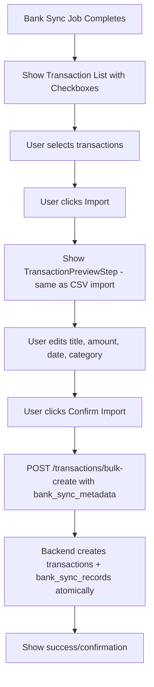
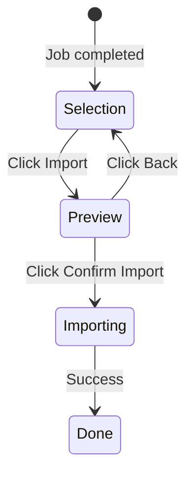

# Bank Sync: Edit Before Import — Design

## Overview

Add a preview/edit step to the bank sync import flow, reusing the same inline-editing table pattern from the CSV statement import. The approach extends the existing `bulk-create` endpoint to optionally create bank sync records, allowing the bank sync import to use the same API path as CSV import.

## Architecture

### Flow Diagram



### Why Extend `bulk-create` Instead of the Bank Sync Import Endpoint?

The CSV import already uses `POST /transactions/bulk-create` which accepts fully user-edited transaction data. Rather than duplicating this logic in the bank sync import endpoint, we extend `bulk-create` to optionally accept bank sync metadata. This way:

1. **Same API for both flows** — CSV import and bank sync import both use `bulk-create`
2. **Same frontend component** — `TransactionPreviewStep` outputs the exact format `bulk-create` expects
3. **Bank sync records are created atomically** — alongside the transactions in the same service call
4. **Minimal backend changes** — just add an optional field to the existing request model

## Backend Changes

### Modified Model: `BulkCreateRequest`

**File:** `backend/src/models/bulk_transaction.rs`

```rust
/// Request for bulk create transactions
#[derive(Debug, Deserialize)]
pub struct BulkCreateRequest {
    pub account_id: Uuid,
    pub transactions: Vec<CreateTransactionRequest>,
    /// Optional bank sync metadata for creating bank_sync_records
    pub bank_sync_metadata: Option<BankSyncMetadata>,
}

/// Bank sync metadata to link imported transactions to external IDs
#[derive(Debug, Deserialize)]
pub struct BankSyncMetadata {
    pub bank_provider_id: Uuid,
    /// External transaction IDs, parallel to the transactions array
    /// (external_transaction_ids[i] corresponds to transactions[i])
    pub external_transaction_ids: Vec<String>,
}
```

### Modified Service: `transaction_service::bulk_create_transactions`

**File:** `backend/src/services/transaction_service.rs`

Update the service function to accept optional `BankSyncMetadata` and handle sync record creation:

1. Accept `bank_sync_metadata: Option<BankSyncMetadata>` parameter
2. After creating transactions, if metadata is present:
   - Validate that `external_transaction_ids.len() == transactions.len()`
   - Build `Vec<NewBankSyncRecord>` pairing each created transaction ID with its external ID
   - Call `repositories::bank_sync::create_records` to insert the sync records
3. Return the created transactions as before

This keeps business logic in the service layer per Rust rules (handlers stay thin).

### Modified Handler: `bulk_create`

**File:** `backend/src/handlers/transactions.rs`

The handler simply passes `request.bank_sync_metadata` through to the service — no business logic in the handler.

### Additional Backend Change: Add `account_id` to `BankSyncReport`

**File:** `backend/src/models/bank_sync.rs`

The `BankSyncReport` currently lacks `account_id`. The frontend needs it to call `bulk-create`. Add `pub account_id: String` to the struct. The value is available from `provider_record.account_id` when building the report in `bank_sync_service.rs`.

Also update the frontend type `BankSyncReport` in `frontend/src/types/bankProvider.ts` to include `account_id: string`.

### Backward Compatibility

- `bank_sync_metadata` is `Option<...>` — existing CSV import calls without it continue to work unchanged
- The old `POST /bank-providers/sync/:job_id/import` endpoint will be removed as part of cleanup (see API Cleanup section)

## Frontend Changes

### Component Flow

Both `BankSyncReportView` and `BankSyncReview` gain a two-step flow:



### Converter Utility

**File:** `frontend/src/utils/bankTransactionConverter.ts` (new)

Converts `FetchedBankTransaction` to `ParsedTransaction` format:

- `external_id` maps to `temp_id`
- Title built from description/merchant (same logic as backend currently does)
- Amount converted to signed string based on `transaction_type`
- `is_valid: true`, `is_potential_duplicate: txn.already_imported`

### Service Layer

**File:** `frontend/src/services/statementImportService.ts`

Update `bulkCreateTransactions` to accept optional bank sync metadata:

```typescript
export interface BulkCreateRequest {
  account_id: string;
  transactions: Array<{...}>;
  bank_sync_metadata?: {
    bank_provider_id: string;
    external_transaction_ids: string[];
  };
}
```

### UI Components

**Files:** `BankSyncReportView.tsx`, `BankSyncReview.tsx`

Per React rules (max 1-2 useState, extract logic to hooks), the two-step flow state is managed by a custom hook. Components stay thin and focused on rendering:

1. Components use `useBankImportPreview` hook for all state management
2. When step is `'select'`, render the existing selection UI
3. When step is `'preview'`, render `TransactionPreviewStep` (reused from CSV import)
4. Fetch categories via `useCategories()` hook directly in the component (React Query caching)

### New Hook: `useBankImportPreview`

**File:** `frontend/src/hooks/usecase/useBankImportPreview.ts` (new)

Manages the two-step import flow. Keeps components under the 1-2 useState limit:

```typescript
interface UseBankImportPreviewReturn {
  step: 'select' | 'preview';
  previewTransactions: ParsedTransaction[];
  accountId: string;
  bankSyncMetadata: BankSyncMetadata | null;
  showPreview: (selectedTxns: FetchedBankTransaction[], bankProviderId: string, accountId: string) => void;
  goBackToSelect: () => void;
  handleConfirmImport: (editedTxns: Array<{...}>) => Promise<void>;
  isImporting: boolean;
}
```

### Hook Updates: `useBankSync`

**File:** `frontend/src/hooks/usecase/useBankSync.ts`

Remove the old `handleImport` that called the bank sync import endpoint. The import is now handled by `useBankImportPreview`.

## Files to Modify

### Backend

| File                                          | Change                                                                    |
| --------------------------------------------- | ------------------------------------------------------------------------- |
| `backend/src/models/bulk_transaction.rs`      | Add `BankSyncMetadata` struct, add optional field to `BulkCreateRequest`  |
| `backend/src/models/bank_sync.rs`             | Add `account_id: String` field to `BankSyncReport`                        |
| `backend/src/services/bank_sync_service.rs`   | Include `account_id` when building the sync report                        |
| `backend/src/services/transaction_service.rs` | Accept optional `BankSyncMetadata`, create sync records after bulk insert |
| `backend/src/handlers/transactions.rs`        | Pass `bank_sync_metadata` through to service                              |

### Frontend

| File                                                  | Change                                                   |
| ----------------------------------------------------- | -------------------------------------------------------- |
| `frontend/src/types/bankProvider.ts`                  | Add `account_id: string` to `BankSyncReport`             |
| `frontend/src/types/statementImport.ts`               | Add optional `bank_sync_metadata` to `BulkCreateRequest` |
| `frontend/src/services/statementImportService.ts`     | Pass through bank_sync_metadata in request               |
| `frontend/src/components/bank/BankSyncReportView.tsx` | Use `useBankImportPreview` hook, render preview step     |
| `frontend/src/components/bank/BankSyncReview.tsx`     | Use `useBankImportPreview` hook, render preview step     |
| `frontend/src/hooks/usecase/useBankSync.ts`           | Remove old import handler                                |

### New Files

| File                                                 | Purpose                                                           |
| ---------------------------------------------------- | ----------------------------------------------------------------- |
| `frontend/src/utils/bankTransactionConverter.ts`     | Pure utility: convert FetchedBankTransaction to ParsedTransaction |
| `frontend/src/hooks/usecase/useBankImportPreview.ts` | Custom hook: manages two-step import flow state                   |

## API Cleanup

Once bank sync import uses `bulk-create`, the following become unnecessary and should be removed:

### Backend — Remove

| Item                                             | File                                        | Reason                                                                       |
| ------------------------------------------------ | ------------------------------------------- | ---------------------------------------------------------------------------- |
| `POST /bank-providers/sync/:job_id/import` route | `backend/src/api/routes.rs`                 | Replaced by `bulk-create` with `bank_sync_metadata`                          |
| `import_transactions` handler                    | `backend/src/handlers/bank_providers.rs`    | No longer called                                                             |
| `import_transactions` service fn                 | `backend/src/services/bank_sync_service.rs` | No longer called                                                             |
| `BankSyncImportRequest` model                    | `backend/src/models/bank_provider.rs`       | No longer needed                                                             |
| `BankImportResult` model                         | `backend/src/models/bank_sync.rs`           | No longer needed                                                             |
| `bulk_create_transactions` handler               | `backend/src/handlers/import.rs`            | Dead code — duplicate of `handlers::transactions::bulk_create`, never routed |

### Frontend — Remove

| Item                                     | File                                           | Reason           |
| ---------------------------------------- | ---------------------------------------------- | ---------------- |
| `importTransactions` function            | `frontend/src/services/bankProviderService.ts` | No longer called |
| `useImportBankTransactions` hook         | `frontend/src/hooks/api/useBankProviders.ts`   | No longer called |
| `BankSyncImportRequest` type             | `frontend/src/types/bankProvider.ts`           | No longer needed |
| `BankImportResult` type                  | `frontend/src/types/bankProvider.ts`           | No longer needed |
| Re-export of `useImportBankTransactions` | `frontend/src/hooks/api/index.ts`              | No longer needed |

### Keep

| Item                                         | Reason                                                       |
| -------------------------------------------- | ------------------------------------------------------------ |
| `repositories::bank_sync::create_records`    | Still needed — called from `transaction_service` bulk create |
| `repositories::bank_sync::find_imported_ids` | Still needed — used during sync to detect duplicates         |

## Testing Considerations

- Backend: Test bulk-create without bank_sync_metadata (backward compat)
- Backend: Test bulk-create with bank_sync_metadata (creates sync records)
- Backend: Test mismatched array lengths (validation error)
- Frontend: Verify preview step shows correct data
- Frontend: Verify edits flow through to bulk-create
- Frontend: Verify bank_sync_metadata is included in request
- Frontend: Verify back button works
- Verify old bank sync import endpoint is fully removed and no references remain
