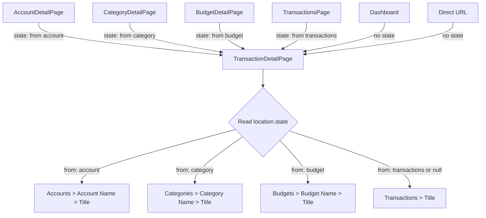

# Breadcrumb Navigation Source — Design

**Requirements**: [requirements.md](./requirements.md)
**GitHub Issue**: [#52](https://github.com/abhijeet-reddy/master-of-coin/issues/52)
**Date**: 2026-03-08

## 1. Overview

Use React Router's `location.state` to pass navigation source context when navigating to a transaction detail page. The `TransactionDetailPage` reads this state to render context-aware breadcrumbs and navigate back to the correct source page on delete. No backend changes are needed.

## 2. Architecture

### 2.1 Navigation State Pattern

When navigating to `/transactions/:id`, the source page passes a state object describing where the user came from:

```typescript
// Type definition for navigation state
interface TransactionNavigationState {
  from: {
    type: "account" | "category" | "budget" | "transactions";
    id?: string; // ID of the source entity (account, category, budget)
    name?: string; // Display name for the breadcrumb
  };
}
```

The `TransactionDetailPage` reads `location.state` and constructs breadcrumbs accordingly. If no state is present (direct URL access, bookmark, Dashboard), it falls back to the default `Transactions > [Title]` breadcrumbs.

### 2.2 Data Flow



## 3. Database Changes

None — this is a frontend-only change.

## 4. API Changes

None — this is a frontend-only change.

## 5. Frontend Changes

### 5.1 New Types

Add a `TransactionNavigationState` type to the types directory:

```typescript
// In frontend/src/types/navigation.ts (new file)
export interface TransactionNavigationState {
  from: {
    type: "account" | "category" | "budget" | "transactions";
    id?: string;
    name?: string;
  };
}
```

### 5.2 Modified Components

#### 5.2.1 `TransactionRow` — [`frontend/src/components/transactions/TransactionRow.tsx`](frontend/src/components/transactions/TransactionRow.tsx)

**Current**: Navigates to `/transactions/${transaction.id}` with no state.

**Change**: Accept an optional `navigationState` prop and pass it as `state` to `navigate()`.

```typescript
interface TransactionRowProps {
  transaction: EnrichedTransaction;
  onClick?: () => void;
  onEdit?: (transaction: EnrichedTransaction) => void;
  onDelete?: (transaction: EnrichedTransaction) => void;
  navigationState?: TransactionNavigationState; // NEW
}

// In handleClick and handleKeyDown:
void navigate(`/transactions/${transaction.id}`, { state: navigationState });
```

#### 5.2.2 `TransactionList` — [`frontend/src/components/transactions/TransactionList.tsx`](frontend/src/components/transactions/TransactionList.tsx)

**Change**: Accept an optional `navigationState` prop and pass it through to each `TransactionRow`.

```typescript
interface TransactionListProps {
  // ... existing props
  navigationState?: TransactionNavigationState; // NEW
}
```

#### 5.2.3 `AccountDetailPage` — [`frontend/src/pages/AccountDetail.tsx`](frontend/src/pages/AccountDetail.tsx)

**Change**: Pass `navigationState` to `TransactionList` with account context:

```typescript
<TransactionList
  // ... existing props
  navigationState={{
    from: { type: 'account', id: account.id, name: account.name }
  }}
/>
```

#### 5.2.4 `CategoryDetailPage` — [`frontend/src/pages/CategoryDetail.tsx`](frontend/src/pages/CategoryDetail.tsx)

**Change**: Pass `navigationState` to `TransactionList` with category context:

```typescript
<TransactionList
  // ... existing props
  navigationState={{
    from: { type: 'category', id: category.id, name: category.name }
  }}
/>
```

#### 5.2.5 `BudgetDetailPage` — [`frontend/src/pages/BudgetDetail.tsx`](frontend/src/pages/BudgetDetail.tsx)

**Change**: Pass `navigationState` to `TransactionList` with budget context:

```typescript
<TransactionList
  // ... existing props
  navigationState={{
    from: { type: 'budget', id: budget.id, name: budget.name }
  }}
/>
```

#### 5.2.6 `TransactionDetailPage` — [`frontend/src/pages/TransactionDetail.tsx`](frontend/src/pages/TransactionDetail.tsx)

**Change**: Read `location.state` and build breadcrumbs dynamically. Also update delete navigation to go back to the source page.

```typescript
import { useParams, useNavigate, useLocation } from "react-router-dom";
import type { TransactionNavigationState } from "@/types";

// Inside component:
const location = useLocation();
const navState = location.state as TransactionNavigationState | null;

// Build breadcrumbs based on navigation source
const buildBreadcrumbs = () => {
  const transactionLabel = transaction?.title || "Details";

  if (navState?.from) {
    switch (navState.from.type) {
      case "account":
        return [
          { label: "Accounts", href: "/accounts" },
          {
            label: navState.from.name || "Account",
            href: `/accounts/${navState.from.id}`,
          },
          { label: transactionLabel },
        ];
      case "category":
        return [
          { label: "Categories", href: "/categories" },
          {
            label: navState.from.name || "Category",
            href: `/categories/${navState.from.id}`,
          },
          { label: transactionLabel },
        ];
      case "budget":
        return [
          { label: "Budgets", href: "/budgets" },
          {
            label: navState.from.name || "Budget",
            href: `/budgets/${navState.from.id}`,
          },
          { label: transactionLabel },
        ];
      default:
        break;
    }
  }

  // Default: Transactions > Title
  return [
    { label: "Transactions", href: "/transactions" },
    { label: transactionLabel },
  ];
};

// For delete navigation - go back to source:
const getDeleteRedirect = () => {
  if (navState?.from) {
    switch (navState.from.type) {
      case "account":
        return `/accounts/${navState.from.id}`;
      case "category":
        return `/categories/${navState.from.id}`;
      case "budget":
        return `/budgets/${navState.from.id}`;
    }
  }
  return "/transactions";
};
```

#### 5.2.7 `RecentTransactions` — [`frontend/src/components/dashboard/RecentTransactions.tsx`](frontend/src/components/dashboard/RecentTransactions.tsx)

**Change**: No changes needed. Dashboard links use `<Link to={...}>` without state, which means `location.state` will be `null` and the default breadcrumb will be used. This is the desired behavior.

## 6. Error Handling

- If `location.state` is `null` or malformed, fall back to default breadcrumbs `Transactions > [Title]`
- If `navState.from.name` is missing, use a generic label like "Account", "Category", or "Budget"
- Type guard the state to ensure safety

## 7. Testing Strategy

- **Manual testing**: Navigate to transaction detail from each source page and verify breadcrumbs
  - From Accounts > Account Detail > click transaction → verify breadcrumb
  - From Transactions list > click transaction → verify breadcrumb
  - From Categories > Category Detail > click transaction → verify breadcrumb
  - From Budgets > Budget Detail > click transaction → verify breadcrumb
  - From Dashboard > Recent Transactions > click transaction → verify breadcrumb
  - Direct URL access → verify default breadcrumb
- **Delete flow**: Delete a transaction from each source context and verify redirect goes to the correct page
- **E2E tests**: Update existing budget-detail and transaction E2E tests if they assert breadcrumb content
