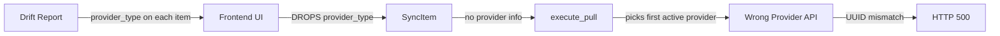
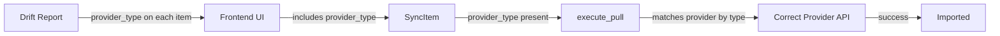

# Bulk Sync Provider Routing Fix — Design

**Requirements**: [requirements.md](./requirements.md)
**Date**: 2026-04-04

## 1. Overview

Thread `provider_type` from the drift report through the sync wizard and bulk sync API so that `execute_pull()` routes each expense to the correct split provider. This is a minimal, surgical fix touching 4 files on the backend and 3 files on the frontend.

## 2. Architecture

### 2.1 Data Flow (Current — Broken)



### 2.2 Data Flow (Fixed)



## 3. Database Changes

None required. The `provider_type` is already stored on drift report items and split provider records.

## 4. API Changes

### 4.1 Modified Request Body: `POST /api/v1/sync`

The `SyncItem` in the request body gains an optional `provider_type` field:

**Before:**

```json
{
  "items": [{ "action": "pull", "external_expense_id": "4383330546" }]
}
```

**After:**

```json
{
  "items": [
    {
      "action": "pull",
      "external_expense_id": "4383330546",
      "provider_type": "splitwise"
    }
  ]
}
```

The field is optional for backward compatibility. If omitted, the existing behavior (first active provider) is used as fallback.

### 4.2 No Response Changes

The response format remains unchanged.

## 5. Backend Changes

### 5.1 `backend/src/models/bulk_sync.rs` — Add `provider_type` to `SyncItem`

Add an optional `provider_type: Option<SplitProviderType>` field to the `SyncItem` struct. Use `#[serde(skip_serializing_if = "Option::is_none")]` for clean serialization.

### 5.2 `backend/src/services/bulk_sync_service.rs` — Thread `provider_type` through

**In `execute_bulk_sync()`** (line 87): Pass `item.provider_type` to `execute_pull()`.

**In `execute_pull()`** (lines 200-304):

- Add `provider_type: Option<SplitProviderType>` parameter
- When looking up the provider (lines 252-262), if `provider_type` is `Some`, filter by both `is_active` AND matching `provider_type`; otherwise fall back to current behavior

The key change in `execute_pull()`:

```rust
// Current (broken):
let provider = providers.into_iter().find(|p| p.is_active)...

// Fixed:
let provider = match provider_type {
    Some(pt) => providers.into_iter().find(|p| p.is_active && p.provider_type == pt),
    None => providers.into_iter().find(|p| p.is_active),
}
.ok_or_else(|| ...)?;
```

## 6. Frontend Changes

### 6.1 `frontend/src/types/sync.ts` — Add `provider_type` to types

Add optional `provider_type` to `SyncItem` and `DriftedSelection`:

```typescript
export interface SyncItem {
  action: SyncAction;
  transaction_id?: string;
  external_expense_id?: string;
  provider_type?: string; // "splitwise" | "splitpro"
}

export interface DriftedSelection {
  action: SyncAction;
  externalExpenseId: string;
  providerType?: string;
}
```

### 6.2 `frontend/src/hooks/usecase/useSyncWizard.ts` — Populate `provider_type`

**For drifted items**: The `DriftedSelection` already stores `externalExpenseId`. Add `providerType` to the selection and include it in `buildSyncItems()`.

**For missing-on-local items**: Change `selectedMissingLocal` from `Set<string>` to `Map<string, string | undefined>` (mapping `external_expense_id` → `provider_type`), or pass the drift report into `buildSyncItems()` to look up `provider_type` from the `MissingOnLocal` items.

The simpler approach: pass the `DriftReport` reference into `buildSyncItems()` and look up `provider_type` from the report's `missing_on_local` and `drifted` arrays when building items.

### 6.3 Components that call `onToggle` for selections

Update the toggle handlers in `DriftedStepView.tsx` and `MissingLocalStepView.tsx` to pass `provider_type` through when selecting items, if using the Map approach. Or no component changes needed if using the report-lookup approach.

## 7. Error Handling

- If `provider_type` is provided but no matching active provider exists, return a clear error: `"No active {provider_type} provider configured for user"`
- If `provider_type` is not provided, fall back to existing behavior (first active provider) — this maintains backward compatibility

## 8. Testing Strategy

- **Manual test**: Configure both Splitwise and SplitPro, run drift detection, select items from both providers, run bulk sync — all should succeed
- **Backend compilation**: `cargo check` passes
- **Frontend compilation**: `npx tsc --noEmit` passes
