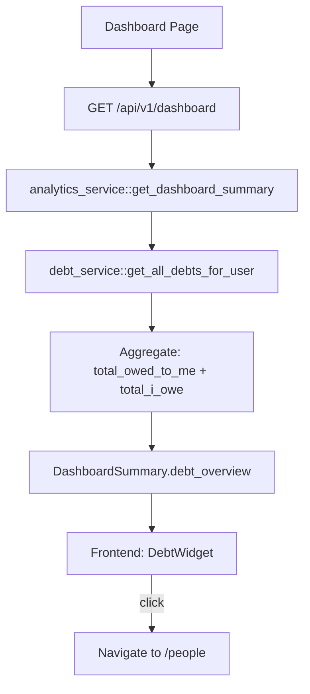

# Dashboard Debt Widget — Design

**Requirements**: [requirements.md](./requirements.md)
**GitHub Issue**: [#38 - Add Debt widget to Dashboard](https://github.com/abhijeet-reddy/master-of-coin/issues/38)
**Date**: 2026-03-15

## 1. Overview

Add aggregate debt totals to the dashboard API response and create a compact `DebtWidget` component. The widget shows two numbers — "You Are Owed" and "You Owe" — and clicking it navigates to the People page for full details. The backend aggregates debts server-side using the existing `debt_service::get_all_debts_for_user()`.

## 2. Architecture



### 2.1 Server-Side Aggregation

The backend calls `debt_service::get_all_debts_for_user()` which returns per-person debts, then aggregates them into two totals:

- **total_owed_to_me**: Sum of all positive `debt_amount` values
- **total_i_owe**: Sum of absolute values of all negative `debt_amount` values

This avoids sending per-person data to the dashboard and keeps the widget simple.

## 3. Database Changes

**None required.** All data comes from existing `transaction_splits` queries.

## 4. API Changes

### 4.1 Modified Endpoints

**`GET /api/v1/dashboard`** — Add `debt_overview` field to the response.

New field added to response:

```json
{
  "debt_overview": {
    "total_owed_to_me": "70.00",
    "total_i_owe": "45.00"
  }
}
```

Both values are always non-negative strings. If no debts exist, both are `"0"`.

## 5. Frontend Changes

### 5.1 New Components

- **`DebtWidget`** in `frontend/src/components/dashboard/DebtWidget.tsx`
  - Compact card with two stat columns: "You Are Owed" (green) and "You Owe" (red)
  - Entire card is clickable, navigates to `/people`
  - Shows cursor pointer and hover effect to indicate clickability
  - Empty state: shows €0.00 for both values

### 5.2 Modified Components

- **[`Dashboard`](frontend/src/pages/Dashboard.tsx)** — Add `DebtWidget` between Net Worth and Budget Progress widgets

### 5.3 Modified Types

- **[`DashboardSummary`](frontend/src/types/models.ts:307)** — Add `debt_overview` field:
  ```typescript
  debt_overview: {
    total_owed_to_me: string;
    total_i_owe: string;
  }
  ```

### 5.4 Component Layout

```
+-------------------------------------------+
|           Net Worth Widget                |
+-------------------------------------------+
|           Debt Widget                     |
|  You Are Owed: €70.00  |  You Owe: €45.00|
|         Click for details ->              |
+-------------------------------------------+
|         Budget Progress                   |
+-------------------+-----------------------+
| Category          | Recent                |
| Breakdown         | Transactions          |
+-------------------+-----------------------+
```

### 5.5 Dashboard Index Export

- **[`index.ts`](frontend/src/components/dashboard/index.ts)** — Add `DebtWidget` export

## 6. Error Handling

- Backend: If `get_all_debts_for_user()` fails, return `debt_overview` with zeros rather than failing the entire dashboard. The debt query runs in parallel with other dashboard queries via `tokio::join!`.
- Frontend: If `debt_overview` is missing/undefined, show €0.00 defaults.

## 7. Testing Strategy

- **Backend**: Update existing dashboard integration test to verify `debt_overview` field is present and correct.
- **Frontend**: Visual verification via browser testing per frontend testing guidelines.
