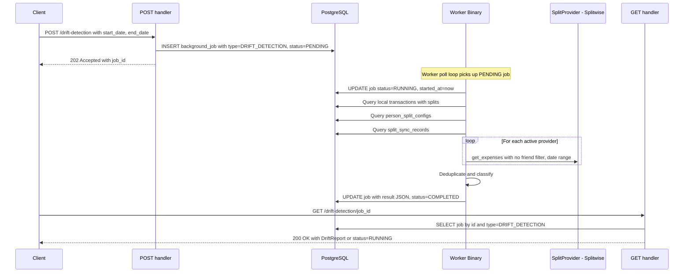
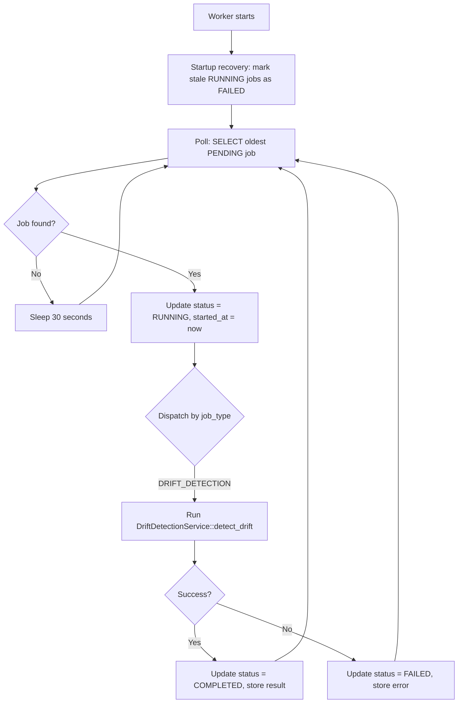

# Drift Detection - Design

**Requirements**: [requirements.md](./requirements.md)
**GitHub Issue**: [#40](https://github.com/abhijeet-reddy/master-of-coin/issues/40)
**Date**: 2026-02-21

## 1. Overview

A new **async drift detection API** that takes a date range, fetches all split expenses from both local and external systems, and returns a **drift report** showing what is in sync, what has drifted, and what is missing on each side.

The API uses a **job-based async pattern** built on a **generic `background_jobs` table** that can be reused for other job types (import statements, bulk sync, etc.):

1. `POST /api/v1/drift-detection` — starts a drift detection job, returns a job ID immediately
2. `GET /api/v1/drift-detection/:job_id` — polls for job status and results
3. `POST /api/v1/drift-detection/:job_id/retry` — retries a failed job

Jobs are stored in a database table for reliability — they survive server restarts and provide queryable history.

## 2. Architecture

### 2.1 High-Level Flow



### 2.2 Job Execution Lifecycle

#### How Jobs Are Executed

The system uses a **separate worker binary** for job execution, cleanly separating the API server from background processing:

1. **API Server** (`main.rs`): Handles HTTP requests. The POST handler inserts a `background_jobs` row with `status=PENDING`. No `tokio::spawn` — the API never executes jobs.
2. **Worker** (`bin/worker.rs`): A separate long-running process that polls the `background_jobs` table for PENDING jobs, executes them sequentially, and updates their status.
3. **Polling**: The GET handler reads the job row from the DB and returns the current state.

Both binaries share the same `lib.rs` crate (models, services, repositories, types) — zero code duplication.

#### Worker Poll Loop



The worker processes **one job per job type concurrently** — so a `DRIFT_DETECTION` and an `IMPORT_STATEMENT` can run simultaneously, but two `DRIFT_DETECTION` jobs run sequentially. This is implemented by tracking which job types are currently running and skipping PENDING jobs of types that already have an active task. The polling interval is **30 seconds** (configurable via `WORKER_POLL_INTERVAL_SECS` env var).

#### Startup Recovery

On worker startup, a recovery sweep marks stale RUNNING jobs as FAILED:

- **RUNNING jobs**: Were mid-execution when the worker died. Marked as `FAILED` with error `"Interrupted by worker restart. Please retry."`.
- **PENDING jobs**: Left as-is - the poll loop will pick them up naturally.

This is simpler than the `tokio::spawn` approach because PENDING jobs don't need re-spawning — the worker loop handles them automatically.

#### Job Cleanup

Old completed/failed jobs accumulate over time. The **worker handles cleanup automatically**:

- Jobs older than **1 year** with terminal status (COMPLETED or FAILED) are eligible for deletion
- The worker runs a cleanup sweep **daily at 00:00 UTC** — a separate `tokio::spawn` task in the worker checks the current time each poll cycle and triggers cleanup when the date changes
- Cleanup also runs on worker startup
- Query: `DELETE FROM background_jobs WHERE status IN ('COMPLETED', 'FAILED') AND created_at < NOW() - INTERVAL '1 year'`
- No per-user logic needed — a single global sweep handles all users

### 2.3 Retry Strategy

#### Automatic Retries (Provider Failures During Execution)

During job execution, if a provider API call fails (network error, rate limit, timeout), the service retries with exponential backoff:

- **Max retries per provider**: 3
- **Backoff**: 1s, 2s, 4s (exponential)
- **Retryable errors**: `NetworkError`, `RateLimited`, `TokenExpired` (matching `SplitProviderError::is_retryable()`)
- **Non-retryable errors**: `AuthenticationFailed`, `ConfigurationError`, `ApiError`

If all retries for a provider are exhausted, the job is marked as **FAILED** with an error message describing which provider(s) failed and why. Partial results are not returned — the user should retry after fixing the issue (e.g., reconnecting their Splitwise account).

#### Manual Retries (User-Initiated)

Users can retry a FAILED job by calling:

```
POST /api/v1/drift-detection/:job_id/retry
```

This endpoint:

1. Validates the original job exists, belongs to the user, and has `status=FAILED`
2. Reads the original job's `input` (start_date, end_date)
3. Creates a **new** job with the same input parameters and `previous_job_id` pointing to the original
4. Returns the new job_id with `status=PENDING`

The original failed job is preserved for history. The new job's `previous_job_id` links back to it, creating a retry chain that can be followed for debugging. This is simpler and safer than mutating the failed job's state.

### 2.4 Fetching External Expenses - All Expenses, Not Per-Friend

The Splitwise API `GET /get_expenses` supports an **optional** `friend_id` parameter. When omitted, it returns **all** expenses for the authenticated user in the date range. This is critical because:

- It catches expenses involving people who don't have a local `person_split_config` mapping yet
- It avoids N+1 API calls (one per friend) — a single call per provider suffices
- External expenses involving unmapped users are flagged with `unmapped_users` in the response so the user knows to create the local person mapping

The existing [`SplitwiseProvider.get_expenses()`](backend/src/services/split_provider/splitwise.rs:318) already accepts `friend_id: Option<&str>` - passing `None` fetches all expenses.

**Pagination**: For large date ranges, Splitwise may return more than the default limit. We'll use `limit=200` and paginate if needed (fetch until we get fewer results than the limit).

### 2.5 Matching Strategy

The matching logic uses a three-tier approach:

1. **Already-linked pairs** (via `split_sync_records`): For each local transaction that has a sync record with an `external_expense_id`, look up that expense in the fetched external set. If found, compare splits -> **synced** or **drifted**. If the external expense was deleted/not found, classify as **missing on external**.

2. **Unlinked local transactions**: Local transactions with splits that have configured providers but no sync record -> **missing on external**.

3. **Unlinked external expenses**: External expenses whose `external_expense_id` doesn't appear in any `split_sync_records` -> **missing on local**. These may include expenses with users who have no local person mapping — flagged with `unmapped_users`.

### 2.6 Count Invariants

```
total_local  = synced + drifted + missing_on_external
total_external = synced + drifted + missing_on_local
```

Where:

- `total_local` = distinct local transactions with splits in the date range that have at least one person with a configured split provider
- `total_external` = distinct external expenses in the date range (after deduplication) where the current user has a non-zero owed_share or paid_share
- `synced` = linked pairs where splits match
- `drifted` = linked pairs where splits differ
- `missing_on_external` = local transactions with no linked external expense
- `missing_on_local` = external expenses with no linked local transaction

### 2.7 Deduplication

External expenses are deduplicated by `external_expense_id`. Since we fetch all expenses without a friend filter, each expense appears exactly once per API call. If multiple providers are configured, expenses are scoped per-provider so no cross-provider deduplication is needed.

### 2.8 Provider Credential Resolution

For each active `split_provider` belonging to the user, the service:

1. Loads the `split_providers` row
2. Decrypts credentials using `encryption::decrypt_credentials()`
3. Gets the provider implementation from the `providers` HashMap
4. Makes a single `get_expenses()` call with `friend_id: None` to fetch all expenses

This reuses the exact same credential pattern as [`SplitSyncService`](backend/src/services/split_sync_service.rs).

## 3. Database Changes

### 3.1 New Tables

#### `background_jobs`

A **generic job table** for all async background operations. Different job types store their type-specific input/output in the `input` and `result` JSONB columns.

| Column            | Type              | Constraints                 | Description                                          |
| ----------------- | ----------------- | --------------------------- | ---------------------------------------------------- |
| `id`              | `UUID`            | PK, DEFAULT gen_random_uuid | Job ID                                               |
| `user_id`         | `UUID`            | NOT NULL, FK -> users       | Owner of the job                                     |
| `job_type`        | `job_type_enum`   | NOT NULL                    | PostgreSQL ENUM: DRIFT_DETECTION, etc.               |
| `status`          | `job_status_enum` | NOT NULL, DEFAULT 'PENDING' | PostgreSQL ENUM: PENDING, RUNNING, COMPLETED, FAILED |
| `previous_job_id` | `UUID`            | NULL, FK -> background_jobs | Links to the original job on retry                   |
| `input`           | `JSONB`           | NULL                        | Job-specific input parameters                        |
| `result`          | `JSONB`           | NULL                        | Job-specific result data                             |
| `error`           | `TEXT`            | NULL                        | Error message if FAILED                              |
| `created_at`      | `TIMESTAMPTZ`     | NOT NULL, DEFAULT now       | When the job was created                             |
| `started_at`      | `TIMESTAMPTZ`     | NULL                        | When the job started running                         |
| `completed_at`    | `TIMESTAMPTZ`     | NULL                        | When the job finished                                |

**Indexes**:

- `idx_background_jobs_user_id` on `(user_id)`
- `idx_background_jobs_user_type` on `(user_id, job_type)`
- `idx_background_jobs_status` on `(status)` — for startup recovery and cleanup

**Future job types** that can reuse this table:

- `IMPORT_STATEMENT` — CSV import processing
- `BULK_SYNC` — sync all transactions in a date range
- `EXPORT_DATA` — data export generation

### 3.2 Migrations

New migration: `create_background_jobs_table`

**up.sql**:

```sql
-- PostgreSQL ENUMs for type safety
CREATE TYPE job_type_enum AS ENUM ('DRIFT_DETECTION');
CREATE TYPE job_status_enum AS ENUM ('PENDING', 'RUNNING', 'COMPLETED', 'FAILED');

CREATE TABLE background_jobs (
    id UUID PRIMARY KEY DEFAULT gen_random_uuid(),
    user_id UUID NOT NULL REFERENCES users(id) ON DELETE CASCADE,
    job_type job_type_enum NOT NULL,
    status job_status_enum NOT NULL DEFAULT 'PENDING',
    previous_job_id UUID REFERENCES background_jobs(id) ON DELETE SET NULL,
    input JSONB,
    result JSONB,
    error TEXT,
    created_at TIMESTAMPTZ NOT NULL DEFAULT NOW(),
    started_at TIMESTAMPTZ,
    completed_at TIMESTAMPTZ
);

CREATE INDEX idx_background_jobs_user_id ON background_jobs(user_id);
CREATE INDEX idx_background_jobs_user_type ON background_jobs(user_id, job_type);
CREATE INDEX idx_background_jobs_status ON background_jobs(status);
```

**down.sql**:

```sql
DROP TABLE IF EXISTS background_jobs;
DROP TYPE IF EXISTS job_status_enum;
DROP TYPE IF EXISTS job_type_enum;
```

> **Note**: Adding new values to PostgreSQL ENUMs requires an `ALTER TYPE ... ADD VALUE` migration (same pattern used for `account_type` ENUM). This is a deliberate trade-off: we get DB-level type safety at the cost of a migration per new job type.

### 3.3 New Queries

A repository function to fetch local transactions that have splits with configured providers in a date range:

```sql
SELECT DISTINCT t.id, t.title, t.amount, t.date, t.account_id,
       ts.id as split_id, ts.person_id, ts.amount as split_amount,
       p.name as person_name,
       psc.split_provider_id, psc.external_user_id,
       ssr.external_expense_id, ssr.sync_status
FROM transactions t
INNER JOIN transaction_splits ts ON ts.transaction_id = t.id
INNER JOIN people p ON p.id = ts.person_id
INNER JOIN person_split_configs psc ON psc.person_id = ts.person_id
LEFT JOIN split_sync_records ssr ON ssr.transaction_split_id = ts.id
WHERE t.user_id = $1
  AND t.date >= $2
  AND t.date <= $3
ORDER BY t.date DESC
```

A query to build the external_user_id -> person_name mapping:

```sql
SELECT psc.external_user_id, p.name
FROM person_split_configs psc
INNER JOIN people p ON p.id = psc.person_id
WHERE p.user_id = $1
```

## 4. API Changes

### 4.1 New Endpoints

| Method | Path                                    | Description                 | Request                                 | Response                    |
| ------ | --------------------------------------- | --------------------------- | --------------------------------------- | --------------------------- |
| POST   | `/api/v1/drift-detection`               | Start a drift detection job | JSON: `start_date`, `end_date` optional | 202 with `job_id`           |
| GET    | `/api/v1/drift-detection/:job_id`       | Get job status and results  | None                                    | `DriftDetectionJobResponse` |
| POST   | `/api/v1/drift-detection/:job_id/retry` | Retry a failed job          | None                                    | 202 with new `job_id`       |

### 4.2 POST — Start Job

```
POST /api/v1/drift-detection
Authorization: Bearer <token>
Content-Type: application/json

{
  "start_date": "2026-01-01T00:00:00Z",
  "end_date": "2026-02-21T23:59:59Z"
}
```

**Response** (202 Accepted):

```json
{
  "job_id": "uuid",
  "status": "PENDING",
  "message": "Drift detection job started"
}
```

### 4.3 GET — Poll for Results

```
GET /api/v1/drift-detection/<job_id>
Authorization: Bearer <token>
```

**Response when RUNNING** (200 OK):

```json
{
  "job_id": "uuid",
  "status": "RUNNING",
  "created_at": "2026-02-21T12:00:00Z",
  "started_at": "2026-02-21T12:00:00Z"
}
```

**Response when COMPLETED** (200 OK):

```json
{
  "job_id": "uuid",
  "status": "COMPLETED",
  "created_at": "2026-02-21T12:00:00Z",
  "started_at": "2026-02-21T12:00:00Z",
  "completed_at": "2026-02-21T12:00:03Z",
  "result": {
    "summary": {
      "total_local": 15,
      "total_external": 17,
      "synced": 10,
      "drifted": 2,
      "missing_on_external": 3,
      "missing_on_local": 5
    },
    "drifted": [
      {
        "transaction_id": "uuid",
        "transaction_title": "Dinner",
        "transaction_date": "2026-01-15T20:00:00Z",
        "local_amount": "-50.00",
        "external_expense_id": "12345",
        "external_description": "Dinner",
        "external_cost": "50.00",
        "external_date": "2026-01-15",
        "local_splits": [
          {
            "person_name": "Alice",
            "external_user_id": "67890",
            "owed_share": "25.00"
          }
        ],
        "external_splits": [
          {
            "external_user_id": "67890",
            "first_name": "Alice",
            "last_name": "Smith",
            "owed_share": "30.00",
            "paid_share": "0.00"
          }
        ]
      }
    ],
    "missing_on_external": [
      {
        "transaction_id": "uuid",
        "transaction_title": "Groceries",
        "transaction_date": "2026-01-20T12:00:00Z",
        "amount": "-80.00",
        "splits": [
          {
            "person_name": "Bob",
            "external_user_id": "11111",
            "amount": "40.00"
          }
        ]
      }
    ],
    "missing_on_local": [
      {
        "external_expense_id": "99999",
        "description": "Taxi",
        "cost": "30.00",
        "currency_code": "EUR",
        "date": "2026-01-22",
        "users": [
          {
            "external_user_id": "67890",
            "first_name": "Alice",
            "last_name": "Smith",
            "paid_share": "30.00",
            "owed_share": "15.00"
          },
          {
            "external_user_id": "12345",
            "first_name": "You",
            "last_name": "",
            "paid_share": "0.00",
            "owed_share": "15.00"
          }
        ],
        "unmapped_users": [
          {
            "external_user_id": "99999",
            "first_name": "Charlie",
            "last_name": "Brown"
          }
        ]
      }
    ]
  }
}
```

**Response when FAILED** (200 OK):

```json
{
  "job_id": "uuid",
  "status": "FAILED",
  "created_at": "2026-02-21T12:00:00Z",
  "started_at": "2026-02-21T12:00:00Z",
  "completed_at": "2026-02-21T12:00:02Z",
  "error": "All providers failed: Authentication failed"
}
```

### 4.4 POST — Retry a Failed Job

```
POST /api/v1/drift-detection/<job_id>/retry
Authorization: Bearer <token>
```

**Response** (202 Accepted):

```json
{
  "job_id": "new-uuid",
  "status": "PENDING",
  "message": "Drift detection job retried"
}
```

Returns 400 if the original job is not in FAILED status. Returns 404 if job not found or belongs to another user.

### 4.5 Modified Endpoints

None.

## 5. Backend Changes

### 5.1 New Custom Types: `JobType` and `JobStatus`

In `backend/src/types/job_types.rs` (added to `types/mod.rs`):

These are **PostgreSQL ENUM types** mapped to Rust enums via Diesel's `DbEnum` pattern (same approach used for `AccountType`, `CurrencyCode`, `BudgetPeriod`).

```rust
use diesel_derive_enum::DbEnum;
use serde::{Deserialize, Serialize};

/// PostgreSQL ENUM: job_type_enum
/// Maps to: CREATE TYPE job_type_enum AS ENUM ('DRIFT_DETECTION')
#[derive(Debug, Clone, PartialEq, Eq, Serialize, Deserialize, DbEnum)]
#[ExistingTypePath = "crate::schema::sql_types::JobTypeEnum"]
pub enum JobType {
    #[db_rename = "DRIFT_DETECTION"]
    DriftDetection,
    // Future variants added here + ALTER TYPE migration
}

/// PostgreSQL ENUM: job_status_enum
/// Maps to: CREATE TYPE job_status_enum AS ENUM ('PENDING', 'RUNNING', 'COMPLETED', 'FAILED')
#[derive(Debug, Clone, PartialEq, Eq, Serialize, Deserialize, DbEnum)]
#[ExistingTypePath = "crate::schema::sql_types::JobStatusEnum"]
pub enum JobStatus {
    #[db_rename = "PENDING"]
    Pending,
    #[db_rename = "RUNNING"]
    Running,
    #[db_rename = "COMPLETED"]
    Completed,
    #[db_rename = "FAILED"]
    Failed,
}

impl JobStatus {
    pub fn is_terminal(&self) -> bool {
        matches!(self, JobStatus::Completed | JobStatus::Failed)
    }
}
```

The `schema::sql_types` module will auto-generate `JobTypeEnum` and `JobStatusEnum` types when `diesel migration run` is executed, matching the existing pattern for [`AccountType`](backend/src/schema.rs:4), [`CurrencyCode`](backend/src/schema.rs:18), etc.

### 5.2 New Model: `BackgroundJob`

In `backend/src/models/background_job.rs`:

```rust
use chrono::{DateTime, Utc};
use diesel::{Identifiable, Insertable, Queryable, Selectable};
use serde::{Deserialize, Serialize};
use uuid::Uuid;

use crate::schema::background_jobs;
use crate::types::{JobStatus, JobType};

#[derive(Debug, Clone, Serialize, Deserialize, Queryable, Selectable, Identifiable)]
#[diesel(table_name = background_jobs)]
#[diesel(check_for_backend(diesel::pg::Pg))]
pub struct BackgroundJob {
    pub id: Uuid,
    pub user_id: Uuid,
    pub job_type: JobType,
    pub status: JobStatus,
    pub previous_job_id: Option<Uuid>,
    pub input: Option<serde_json::Value>,
    pub result: Option<serde_json::Value>,
    pub error: Option<String>,
    pub created_at: DateTime<Utc>,
    pub started_at: Option<DateTime<Utc>>,
    pub completed_at: Option<DateTime<Utc>>,
}

#[derive(Debug, Insertable)]
#[diesel(table_name = background_jobs)]
pub struct NewBackgroundJob {
    pub user_id: Uuid,
    pub job_type: JobType,
    pub status: JobStatus,
    pub previous_job_id: Option<Uuid>,
    pub input: Option<serde_json::Value>,
}
```

Note: `job_type` and `status` are now typed as `JobType` and `JobStatus` enums directly — Diesel handles the PostgreSQL ENUM mapping automatically via the `DbEnum` derive.

### 5.3 New Model: Drift Detection Types

In `backend/src/models/drift_detection.rs` — request/response types and the DriftReport structure. All report structs derive `Clone + Serialize + Deserialize` so they can be stored as JSONB and deserialized back.

(Full struct definitions: `DriftDetectionRequest`, `StartJobResponse`, `DriftDetectionJobResponse`, `DriftReport`, `DriftSummary`, `DriftedItem`, `MissingOnExternal`, `MissingOnLocal`, `LocalSplitInfo`, `ExternalSplitInfo`, `UnmappedUser` — as specified in the response schema above.)

### 5.4 New Repository: `background_job`

In `backend/src/repositories/background_job.rs`:

- `create_job(pool, new_job)` -> `BackgroundJob`
- `find_by_id(pool, job_id)` -> `Option<BackgroundJob>`
- `find_by_user_and_type(pool, user_id, job_type: &str)` -> `Vec<BackgroundJob>`
- `find_stale_jobs(pool)` -> `Vec<BackgroundJob>` — WHERE status = 'RUNNING' (for startup recovery)
- `find_next_pending(pool, exclude_types)` -> `Option<BackgroundJob>` — oldest PENDING job, optionally excluding types already running
- `update_running(pool, job_id)` -> `BackgroundJob` — sets status=RUNNING, started_at=now
- `update_completed(pool, job_id, result_json)` -> `BackgroundJob` — sets status=COMPLETED, result, completed_at=now
- `update_failed(pool, job_id, error)` -> `BackgroundJob` — sets status=FAILED, error, completed_at=now
- `cleanup_old_jobs(pool, older_than)` -> `usize` — delete terminal jobs older than threshold (global, not per-user)

### 5.5 New Service: `DriftDetectionService`

In `backend/src/services/drift_detection_service.rs`:

**Public method:**

- `detect_drift(pool, providers, user_id, start_date, end_date)` -> `ApiResult<DriftReport>`

**Internal helpers:**

- `fetch_local_split_transactions(pool, user_id, start_date, end_date)` — Diesel query joining transactions + splits + people + person_split_configs + split_sync_records
- `fetch_all_external_expenses(pool, providers, user_id, start_date, end_date)` — for each active provider, calls `get_expenses(None, ...)` with retry logic, paginates if needed
- `fetch_with_retry(provider, credentials, params, max_retries)` — wraps a single provider API call with exponential backoff (1s, 2s, 4s), only retries on `is_retryable()` errors
- `build_external_user_mapping(pool, user_id)` — map of `external_user_id -> person_name`
- `classify(local_txns, external_expenses, user_mapping)` — the core matching and classification logic

### 5.6 Worker Binary

New file: `backend/src/bin/worker.rs`

The worker is a separate Rust binary that shares the same `lib.rs` crate. It:

1. Initializes config, DB pool, and split providers (same setup as `main.rs`)
2. Runs startup recovery (marks stale RUNNING jobs as FAILED)
3. Enters the poll loop: queries for PENDING jobs, executes them, updates status

```rust
// Pseudocode for worker.rs
#[tokio::main]
async fn main() {
    tracing_subscriber::init();
    let config = Config::from_env();
    let pool = db::create_pool(&config.database_url);
    let providers = init_providers();

    // Startup recovery
    recover_stale_jobs(&pool).await;

    // Poll loop
    let poll_interval = Duration::from_secs(
        env::var("WORKER_POLL_INTERVAL_SECS")
            .unwrap_or("30".into())
            .parse().unwrap_or(30)
    );

    loop {
        if let Some(job) = background_job::find_next_pending(&pool) {
            background_job::update_running(&pool, job.id);

            match job.job_type {
                JobType::DriftDetection => {
                    let input: DriftDetectionRequest = serde_json::from_value(job.input.unwrap());
                    match detect_drift(&pool, &providers, job.user_id, input.start_date, input.end_date).await {
                        Ok(report) => background_job::update_completed(&pool, job.id, serde_json::to_value(report)),
                        Err(e) => background_job::update_failed(&pool, job.id, e.to_string()),
                    }
                }
                // Future job types dispatched here
            }
        } else {
            tokio::time::sleep(poll_interval).await;
        }
    }
}
```

**Cargo.toml** additions:

```toml
[[bin]]
name = "master-of-coin"
path = "src/main.rs"

[[bin]]
name = "worker"
path = "src/bin/worker.rs"
```

### 5.7 Docker Changes

Both binaries are built from the same Dockerfile. Docker Compose runs them as separate services:

```yaml
services:
  api:
    build: .
    command: ["./master-of-coin"]
    ports: ["3000:3000"]
    depends_on: [db]

  worker:
    build: .
    command: ["./worker"]
    depends_on: [db]
    # No ports — worker doesn't serve HTTP
    environment:
      - WORKER_POLL_INTERVAL_SECS=30
```

Both services use the **same Docker image** — just different entrypoints. The Dockerfile builds both binaries:

```dockerfile
RUN cargo build --release --bin master-of-coin --bin worker
```

### 5.8 New Handler

Three handler functions in `backend/src/handlers/drift_detection.rs`:

- **`start_drift_detection`** — POST handler
  - Creates `background_jobs` row: `job_type=DRIFT_DETECTION`, `status=PENDING`, `input={start_date, end_date}`
  - Returns 202 with job_id (worker picks it up via poll loop)

- **`get_drift_detection`** — GET handler
  - Reads job from DB, validates `job_type=DRIFT_DETECTION` and user ownership
  - Deserializes `result` JSONB into `DriftReport` if COMPLETED
  - Returns current status + result/error

- **`retry_drift_detection`** — POST retry handler
  - Validates original job is FAILED and belongs to user
  - Reads `input` from original job
  - Creates new job with same input and `previous_job_id` = original job's ID
  - Returns 202 with new job_id (worker picks it up)

### 5.9 Route Registration

Add to [`routes.rs`](backend/src/api/routes.rs):

```rust
// Drift detection - async job-based
.route(
    "/drift-detection",
    post(handlers::drift_detection::start_drift_detection).layer(middleware::from_fn(
        |auth, req, next| {
            require_scope(ResourceType::Transactions, OperationType::Read, auth, req, next)
        },
    )),
)
.route(
    "/drift-detection/:job_id",
    get(handlers::drift_detection::get_drift_detection).layer(middleware::from_fn(
        |auth, req, next| {
            require_scope(ResourceType::Transactions, OperationType::Read, auth, req, next)
        },
    )),
)
.route(
    "/drift-detection/:job_id/retry",
    post(handlers::drift_detection::retry_drift_detection).layer(middleware::from_fn(
        |auth, req, next| {
            require_scope(ResourceType::Transactions, OperationType::Read, auth, req, next)
        },
    )),
)
```

All use `Transactions:Read` scope since this is a read-only operation.

### 5.10 Module Registration

- Add `pub mod drift_detection;` to [`handlers/mod.rs`](backend/src/handlers/mod.rs)
- Add `pub mod drift_detection;` and `pub mod background_job;` to [`models/mod.rs`](backend/src/models/mod.rs)
- Add `pub mod drift_detection_service;` to [`services/mod.rs`](backend/src/services/mod.rs)
- Add `pub mod background_job;` to [`repositories/mod.rs`](backend/src/repositories/mod.rs)
- Add `pub mod job_types;` to [`types/mod.rs`](backend/src/types/mod.rs) and re-export `JobType`, `JobStatus`
- `background_jobs` table added to [`schema.rs`](backend/src/schema.rs) (auto-generated by diesel migration)

## 6. Error Handling

| Scenario                      | Error / Behavior                                         |
| ----------------------------- | -------------------------------------------------------- |
| Missing `start_date` in body  | 400 Bad Request — "start_date is required"               |
| Invalid date format           | 400 Bad Request — "Invalid date format"                  |
| Job not found                 | 404 Not Found — "Job not found"                          |
| Job belongs to different user | 404 Not Found — same as not found for security           |
| Job is wrong type             | 404 Not Found — filtered by DRIFT_DETECTION              |
| Retry non-FAILED job          | 400 Bad Request — "Only FAILED jobs can be retried"      |
| No split providers configured | Job COMPLETED with empty report, zero counts             |
| Provider API failure          | Automatic retry (3x exponential backoff)                 |
| All retries exhausted         | Job FAILED with error describing which provider(s)       |
| Worker restart mid-job        | RUNNING -> FAILED on next worker startup, user can retry |

## 7. Testing Strategy

### 7.1 Integration Tests

New test file: `backend/tests/integration/api/test_drift_detection.rs`

Tests:

1. **Start and poll job**: POST returns 202 with job_id, GET returns PENDING/RUNNING/COMPLETED
2. **All synced**: Create transactions with splits, create matching sync records -> all show as synced, counts add up
3. **Drift detection**: Create linked pairs where local and external amounts differ -> shows as drifted
4. **Missing on external**: Create transactions with splits but no sync records -> shows as missing on external
5. **Missing on local**: External expenses that have no local match -> shows as missing on local
6. **Date range filtering**: Verify only transactions within the date range are included
7. **No providers configured**: Returns empty report gracefully
8. **Unmapped users**: External expenses with users not in `person_split_configs` -> flagged in `unmapped_users`
9. **Job not found**: GET with invalid job_id returns 404
10. **Job ownership**: User A cannot see User B's job
11. **Retry creates new job**: POST retry on FAILED job creates new job with `previous_job_id` set
12. **Retry non-failed**: POST retry on COMPLETED job returns 400

### 7.2 Unit-Level Testing

The classification logic in `classify()` can be tested with constructed data without hitting external APIs.

### 7.3 Manual Testing

Since this calls external Splitwise APIs, manual testing against a real Splitwise account is recommended before release.
