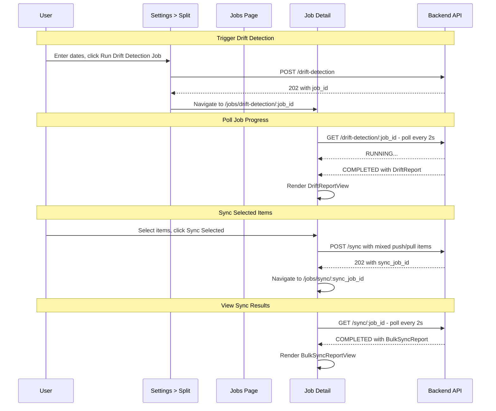

# Drift UI — Design

**Requirements**: [requirements.md](./requirements.md)
**GitHub Issue**: [#41](https://github.com/abhijeet-reddy/master-of-coin/issues/41) (Sub-feature B)
**Date**: 2026-02-21

## 1. Overview

Two new frontend pages plus a Settings enhancement:

1. **Jobs page** (`/jobs`) — generic list of all background jobs with type/status badges
2. **Job detail page** (`/jobs/:type/:id`) — type-specific view: drift report for DRIFT_DETECTION, sync results for BULK_SYNC
3. **Settings > Split tab enhancement** — date range form to trigger drift detection, navigates to job detail

The drift detection detail view allows selecting items and creating a sync job. The sync job detail view shows per-item results with retry support.

## 2. Architecture

### 2.1 Page Structure

```mermaid
flowchart TD
    A[Settings > Split Tab] -->|Run Drift Detection Job| B[POST /drift-detection]
    B -->|Navigate| C[/jobs/drift-detection/:id]

    D[Jobs Page /jobs] -->|Click row| C

    C --> E{type param?}
    E -->|drift-detection| F[DriftReportView]
    E -->|sync| G[BulkSyncReportView]

    F -->|Sync wizard + submit| H[POST /sync]
    H -->|Navigate| C2[/jobs/sync/:new_id]
    C2 --> G

    F -->|Retry failed job| B2[POST /drift-detection/:id/retry]
    B2 -->|Navigate| C3[/jobs/drift-detection/:new_id]

    G -->|Retry failed items| H2[POST /sync/:id/retry]
    H2 -->|Navigate| C4[/jobs/sync/:new_id]
```

### 2.2 Data Flow



### 2.3 Polling Strategy

Jobs are polled using React Query `refetchInterval`:

- PENDING or RUNNING → poll every **2 seconds**
- COMPLETED or FAILED → stop polling (`refetchInterval: false`)
- Use `enabled` flag to only poll when there is an active job ID

## 3. Backend Changes

### 3.1 New Endpoint: List Jobs

| Method | Path           | Description                    | Response                    |
| ------ | -------------- | ------------------------------ | --------------------------- |
| GET    | `/api/v1/jobs` | List all jobs for current user | `Vec<BackgroundJobSummary>` |

**Query parameters:**

- `job_type` (optional) — filter by type: `DRIFT_DETECTION`, `BULK_SYNC`
- `limit` (optional, default 50) — max results
- `offset` (optional, default 0) — pagination offset

**Response:**

```json
[
  {
    "id": "uuid",
    "job_type": "DRIFT_DETECTION",
    "status": "COMPLETED",
    "created_at": "2026-02-21T12:00:00Z",
    "started_at": "2026-02-21T12:00:01Z",
    "completed_at": "2026-02-21T12:00:03Z",
    "error": null,
    "summary": {
      "total_local": 15,
      "synced": 10,
      "drifted": 2,
      "missing_on_external": 3,
      "missing_on_local": 5
    }
  }
]
```

The `summary` field is extracted from the job result JSONB — drift detection gets `DriftSummary`, bulk sync gets `BulkSyncSummary`. Full report is NOT included in the list view.

**New files:**

- `backend/src/handlers/jobs.rs` — `list_jobs` handler
- `backend/src/models/job_summary.rs` — `BackgroundJobSummary`, `ListJobsQuery` types

**Modified files:**

- `backend/src/handlers/mod.rs` — add `pub mod jobs;`
- `backend/src/models/mod.rs` — add `pub mod job_summary;`
- `backend/src/api/routes.rs` — add `GET /jobs` route
- `backend/src/repositories/background_job.rs` — add `list_by_user()` method with optional type filter, limit, offset

### 3.2 New Repository Method

```rust
/// List jobs for a user with optional type filter and pagination
pub fn list_by_user(
    pool: &DbPool,
    user_id: Uuid,
    job_type: Option<JobType>,
    limit: i64,
    offset: i64,
) -> ApiResult<Vec<BackgroundJob>>
```

## 4. Frontend Changes

### 4.1 New Routes

Add to [`App.tsx`](frontend/src/App.tsx):

```tsx
<Route path="jobs" element={<JobsPage />} />
<Route path="jobs/:type/:id" element={<JobDetailPage />} />
```

Single route with `:type` param. The `JobDetailPage` wrapper reads `type` and `id` from URL params, fetches from the right API endpoint, and renders the appropriate sub-view:

- `/jobs/drift-detection/:id` → calls `GET /api/v1/drift-detection/:id` → renders `DriftReportView`
- `/jobs/sync/:id` → calls `GET /api/v1/sync/:id` → renders `BulkSyncReportView`

The jobs list navigates to `/jobs/{type}/{id}` based on `job_type` (mapping `DRIFT_DETECTION` → `drift-detection`, `BULK_SYNC` → `sync`).

### 4.2 Sidebar Update

Add to [`Sidebar.tsx`](frontend/src/components/layout/Sidebar.tsx) after Reports, before Settings:

```tsx
<NavItem icon={MdWorkHistory} label="Jobs" to="/jobs" />
```

### 4.3 Settings > Split Tab Enhancement

Add a "Run Drift Detection Job" button to the existing [`SplitIntegrationsList`](frontend/src/components/settings/SplitIntegrationsList.tsx) component. Clicking it opens a **modal** with:

- Date range pickers (start_date, end_date)
- "Run Drift Detection Job" button
- On submit: calls `POST /drift-detection`, closes modal, navigates to `/jobs/drift-detection/:job_id`

New component: `DriftDetectionModal.tsx` — modal with date range form.

### 4.4 New Types

**`frontend/src/types/jobs.ts`**:

```typescript
export type JobType = "DRIFT_DETECTION" | "BULK_SYNC";
export type JobStatus = "PENDING" | "RUNNING" | "COMPLETED" | "FAILED";

export interface BackgroundJobSummary {
  id: string;
  job_type: JobType;
  status: JobStatus;
  created_at: string;
  started_at?: string;
  completed_at?: string;
  error?: string;
  summary?: Record<string, unknown>;
}
```

**`frontend/src/types/drift.ts`**:

```typescript
export interface DriftDetectionRequest {
  start_date: string;
  end_date: string;
}

export interface DriftDetectionJobResponse {
  job_id: string;
  status: JobStatus;
  created_at: string;
  started_at?: string;
  completed_at?: string;
  result?: DriftReport;
  error?: string;
}

export interface DriftReport {
  summary: DriftSummary;
  drifted: DriftedItem[];
  missing_on_external: MissingOnExternal[];
  missing_on_local: MissingOnLocal[];
}

export interface DriftSummary {
  total_local: number;
  total_external: number;
  synced: number;
  drifted: number;
  missing_on_external: number;
  missing_on_local: number;
}

export interface DriftedItem {
  transaction_id: string;
  transaction_title: string;
  transaction_date: string;
  local_amount: string;
  external_expense_id: string;
  external_description: string;
  external_cost: string;
  external_date: string;
  local_splits: LocalSplitInfo[];
  external_splits: ExternalSplitInfo[];
}

export interface MissingOnExternal {
  transaction_id: string;
  transaction_title: string;
  transaction_date: string;
  amount: string;
  splits: LocalSplitInfo[];
}

export interface MissingOnLocal {
  external_expense_id: string;
  description: string;
  cost: string;
  currency_code: string;
  date: string;
  users: ExternalSplitInfo[];
  unmapped_users?: UnmappedUser[];
}

export interface LocalSplitInfo {
  person_name: string;
  external_user_id: string;
  owed_share: string;
}

export interface ExternalSplitInfo {
  external_user_id: string;
  first_name: string;
  last_name: string;
  owed_share: string;
  paid_share: string;
}

export interface UnmappedUser {
  external_user_id: string;
  first_name: string;
  last_name: string;
}
```

**`frontend/src/types/sync.ts`**:

```typescript
export type SyncAction = "push" | "pull";

export interface SyncItem {
  action: SyncAction;
  transaction_id?: string;
  external_expense_id?: string;
}

export interface BulkSyncRequest {
  items: SyncItem[];
}

export interface StartSyncJobResponse {
  job_id: string;
  status: JobStatus;
  message: string;
  total_items: number;
}

export interface BulkSyncJobResponse {
  job_id: string;
  status: JobStatus;
  created_at: string;
  started_at?: string;
  completed_at?: string;
  result?: BulkSyncReport;
  error?: string;
}

export interface BulkSyncReport {
  summary: BulkSyncSummary;
  items: SyncItemResult[];
}

export interface BulkSyncSummary {
  total: number;
  succeeded: number;
  failed: number;
}

export interface SyncItemResult {
  action: SyncAction;
  transaction_id?: string;
  external_expense_id?: string;
  status: string;
  detail?: Record<string, unknown>;
  error?: string;
}
```

### 4.5 New Services

**`frontend/src/services/jobService.ts`**:

- `listJobs(params?)` → `GET /jobs`

**`frontend/src/services/driftService.ts`**:

- `startDriftDetection(request)` → `POST /drift-detection`
- `getDriftJob(jobId)` → `GET /drift-detection/:job_id`
- `retryDriftJob(jobId)` → `POST /drift-detection/:job_id/retry`

**`frontend/src/services/bulkSyncService.ts`**:

- `startBulkSync(request)` → `POST /sync`
- `getBulkSyncJob(jobId)` → `GET /sync/:job_id`
- `retryBulkSync(jobId)` → `POST /sync/:job_id/retry`

### 4.6 New Hooks

**`frontend/src/hooks/api/useJobs.ts`**:

- `useJobs(params?)` — query to list jobs

**`frontend/src/hooks/api/useDriftDetection.ts`**:

- `useStartDriftDetection()` — mutation
- `useDriftJob(jobId)` — query with polling
- `useRetryDriftJob()` — mutation

**`frontend/src/hooks/api/useBulkSync.ts`**:

- `useStartBulkSync()` — mutation
- `useBulkSyncJob(jobId)` — query with polling
- `useRetryBulkSync()` — mutation

**`frontend/src/hooks/usecase/useSyncWizard.ts`**:

- Manages the sync wizard state: current step, selections per step, push/pull toggles for drifted items
- Builds `SyncItem[]` from selected items (auto-determines push/pull based on item type):
  - **Missing on External** items → push with `transaction_id`
  - **Missing on Local** items → pull with `external_expense_id`
  - **Drifted** items → user-selected push or pull per item (via toggle in wizard step 1)
- Provides step navigation (next, back, skip)
- On submit: creates `BulkSyncRequest` and calls `startBulkSync`, then navigates to `/jobs/sync/:job_id`

### 4.7 New Components

**Pages:**

- `frontend/src/pages/Jobs.tsx` — Jobs list page
- `frontend/src/pages/JobDetail.tsx` — Wrapper page that reads `:type` and `:id` from URL, fetches from the right endpoint, renders the appropriate sub-view. Handles common concerns: back button, loading, error, polling.

**Job components** (`frontend/src/components/jobs/`):

- `JobHistoryList.tsx` — Table of jobs with type badge, status badge, timestamps, summary
- `JobStatusBadge.tsx` — Colored badge: green=COMPLETED, blue=RUNNING, gray=PENDING, red=FAILED
- `JobTypeBadge.tsx` — Badge: DRIFT_DETECTION, BULK_SYNC
- `JobProgressCard.tsx` — Shows PENDING/RUNNING status with spinner, used on detail page while polling

**Drift report components** (`frontend/src/components/drift/`):

- `DriftReportView.tsx` — Full drift report: summary card + tabbed item lists + Sync button
- `DriftSummaryCard.tsx` — Grid of summary counts (synced, drifted, missing external, missing local)
- `DriftItemList.tsx` — List of items, used for each tab (read-only in detail view, with checkboxes in wizard)
- `DriftItemRow.tsx` — Single item row showing local vs external data

**Sync wizard components** (`frontend/src/components/sync/wizard/`):

- `SyncWizard.tsx` — Modal container with step navigation (back, next, skip, submit)
- `DriftedStepView.tsx` — Step 1: drifted items with checkboxes + push/pull toggle per item
- `MissingExternalStepView.tsx` — Step 2: missing on external items with checkboxes (always push)
- `MissingLocalStepView.tsx` — Step 3: missing on local items with checkboxes (always pull)
- `ReviewStepView.tsx` — Step 4: summary of all selected actions + Sync All button

**Bulk sync report components** (`frontend/src/components/sync/`):

- `BulkSyncReportView.tsx` — Sync results: summary + per-item list
- `SyncItemResultRow.tsx` — Single result row with success/failure badge

**Settings enhancement:**

- `DriftDetectionModal.tsx` — Modal with date range pickers + Run Drift Detection Job button

### 4.8 Component Hierarchy

```
JobsPage (/jobs)
└── JobHistoryList
    └── JobHistoryRow (per job)
        ├── JobTypeBadge
        └── JobStatusBadge

JobDetailPage (/jobs/:type/:id)
├── Back to Jobs link
├── JobProgressCard (while PENDING/RUNNING)
├── Error display (if FAILED, with Retry button)
├── DriftReportView (when type=drift-detection + COMPLETED)
    ├── DriftSummaryCard
    ├── Sync button -> opens SyncWizard
    └── Tabs (read-only)
        ├── DriftedTab - drifted items with local vs external comparison
        ├── MissingExternalTab - local transactions not on provider
        └── MissingLocalTab - external expenses not in local (with unmapped user warnings)

SyncWizard (modal launched from Sync button)
├── Step 1: DriftedStepView (select + push/pull toggle)
├── Step 2: MissingExternalStepView (select to push)
├── Step 3: MissingLocalStepView (select to pull)
└── Step 4: ReviewStepView (summary + Sync All button)

├── BulkSyncReportView (when type=sync + COMPLETED)
    ├── BulkSyncSummaryCard
    ├── Retry button (if has failed items)
    └── SyncItemResultRow (per item)

Settings > Split Tab
└── SplitIntegrationsList (existing)
    └── DriftDetectionModal (button + modal)
```

### 4.9 Page Wireframes

**Jobs Page - /jobs**

```
+-----------------------------------------------------------+
|  Jobs                                                      |
|  View and manage background jobs                           |
+------------------------------------------------------------+
|  Filter: [All Types v]                                     |
+--------+--------------+-----------+------------+-----------+
| Type   | Status       | Created   | Summary    |           |
+--------+--------------+-----------+------------+-----------+
| DRIFT  | * COMPLETED  | 2 min ago | 10 synced, |    ->     |
|        |              |           | 2 drifted  |           |
+--------+--------------+-----------+------------+-----------+
| SYNC   | * COMPLETED  | 1 min ago | 3/3 ok     |    ->     |
+--------+--------------+-----------+------------+-----------+
| DRIFT  | * FAILED     | 1 hr ago  | Error:...  |    ->     |
+--------+--------------+-----------+------------+-----------+
| SYNC   | * RUNNING    | just now  | Processing |    ->     |
+--------+--------------+-----------+------------+-----------+
```

**Drift Details Page (read-only report with tabs)**

```
+-----------------------------------------------------------+
|  <- Back to Jobs                                           |
|  Drift Details - Feb 21, 2026 12:00                        |
|  Status: * COMPLETED  Duration: 2.3s     [ Sync ]         |
+-----------------------------------------------------------+
|  +----------+ +----------+ +----------+ +----------+       |
|  | Synced   | | Drifted  | | Missing  | | Missing  |       |
|  |   10     | |    2     | | External | |  Local   |       |
|  |          | |          | |    3     | |    5     |       |
|  +----------+ +----------+ +----------+ +----------+       |
+-----------------------------------------------------------+
|  [Drifted (2)] [Missing on External (3)] [Missing Local (5)]|
+-----------------------------------------------------------+
|  Showing: Drifted tab                                      |
|  +-------------------------------------------------------+ |
|  | Dinner - Jan 15                                       | |
|  |   Local: -50.00  External: -50.00                     | |
|  |   Alice owes 25.00 vs 30.00                           | |
|  +-------------------------------------------------------+ |
|  +-------------------------------------------------------+ |
|  | Groceries - Jan 20                                    | |
|  |   Local: -80.00  External: -80.00                     | |
|  |   Bob owes 40.00 vs 45.00                             | |
|  +-------------------------------------------------------+ |
+-----------------------------------------------------------+

Drifted tab:
+-----------------------------------------------------------+
|  +-------------------------------------------------------+ |
|  | Dinner - Jan 15                                       | |
|  |   Local: -50.00  External: -50.00                     | |
|  |   Local splits:   Alice owes 25.00                    | |
|  |   External splits: Alice owes 30.00                   | |
|  +-------------------------------------------------------+ |
|  +-------------------------------------------------------+ |
|  | Groceries - Jan 20                                    | |
|  |   Local: -80.00  External: -80.00                     | |
|  |   Local splits:   Bob owes 40.00                      | |
|  |   External splits: Bob owes 45.00                     | |
|  +-------------------------------------------------------+ |
+-----------------------------------------------------------+

Missing on External tab:
+-----------------------------------------------------------+
|  +-------------------------------------------------------+ |
|  | Taxi - Jan 22                                -30.00   | |
|  |   Splits: Alice owes 15.00                            | |
|  +-------------------------------------------------------+ |
|  +-------------------------------------------------------+ |
|  | Coffee - Jan 25                              -5.00    | |
|  |   Splits: Bob owes 2.50                               | |
|  +-------------------------------------------------------+ |
|  +-------------------------------------------------------+ |
|  | Lunch - Jan 28                               -25.00   | |
|  |   Splits: Alice owes 12.50                            | |
|  +-------------------------------------------------------+ |
+-----------------------------------------------------------+

Missing on Local tab:
+-----------------------------------------------------------+
|  +-------------------------------------------------------+ |
|  | Movie tickets #99                    20.00 EUR        | |
|  |   Users: Alice owes 10.00, You owe 10.00             | |
|  +-------------------------------------------------------+ |
|  +-------------------------------------------------------+ |
|  | Gas station #101                     45.00 EUR        | |
|  |   Users: Bob owes 22.50, You owe 22.50               | |
|  +-------------------------------------------------------+ |
|  +-------------------------------------------------------+ |
|  | Dinner out #102                      60.00 EUR        | |
|  |   Users: Charlie owes 30.00, You owe 30.00           | |
|  |   ! Unmapped user: Charlie Brown (ext: 99999)         | |
|  +-------------------------------------------------------+ |
+-----------------------------------------------------------+
```

**Sync Wizard (launched from Sync button - modal or page)**

```
Step 1 of 4: Drifted Items
+-----------------------------------------------------------+
|  Select items and choose Push or Pull for each:            |
|                                                            |
|  [ ] Select All                                            |
|  +-------------------------------------------------------+ |
|  | [x] Dinner - Jan 15              [Push v] / [Pull]    | |
|  |   Local: -50.00  External: -50.00                     | |
|  +-------------------------------------------------------+ |
|  +-------------------------------------------------------+ |
|  | [ ] Groceries - Jan 20           [Push] / [Pull v]    | |
|  |   Local: -80.00  External: -80.00                     | |
|  +-------------------------------------------------------+ |
|                              [ Skip ] [ Next -> ]          |
+-----------------------------------------------------------+

Step 2 of 4: Missing on External
+-----------------------------------------------------------+
|  Select local transactions to push to provider:            |
|                                                            |
|  [x] Select All                                            |
|  +-------------------------------------------------------+ |
|  | [x] Taxi - Jan 22         -30.00   -> PUSH            | |
|  | [x] Coffee - Jan 25       -5.00    -> PUSH            | |
|  | [x] Lunch - Jan 28        -25.00   -> PUSH            | |
|  +-------------------------------------------------------+ |
|                    [ <- Back ] [ Skip ] [ Next -> ]        |
+-----------------------------------------------------------+

Step 3 of 4: Missing on Local
+-----------------------------------------------------------+
|  Select external expenses to pull into local:              |
|                                                            |
|  [ ] Select All                                            |
|  +-------------------------------------------------------+ |
|  | [x] Movie tickets #99    20.00 EUR  -> PULL           | |
|  | [ ] Gas station #101     45.00 EUR  -> PULL           | |
|  +-------------------------------------------------------+ |
|                    [ <- Back ] [ Skip ] [ Next -> ]        |
+-----------------------------------------------------------+

Step 4 of 4: Review and Submit
+-----------------------------------------------------------+
|  Review your sync actions:                                 |
|                                                            |
|  PUSH (4 items):                                           |
|    Dinner, Taxi, Coffee, Lunch                             |
|                                                            |
|  PULL (2 items):                                           |
|    Groceries, Movie tickets                                |
|                                                            |
|  Total: 6 items                                            |
|                    [ <- Back ]         [ Sync All ]        |
+-----------------------------------------------------------+
```

**Job Detail - Bulk Sync - COMPLETED**

```
+-----------------------------------------------------------+
|  <- Back to Jobs                                           |
|  Bulk Sync - Feb 21, 2026 12:05                            |
|  Status: * COMPLETED  Duration: 4.2s                       |
+-----------------------------------------------------------+
|  +--------------+ +--------------+ +--------------+        |
|  |   Total: 3   | | Succeeded: 2 | |  Failed: 1   |        |
|  +--------------+ +--------------+ +--------------+        |
+-----------------------------------------------------------+
|  +-------------------------------------------------------+ |
|  | OK  PUSH - Dinner - uuid-1                            | |
|  |   Created expense #67890 on Splitwise                 | |
|  +-------------------------------------------------------+ |
|  +-------------------------------------------------------+ |
|  | OK  PULL - Expense #12345                             | |
|  |   Imported as local transaction                        | |
|  +-------------------------------------------------------+ |
|  +-------------------------------------------------------+ |
|  | ERR PUSH - Groceries - uuid-2                         | |
|  |   Error: Transaction has no splits to sync             | |
|  +-------------------------------------------------------+ |
+-----------------------------------------------------------+
|  1 failed item    [ Retry Failed ]                         |
+-----------------------------------------------------------+
```

**Settings > Split Tab**

```
+-----------------------------------------------------------+
|  Split Provider Integrations                               |
|  ... existing Splitwise card ...                           |
+-----------------------------------------------------------+
|                                                            |
|  [ Run Drift Detection Job ]                               |
|                                                            |
+-----------------------------------------------------------+

Modal (opens on button click):
+-----------------------------------------------------------+
|  Run Drift Detection Job                       [ X ]       |
|                                                            |
|  Compare local transactions with your external             |
|  split provider to find differences.                       |
|                                                            |
|  Start Date: [ 2026-01-01    ]                             |
|  End Date:   [ 2026-02-21    ]                             |
|                                                            |
|              [ Cancel ]  [ Run Drift Detection Job ]       |
+-----------------------------------------------------------+
```

## 5. Error Handling

| Scenario                        | UI Behavior                                             |
| ------------------------------- | ------------------------------------------------------- |
| Drift detection job fails       | Show error message with Retry button on detail page     |
| Bulk sync item fails            | Show per-item error in results, Retry button for failed |
| No split providers configured   | Show info message directing user to connect Splitwise   |
| Network error during polling    | Show toast error, continue polling                      |
| Job not found                   | Show "Job not found" with back link                     |
| Empty drift report - all synced | Show "All in sync!" success state                       |
| No jobs in history              | Show empty state with "Run your first comparison" CTA   |
| No items selected for sync      | Sync button disabled                                    |

## 6. Testing Strategy

### 6.1 Frontend Testing

Per `.agents/testing/testing-front-end.md`:

- All UI changes must be tested in a browser using Docker
- Test the full flow: Settings > Run Drift Detection Job → Job Detail → Sync wizard → View results
- Test job history list and navigation
- Test retry functionality for both job types
- Test error states and empty states
- Test responsive layout

### 6.2 Backend Testing

- Integration test for `GET /api/v1/jobs` endpoint (list jobs, filter by type, pagination)
- Verify existing drift detection and bulk sync tests still pass
