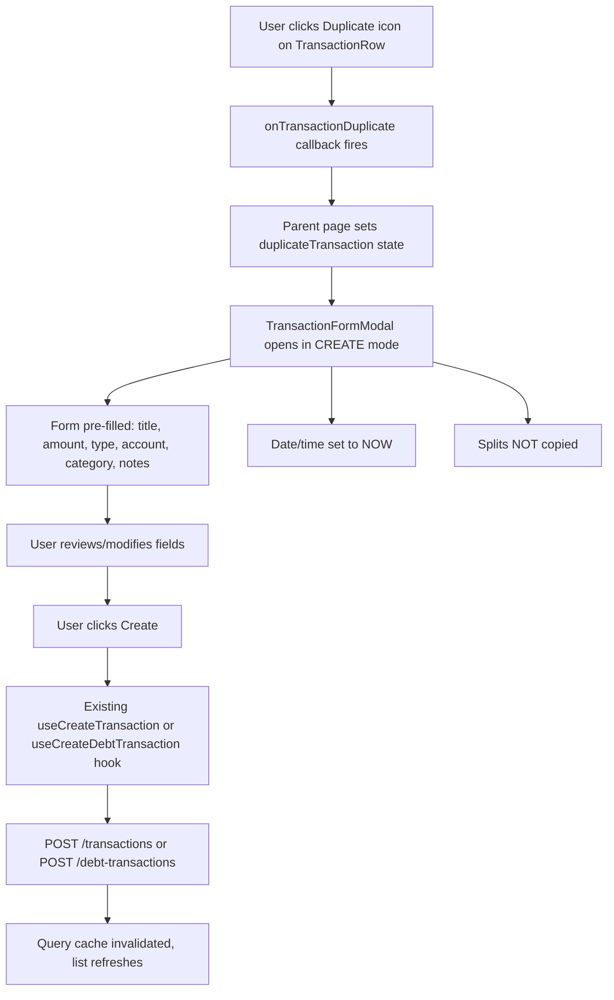

# Duplicate Transaction — Design

**Requirements**: [requirements.md](./requirements.md)
**Date**: 2026-04-04

## 1. Overview

This is a **frontend-only** feature. No backend changes, no new API endpoints, no database migrations. The duplicate action converts an existing transaction's data into a `CreateTransactionRequest` (or `CreateDebtTransactionRequest` for debt transactions) and opens the existing `TransactionFormModal` in create mode with pre-filled values.

The key architectural decision is to thread a new `onTransactionDuplicate` callback through the existing component hierarchy, mirroring the pattern already used by `onTransactionEdit` and `onTransactionDelete`.

## 2. Architecture

### 2.1 Data Flow



### 2.2 Key Design Decisions

1. **No new components** — We reuse `TransactionFormModal` which already supports both create and edit modes. Duplicate is essentially "create with pre-filled defaults".

2. **No `defaultValues` prop needed** — The modal already accepts a `transaction` prop for edit mode and a `defaultAccountId` prop. We'll add a new `defaultValues` prop that provides initial form values without putting the modal in edit mode (i.e., `transaction` remains `undefined`).

3. **Transfer transactions excluded** — Transfers involve two linked transactions across accounts. Duplicating them would require the `TransferFormModal`, which is a separate flow. The duplicate button will be hidden for transfer transactions.

## 3. Database Changes

None.

## 4. API Changes

None. Uses existing endpoints:

- `POST /api/v1/transactions` — for normal transactions
- `POST /api/v1/debt-transactions` — for debt transactions

## 5. Frontend Changes

### 5.1 Modified Components

#### 5.1.1 `TransactionFormModal` — Add `defaultValues` prop

Currently the modal determines initial form values from either:

- The `transaction` prop (edit mode) — sets all fields from the existing transaction
- Nothing (create mode) — uses empty defaults

We add a new optional `defaultValues` prop:

```typescript
interface TransactionFormDefaultValues {
  title?: string;
  amount?: string;
  transaction_type?: "income" | "expense";
  account_id?: string;
  category_id?: string;
  notes?: string;
  // For debt transactions:
  payer_mode?: PayerMode;
  payer_person_id?: string;
  payer_currency?: string;
}
```

When `defaultValues` is provided and `transaction` is `undefined`, the form opens in **create mode** but with pre-filled values. Date and time always default to "now".

**File**: [`frontend/src/components/transactions/TransactionFormModal.tsx`](frontend/src/components/transactions/TransactionFormModal.tsx)

#### 5.1.2 `TransactionRow` — Add duplicate button

Add an `onDuplicate` callback prop alongside the existing `onEdit` and `onDelete`. Render a copy/duplicate icon button next to the delete button. Hide it for transfer transactions.

**File**: [`frontend/src/components/transactions/TransactionRow.tsx`](frontend/src/components/transactions/TransactionRow.tsx)

#### 5.1.3 `TransactionList` — Thread `onTransactionDuplicate` callback

Add `onTransactionDuplicate` prop and pass it down to each `TransactionRow`.

**File**: [`frontend/src/components/transactions/TransactionList.tsx`](frontend/src/components/transactions/TransactionList.tsx)

#### 5.1.4 `TransactionActions` — Add duplicate button on detail page

Add an `onDuplicate` callback prop and render a "Duplicate" button alongside Edit and Delete.

**File**: [`frontend/src/components/transactions/detail/TransactionActions.tsx`](frontend/src/components/transactions/detail/TransactionActions.tsx)

#### 5.1.5 Pages — Wire up duplicate handler

Each page that displays transactions needs:

1. A `duplicateTransaction` state variable (similar to `editTransaction`)
2. A `handleDuplicateTransaction` callback that sets this state
3. A helper function to convert `EnrichedTransaction` → `TransactionFormDefaultValues`
4. Pass `defaultValues` to `TransactionFormModal`

**Pages to modify**:

- [`Transactions.tsx`](frontend/src/pages/Transactions.tsx) — Has full modal support already (create + edit)
- [`AccountDetail.tsx`](frontend/src/pages/AccountDetail.tsx) — Has create modal already
- [`TransactionDetail.tsx`](frontend/src/pages/TransactionDetail.tsx) — Has edit modal already

**Pages that need a new modal instance**:

- [`CategoryDetail.tsx`](frontend/src/pages/CategoryDetail.tsx) — Currently no TransactionFormModal
- [`PersonDetail.tsx`](frontend/src/pages/PersonDetail.tsx) — Currently no TransactionFormModal
- [`BudgetDetail.tsx`](frontend/src/pages/BudgetDetail.tsx) — Currently no TransactionFormModal

### 5.2 Helper Utility

Create a utility function to extract default values from a transaction:

```typescript
// frontend/src/utils/transactionDuplicate.ts
export function buildDuplicateDefaults(
  transaction: EnrichedTransaction,
): TransactionFormDefaultValues {
  const amount = parseFloat(transaction.amount);
  return {
    title: transaction.title,
    amount: Math.abs(amount).toString(),
    transaction_type: amount >= 0 ? "income" : "expense",
    account_id: transaction.account.id,
    category_id: transaction.category?.id,
    notes: transaction.notes,
    payer_mode: transaction.debt_metadata ? "other" : "self",
    payer_person_id: transaction.debt_metadata?.payer_person_id,
    payer_currency: transaction.debt_metadata
      ? transaction.account.currency
      : undefined,
  };
}
```

### 5.3 New Types

Add `TransactionFormDefaultValues` interface to the types:

**File**: [`frontend/src/types/models.ts`](frontend/src/types/models.ts) (or inline in the modal)

## 6. Error Handling

No new error handling needed — the existing `TransactionFormModal` already handles submission errors with `submitError` state and `ErrorAlert`.

## 7. Testing Strategy

- **Manual testing**: Test duplicate from each of the 6 pages (Transactions, Account Detail, Category Detail, Person Detail, Budget Detail, Transaction Detail)
- **Verify pre-fill**: Confirm title, amount, type, account, category, notes are pre-filled correctly
- **Verify date reset**: Confirm date/time defaults to now, not the source transaction's date
- **Verify create mode**: Confirm modal title says "Add Transaction", not "Edit Transaction"
- **Verify debt transactions**: Confirm payer mode and person are pre-filled for debt transactions
- **Verify transfers excluded**: Confirm duplicate button is hidden for transfer transactions
- **E2E tests**: Add a Playwright test for duplicating a transaction from the Transactions page
