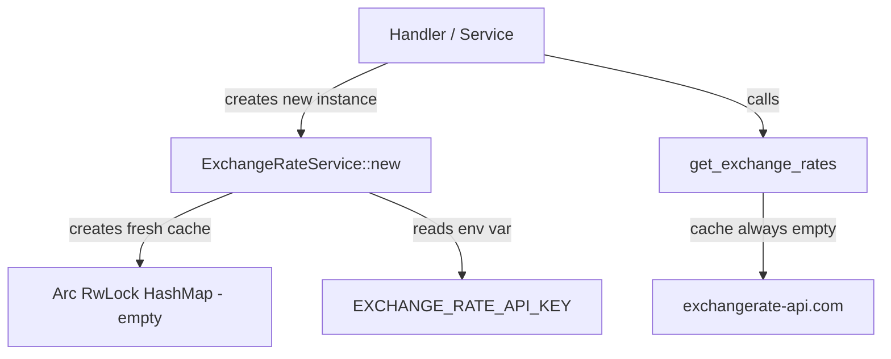
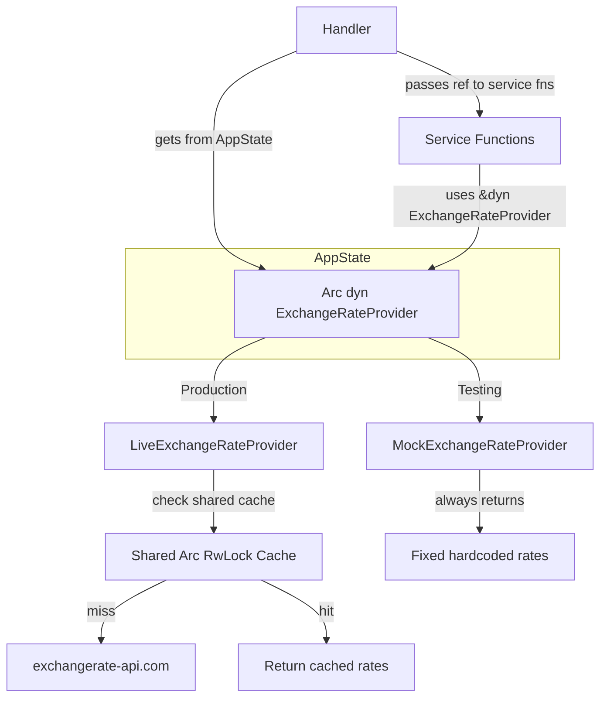

# Exchange Rate Test Mocking & Service Singleton — Design

**Requirements**: [requirements.md](./requirements.md)
**GitHub Issue**: N/A
**Date**: 2026-03-14

## 1. Overview

This design introduces a trait-based abstraction for exchange rate fetching, makes the `ExchangeRateService` a shared singleton in `AppState`, and provides a mock implementation for tests. This eliminates real API calls during testing and fixes the broken caching in production.

## 2. Architecture

### 2.1 Current Architecture — Problems



**Problems:**

- Every handler/service call creates a **new** `ExchangeRateService` with an **empty** cache
- The 24-hour cache duration is meaningless since the cache is never reused
- Tests make **real HTTP calls** to the external API
- Tests require `EXCHANGE_RATE_API_KEY` in the environment

### 2.2 New Architecture



### 2.3 Trait-Based Abstraction

The core change is introducing an `ExchangeRateProvider` trait that both the live and mock implementations satisfy:

```rust
#[async_trait]
pub trait ExchangeRateProvider: Send + Sync {
    /// Get exchange rates for a given base currency
    async fn get_exchange_rates(
        &self,
        base_currency: CurrencyCode,
    ) -> Result<HashMap<CurrencyCode, BigDecimal>, ApiError>;

    /// Convert an amount from one currency to another
    async fn convert_currency(
        &self,
        amount: &BigDecimal,
        from_currency: CurrencyCode,
        to_currency: CurrencyCode,
    ) -> Result<BigDecimal, ApiError>;

    /// Convert an amount to the primary currency
    async fn convert_to_primary_currency(
        &self,
        amount: &BigDecimal,
        from_currency: CurrencyCode,
    ) -> Result<BigDecimal, ApiError>;
}
```

## 3. Database Changes

None — this is a pure code refactor with no database changes.

## 4. API Changes

None — no API contract changes. The `/api/v1/exchange-rates` endpoint returns the same response format.

## 5. Code Changes

### 5.1 ExchangeRateProvider Trait

**File**: `backend/src/services/exchange_rate_service.rs`

Define the trait and provide default implementations for `convert_currency` and `convert_to_primary_currency` since they can be built on top of `get_exchange_rates`:

```rust
use async_trait::async_trait;

#[async_trait]
pub trait ExchangeRateProvider: Send + Sync {
    async fn get_exchange_rates(
        &self,
        base_currency: CurrencyCode,
    ) -> Result<HashMap<CurrencyCode, BigDecimal>, ApiError>;

    async fn convert_currency(
        &self,
        amount: &BigDecimal,
        from_currency: CurrencyCode,
        to_currency: CurrencyCode,
    ) -> Result<BigDecimal, ApiError> {
        if from_currency == to_currency {
            return Ok(amount.clone());
        }
        let rates = self.get_exchange_rates(from_currency).await?;
        let to_rate = rates.get(&to_currency).ok_or_else(|| {
            tracing::error!("No exchange rate found for {} to {}",
                from_currency.as_str(), to_currency.as_str());
            ApiError::Internal
        })?;
        Ok(amount * to_rate)
    }

    async fn convert_to_primary_currency(
        &self,
        amount: &BigDecimal,
        from_currency: CurrencyCode,
    ) -> Result<BigDecimal, ApiError> {
        self.convert_currency(amount, from_currency, PRIMARY_CURRENCY).await
    }
}
```

### 5.2 LiveExchangeRateProvider — renamed from ExchangeRateService

**File**: `backend/src/services/exchange_rate_service.rs`

The existing `ExchangeRateService` becomes `LiveExchangeRateProvider` and implements the trait. All existing logic (cache check, API fetch, rate parsing) stays the same:

```rust
pub struct LiveExchangeRateProvider {
    cache: Arc<RwLock<HashMap<CurrencyCode, CachedRates>>>,
    api_key: String,
    cache_duration: std::time::Duration,
}

impl LiveExchangeRateProvider {
    pub fn new() -> Result<Self, ApiError> {
        let api_key = env::var("EXCHANGE_RATE_API_KEY").map_err(|_| {
            tracing::error!("EXCHANGE_RATE_API_KEY environment variable not set");
            ApiError::Internal
        })?;
        Ok(Self {
            cache: Arc::new(RwLock::new(HashMap::new())),
            api_key,
            cache_duration: std::time::Duration::from_secs(86400),
        })
    }
}

#[async_trait]
impl ExchangeRateProvider for LiveExchangeRateProvider {
    async fn get_exchange_rates(
        &self,
        base_currency: CurrencyCode,
    ) -> Result<HashMap<CurrencyCode, BigDecimal>, ApiError> {
        // Existing cache-then-fetch logic (unchanged)
    }
}
```

### 5.3 MockExchangeRateProvider

**File**: `backend/src/services/exchange_rate_service.rs`

A mock provider that returns fixed, deterministic rates. This is **not** behind `#[cfg(test)]` — it lives in the main crate so the test binary (which is a separate crate) can use it:

```rust
/// Mock exchange rate provider for testing.
/// Returns fixed rates that never change, eliminating external API calls.
pub struct MockExchangeRateProvider {
    rates: HashMap<CurrencyCode, HashMap<CurrencyCode, BigDecimal>>,
}

impl MockExchangeRateProvider {
    /// Create with sensible default rates for testing
    pub fn new() -> Self {
        Self { rates: Self::default_rates() }
    }

    /// Create with custom rates
    pub fn with_rates(
        rates: HashMap<CurrencyCode, HashMap<CurrencyCode, BigDecimal>>
    ) -> Self {
        Self { rates }
    }

    fn default_rates() -> HashMap<CurrencyCode, HashMap<CurrencyCode, BigDecimal>> {
        // Build mathematically consistent rate tables for each base currency
        // See Section 6 for the full rate table
    }
}

#[async_trait]
impl ExchangeRateProvider for MockExchangeRateProvider {
    async fn get_exchange_rates(
        &self,
        base_currency: CurrencyCode,
    ) -> Result<HashMap<CurrencyCode, BigDecimal>, ApiError> {
        self.rates.get(&base_currency)
            .cloned()
            .ok_or(ApiError::Internal)
    }
}
```

### 5.4 AppState Changes

**File**: `backend/src/lib.rs`

Add the exchange rate provider to `AppState` as a shared `Arc<dyn ExchangeRateProvider>`:

```rust
use std::sync::Arc;
use services::exchange_rate_service::ExchangeRateProvider;

#[derive(Clone)]
pub struct AppState {
    pub db: DbPool,
    pub config: Config,
    pub split_sync: Option<services::split_sync_service::SplitSyncService>,
    pub exchange_rate_provider: Arc<dyn ExchangeRateProvider>,
}

impl AppState {
    /// Create AppState with the live exchange rate provider (production)
    pub fn new(db: DbPool, config: Config) -> Self {
        let split_sync = Some(services::split_sync_service::SplitSyncService::new(db.clone()));
        let exchange_rate_provider: Arc<dyn ExchangeRateProvider> =
            Arc::new(LiveExchangeRateProvider::new()
                .expect("Failed to create exchange rate provider"));
        Self { db, config, split_sync, exchange_rate_provider }
    }

    /// Create AppState with a custom exchange rate provider (for testing)
    pub fn with_exchange_provider(
        db: DbPool,
        config: Config,
        exchange_rate_provider: Arc<dyn ExchangeRateProvider>,
    ) -> Self {
        let split_sync = Some(services::split_sync_service::SplitSyncService::new(db.clone()));
        Self { db, config, split_sync, exchange_rate_provider }
    }
}
```

### 5.5 Handler Changes

**File**: `backend/src/handlers/exchange_rates.rs`

Get the provider from `AppState` instead of creating a new instance:

```rust
pub async fn get_exchange_rates(
    Extension(auth_context): Extension<AuthContext>,
    State(state): State<AppState>,
    Query(query): Query<ExchangeRateQuery>,
) -> Result<Json<ExchangeRateResponse>, ApiError> {
    let base_currency = query.base.unwrap_or(PRIMARY_CURRENCY);

    // Use shared provider from AppState
    let rates = state.exchange_rate_provider
        .get_exchange_rates(base_currency)
        .await?;

    // ... rest unchanged (convert to response format)
}
```

### 5.6 Service Function Changes

**Files**: `backend/src/services/analytics_service.rs`, `backend/src/services/budget_service.rs`

Service functions currently create their own `ExchangeRateService::new()`. Instead, they receive a **reference** (`&dyn ExchangeRateProvider`) from the handler that calls them. The handler has access to `AppState` and passes `&*state.exchange_rate_provider`:

```rust
// analytics_service.rs — Before:
pub async fn get_dashboard_summary(pool: &DbPool, user_id: Uuid) -> Result<...> {
    let exchange_service = ExchangeRateService::new()?;
    exchange_service.convert_to_primary_currency(&balance, currency).await?;
}

// analytics_service.rs — After:
pub async fn get_dashboard_summary(
    pool: &DbPool,
    user_id: Uuid,
    exchange_provider: &dyn ExchangeRateProvider,
) -> Result<...> {
    exchange_provider.convert_to_primary_currency(&balance, currency).await?;
}
```

**Why pass a reference instead of `Arc`?** The service functions don't need ownership — they only use the provider for the duration of the request. A `&dyn ExchangeRateProvider` reference is simpler, avoids unnecessary `Arc` cloning, and makes the dependency explicit without coupling services to the `Arc` wrapper.

The **handlers** that call these services extract the provider from `AppState` and pass a reference:

```rust
// In a handler:
let summary = analytics_service::get_dashboard_summary(
    &state.db,
    user_id,
    &*state.exchange_rate_provider,  // Arc<dyn T> -> &dyn T
).await?;
```

### 5.7 Test Server Changes

**File**: `backend/tests/integration/common/test_server.rs`

Use `MockExchangeRateProvider` when creating the test server:

```rust
use master_of_coin_backend::services::exchange_rate_service::{
    ExchangeRateProvider, MockExchangeRateProvider,
};

pub async fn create_test_server() -> TestServer {
    let config = create_test_config();
    let db_pool = create_test_db_pool();

    // Use mock exchange rate provider — no real API calls in tests
    let exchange_provider: Arc<dyn ExchangeRateProvider> =
        Arc::new(MockExchangeRateProvider::new());

    let state = AppState::with_exchange_provider(
        db_pool, config, exchange_provider
    );

    let app = create_router(state);
    TestServer::new(app).expect("Failed to create test server")
}
```

### 5.8 Live API Smoke Test

**File**: `backend/tests/integration/api/test_exchange_rates.rs`

Keep **one** test that makes a real API call to verify the live integration works. This test is marked `#[ignore]` so it doesn't run in normal `cargo test` but can be run explicitly with `cargo test -- --ignored` or in a dedicated CI step:

```rust
/// Smoke test that verifies the real exchange rate API integration works.
/// This test is ignored by default to avoid consuming API quota.
/// Run explicitly with: cargo test test_live_exchange_rate_api -- --ignored
#[tokio::test]
#[ignore]
async fn test_live_exchange_rate_api() {
    // This test requires EXCHANGE_RATE_API_KEY to be set
    dotenvy::from_filename("../.env").ok();

    let provider = LiveExchangeRateProvider::new()
        .expect("EXCHANGE_RATE_API_KEY must be set for this test");

    let rates = provider.get_exchange_rates(CurrencyCode::Eur).await
        .expect("Should fetch rates from live API");

    // Basic sanity checks
    assert!(rates.contains_key(&CurrencyCode::Usd));
    assert!(rates.contains_key(&CurrencyCode::Gbp));

    let usd_rate = rates.get(&CurrencyCode::Usd).unwrap();
    let usd_f64: f64 = usd_rate.to_string().parse().unwrap();
    assert!(usd_f64 > 0.5 && usd_f64 < 2.0, "USD rate should be reasonable");
}
```

### 5.9 Test Assertion Updates

Tests in `test_exchange_rates.rs` and `test_currency_conversion.rs` should be updated to use exact values based on the mock rates instead of ±10% tolerance ranges:

```rust
// Before (flaky, depends on real rates):
let expected_min = BigDecimal::from_str("2700").unwrap(); // 3000 - 10%
let expected_max = BigDecimal::from_str("3300").unwrap(); // 3000 + 10%

// After (deterministic with mock rates):
// EUR=1000, USD=1080/1.08=1000, GBP=850/0.85=1000 → net worth = 3000
let expected = BigDecimal::from_str("3000").unwrap();
```

## 6. Mock Rate Table

The mock provider will use these fixed rates (approximate real-world values):

| Base | EUR     | USD     | GBP     | JPY     | CAD     | AUD     | INR     |
| ---- | ------- | ------- | ------- | ------- | ------- | ------- | ------- |
| EUR  | 1.0     | 1.08    | 0.85    | 162.0   | 1.47    | 1.65    | 90.0    |
| USD  | 0.926   | 1.0     | 0.787   | 150.0   | 1.361   | 1.528   | 83.333  |
| GBP  | 1.176   | 1.271   | 1.0     | 190.588 | 1.729   | 1.941   | 105.882 |
| JPY  | 0.00617 | 0.00667 | 0.00525 | 1.0     | 0.00907 | 0.01019 | 0.5556  |
| CAD  | 0.680   | 0.735   | 0.578   | 110.204 | 1.0     | 1.122   | 61.224  |
| AUD  | 0.606   | 0.654   | 0.515   | 98.182  | 0.891   | 1.0     | 54.545  |
| INR  | 0.01111 | 0.012   | 0.00945 | 1.8     | 0.01633 | 0.01833 | 1.0     |

> Note: Rates are mathematically consistent — cross-rates are derived from EUR base rates.

## 7. Error Handling

- `LiveExchangeRateProvider::new()` returns `Result<Self, ApiError>` — fails if `EXCHANGE_RATE_API_KEY` is not set (production only)
- `MockExchangeRateProvider::new()` is infallible — always succeeds
- `AppState::new()` will panic if the live provider can't be created (same as current behavior)
- `AppState::with_exchange_provider()` accepts any provider, no fallibility

## 8. Testing Strategy

### 8.1 What Changes

- **All integration tests** automatically use `MockExchangeRateProvider` via the test server
- **No `EXCHANGE_RATE_API_KEY` needed** in test environment for normal test runs
- **Deterministic results** — tests can assert exact values instead of ranges

### 8.2 Tests to Update

1. **`test_exchange_rates.rs`** — Update assertions to match mock rate values exactly; add `#[ignore]` live smoke test
2. **`test_currency_conversion.rs`** — Replace ±10% tolerance with exact expected values based on mock rates
3. **`test_budget_spending.rs`** — No changes needed (uses EUR-only accounts)

### 8.3 New Tests

- `#[ignore] test_live_exchange_rate_api` — Smoke test for real API (run manually or in dedicated CI)
- Unit test for `MockExchangeRateProvider` — verify it returns correct rates for all base currencies
- Unit test for trait default methods — verify `convert_currency` and `convert_to_primary_currency`

## 9. Dependency Changes

Add `async-trait` crate to `Cargo.toml` (if not already present) for the `#[async_trait]` macro on the trait definition.
