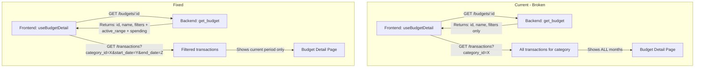

# Fix Budget Date Filtering — Design

**Requirements**: [requirements.md](./requirements.md)
**GitHub Issue**: [#48](https://github.com/abhijred/master-of-coin/issues/48)
**Date**: 2026-03-06

## 1. Overview

This fix addresses two interconnected bugs that cause the budget detail page to show transactions from all time instead of only the current budget period. The backend `GET /budgets/:id` endpoint needs to return the active date range and computed spending fields, and the frontend hook needs to use those dates when querying transactions.

The fix reuses existing infrastructure on both sides — the backend already has `get_active_range()` and `calculate_budget_status()` with correct date logic, and the frontend `QueryParams` type already defines `start_date`/`end_date` fields.

## 2. Architecture

### 2.1 Data Flow — Current vs Fixed



### 2.2 Fix Strategy

The fix follows a two-phase approach:

1. **Backend**: Extend `BudgetResponse` and `get_budget()` to include `active_range`, `current_spending`, and `percentage` — reusing logic from `calculate_budget_status()`.
2. **Frontend**: Update `useBudgetDetail.ts` to extract `start_date`/`end_date` from `budget.active_range` and pass them to the transaction query.

## 3. Database Changes

### 3.1 New Tables

None — no database changes required.

### 3.2 Migrations

None required.

### 3.3 Models

No new models. Only the `BudgetResponse` struct needs additional optional fields.

## 4. API Changes

### 4.1 New Endpoints

None.

### 4.2 Modified Endpoints

#### `GET /budgets/:id` — Enhanced Response

The response will include three new optional fields. They are optional because a budget may not have an active range for the current date.

**Before:**

```json
{
  "id": "uuid",
  "user_id": "uuid",
  "name": "Monthly Groceries",
  "filters": { "category_id": "uuid" }
}
```

**After:**

```json
{
  "id": "uuid",
  "user_id": "uuid",
  "name": "Monthly Groceries",
  "filters": { "category_id": "uuid" },
  "active_range": {
    "id": "uuid",
    "budget_id": "uuid",
    "limit_amount": "500.00",
    "period": "MONTHLY",
    "start_date": "2026-03-01",
    "end_date": null
  },
  "current_spending": "123.45",
  "percentage_used": 24.69
}
```

**Field details:**

| Field              | Type                          | Description                                                   |
| ------------------ | ----------------------------- | ------------------------------------------------------------- |
| `active_range`     | `BudgetRangeResponse \| null` | The budget range active for today's date, or null if none     |
| `current_spending` | `string \| null`              | Total absolute expense spending in the active period, or null |
| `percentage_used`  | `number \| null`              | Percentage of limit used (0.0–100.0+), or null                |

## 5. Backend Changes

### 5.1 `BudgetResponse` Struct — [`backend/src/models/budget.rs`](backend/src/models/budget.rs)

Add three new optional fields to the existing struct:

```rust
#[derive(Debug, Serialize, Deserialize)]
pub struct BudgetResponse {
    pub id: Uuid,
    pub user_id: Uuid,
    pub name: String,
    pub filters: JsonValue,
    pub active_range: Option<BudgetRangeResponse>,
    pub current_spending: Option<String>,
    pub percentage_used: Option<f64>,
}
```

The `From<Budget>` impl will set these to `None` by default (preserving backward compatibility for `list_budgets` and `create_budget`). The `get_budget()` service function will populate them.

### 5.2 `get_budget()` Function — [`backend/src/services/budget_service.rs`](backend/src/services/budget_service.rs:55)

After fetching the budget and verifying ownership, add logic to:

1. Call `repositories::budget::get_active_range(pool, budget_id, today)` to get the active range
2. If an active range exists:
   - Build a `TransactionFilter` with `start_date` and `end_date` from the range (reuse pattern from `calculate_budget_status()`)
   - Apply budget category/account filters from `budget.filters` JSON
   - Query transactions and sum negative amounts (expenses), converting currencies via `ExchangeRateService`
   - Calculate percentage used
3. Construct `BudgetResponse` with the populated fields

This reuses the exact same logic already proven in [`calculate_budget_status()`](backend/src/services/budget_service.rs:212), just integrated into `get_budget()`.

### 5.3 Files Changed

| File                                                                               | Change                                                                     |
| ---------------------------------------------------------------------------------- | -------------------------------------------------------------------------- |
| [`backend/src/models/budget.rs`](backend/src/models/budget.rs)                     | Add 3 optional fields to `BudgetResponse`, update `From<Budget>` impl      |
| [`backend/src/services/budget_service.rs`](backend/src/services/budget_service.rs) | Enhance `get_budget()` to populate active_range, spending, percentage_used |

## 6. Frontend Changes

### 6.1 New Components

None.

### 6.2 New Hooks

None.

### 6.3 New Services

None.

### 6.4 Modified Hooks

#### `useBudgetDetail` — [`frontend/src/hooks/usecase/useBudgetDetail.ts`](frontend/src/hooks/usecase/useBudgetDetail.ts)

The `transactionQueryParams` memo (line 31–38) currently only passes `category_id`:

```typescript
// CURRENT (broken)
const transactionQueryParams = useMemo(() => {
  if (!budget) return undefined;
  const params: Record<string, string | undefined> = {};
  if (budget.filters?.category_id) {
    params.category_id = budget.filters.category_id;
  }
  return params;
}, [budget]);
```

**Fix**: Add `start_date` and `end_date` from `budget.active_range`:

```typescript
// FIXED
const transactionQueryParams = useMemo(() => {
  if (!budget) return undefined;
  const params: Record<string, string | undefined> = {};
  if (budget.filters?.category_id) {
    params.category_id = budget.filters.category_id;
  }
  // Scope transactions to the active budget period
  if (budget.active_range) {
    params.start_date = budget.active_range.start_date;
    params.end_date = budget.active_range.end_date;
  }
  return params;
}, [budget]);
```

This works because:

- The frontend [`Budget`](frontend/src/types/models.ts:247) type already defines `active_range?: BudgetRange` with `start_date` and `end_date`
- The [`QueryParams`](frontend/src/types/api.ts:26) type already defines `start_date?` and `end_date?`
- The backend `TransactionFilter` already supports these date fields in the query

### 6.5 Modified Types

#### `Budget` interface — [`frontend/src/types/models.ts`](frontend/src/types/models.ts:247)

Rename `percentage` to `percentage_used` to match the backend response field name:

```typescript
export interface Budget {
  // ... existing fields ...
  percentage_used?: number; // was: percentage?: number
  // ...
}
```

### 6.6 Files Changed

| File                                                                                             | Change                                                                             |
| ------------------------------------------------------------------------------------------------ | ---------------------------------------------------------------------------------- |
| [`frontend/src/hooks/usecase/useBudgetDetail.ts`](frontend/src/hooks/usecase/useBudgetDetail.ts) | Add `start_date`/`end_date` from `budget.active_range` to `transactionQueryParams` |
| [`frontend/src/types/models.ts`](frontend/src/types/models.ts:253)                               | Rename `percentage` to `percentage_used` in `Budget` interface                     |

## 7. Error Handling

- If no active range exists for today's date, `active_range`, `current_spending`, and `percentage_used` will be `null` in the response. The frontend already handles these as optional fields.
- If the frontend receives a budget without `active_range`, the transaction query will behave as before (no date filtering) — a graceful degradation.
- Currency conversion errors in spending calculation will propagate as `ApiError` from the existing `ExchangeRateService`.

## 8. Testing Strategy

### 8.1 Backend Testing

- Verify `GET /budgets/:id` returns `active_range`, `current_spending`, and `percentage_used` when an active range exists
- Verify these fields are `null` when no active range exists for today
- Verify spending calculation only includes transactions within the date range
- Run existing budget service tests to ensure no regressions

### 8.2 Frontend Testing

- Run E2E tests for the budget detail page
- Verify the transaction list only shows current-period transactions
- Take screenshots for visual verification before and after the fix

### 8.3 Integration Testing

- Create a budget with a monthly range, add transactions in current and previous months
- Confirm the budget detail page shows only current month transactions
- Confirm spending amount matches only current month expenses
