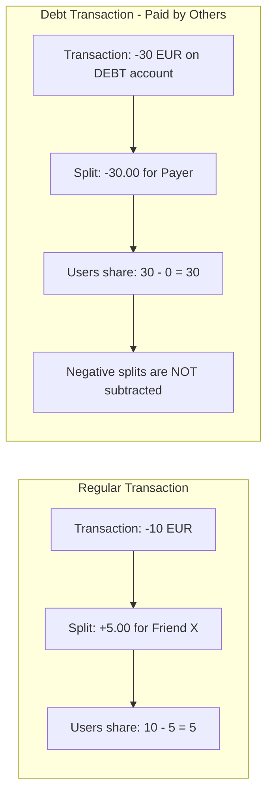
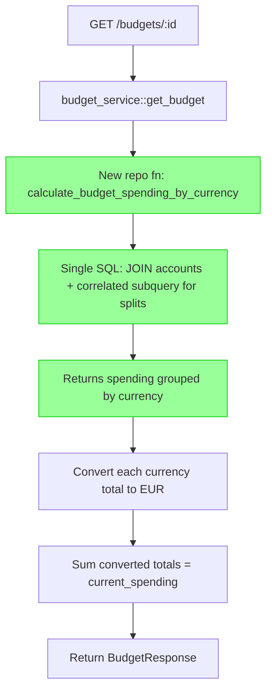

# Fix Budget Spending Split Calculation — Design

**Requirements**: [requirements.md](./requirements.md)
**Date**: 2026-03-07

## 1. Overview

The budget service calculates spending by summing `transaction.amount.abs()` for all expense transactions matching the budget's filters. It does not account for transaction splits - amounts that friends owe the user. The fix replaces the current N+1 query loop with a single SQL query that:

1. JOINs transactions with accounts (to get currency) and LEFT JOINs with transaction_splits
2. Computes the user's share per transaction in SQL: `ABS(amount) - COALESCE(SUM(positive splits), 0)`
3. Groups by currency and sums the user's shares per currency

The service layer then only needs to do one currency conversion per distinct currency (typically 1-2 conversions total).

Debt transactions ("paid by others") have splits with **negative** amounts for debt tracking. These must NOT be subtracted — the transaction amount already represents the user's share.

## 2. Architecture

### 2.1 Two Types of Splits



### 2.2 Single-Query Approach

The entire budget spending calculation is done in one SQL query that returns spending grouped by currency:

```sql
SELECT
    a.currency,
    SUM(
        ABS(t.amount) - COALESCE(
            (SELECT SUM(ts.amount)
             FROM transaction_splits ts
             WHERE ts.transaction_id = t.id AND ts.amount > 0),
            0
        )
    ) AS total_user_spending
FROM transactions t
JOIN accounts a ON a.id = t.account_id
WHERE t.user_id = $1
  AND t.amount < 0
  AND t.category_id = $2        -- optional budget filter
  AND t.date >= $3              -- budget range start
  AND t.date <= $4              -- budget range end
GROUP BY a.currency
```

This returns rows like:

```
| currency | total_user_spending |
|----------|---------------------|
| EUR      | 37.00               |
| USD      | 12.50               |
```

The service layer then converts each currency total to the primary currency (EUR) — typically just 1-2 conversions.

### 2.3 Fixed Flow



## 3. Database Changes

**None required.** No new tables, columns, or migrations. The fix uses existing tables with a new query pattern.

## 4. API Changes

### 4.1 Modified Behavior — No Contract Changes

The API contract for `GET /api/v1/budgets/:id` remains identical. The only change is the **value** of `current_spending` and `percentage_used`.

| Field              | Before Fix                  | After Fix                                      |
| ------------------ | --------------------------- | ---------------------------------------------- |
| `current_spending` | Full transaction amount sum | User's share after subtracting positive splits |
| `percentage_used`  | Based on full amounts       | Based on user's shares                         |

## 5. Backend Changes

### 5.1 New Repository Function: `backend/src/repositories/budget.rs`

Add a new function `calculate_spending_by_currency` that executes the single SQL query described in section 2.2.

**Signature:**

```rust
pub async fn calculate_spending_by_currency(
    pool: &DbPool,
    user_id: Uuid,
    filter: &TransactionFilter,
) -> Result<Vec<CurrencySpending>, ApiError>
```

**Return type:**

```rust
pub struct CurrencySpending {
    pub currency: CurrencyCode,
    pub total_user_spending: BigDecimal,
}
```

**Implementation approach:** Use `diesel::sql_query` with a raw SQL query since the correlated subquery for conditional split aggregation is complex to express in Diesel's DSL. This is a read-only query with parameterized inputs, so raw SQL is safe and maintainable.

### 5.2 Modified: `backend/src/services/budget_service.rs`

#### 5.2.1 `get_budget()` — Replace the entire spending loop

**Before** (lines 112-129): N+1 queries — loads transactions, then per-transaction loads account and sums amount.

**After:** Single call to the new repository function + currency conversion:

```rust
let spending_by_currency = repositories::budget::calculate_spending_by_currency(
    pool, user_id, &filter
).await?;

let exchange_service = ExchangeRateService::new()?;
let mut current_spending = BigDecimal::from(0);

for row in &spending_by_currency {
    let converted = exchange_service
        .convert_to_primary_currency(&row.total_user_spending, row.currency)
        .await?;
    current_spending += converted;
}
```

This replaces ~N+1 queries with 1 query + ~1-2 currency conversions.

#### 5.2.2 `calculate_budget_status()` — Same change

Apply the identical pattern to replace the spending loop in `calculate_budget_status()`.

### 5.3 Key Design Decisions

1. **Single SQL query with correlated subquery** — Computes split-adjusted spending per currency in one database round-trip. The correlated subquery `(SELECT SUM(ts.amount) FROM transaction_splits ts WHERE ts.transaction_id = t.id AND ts.amount > 0)` is efficient because `transaction_splits.transaction_id` is indexed (foreign key).

2. **Only subtract positive splits** — The `WHERE ts.amount > 0` clause ensures only regular splits (positive amounts) are summed. Debt transaction splits (negative amounts) are excluded.

3. **Group by currency** — Instead of converting per-transaction, we sum per-currency in SQL and only convert the totals. This reduces currency conversion calls from N to the number of distinct currencies (typically 1-2).

4. **Raw SQL via `diesel::sql_query`** — The conditional aggregation with correlated subquery is complex in Diesel's type-safe DSL. Raw SQL is clearer, well-tested, and safe with parameterized inputs.

5. **No changes to `list_budgets()`** — The list endpoint doesn't compute spending.

## 6. Frontend Changes

**None required.** The frontend already correctly displays `current_spending` from the backend response.

## 7. Error Handling

No new error cases. COALESCE handles NULL (no splits) → 0. Empty result set means zero spending.

## 8. Testing Strategy

### 8.1 Existing Tests — Already Written

| Test                                             | Expected Result                            |
| ------------------------------------------------ | ------------------------------------------ |
| `test_budget_spending_accounts_for_splits`       | Currently FAILS → should PASS              |
| `test_budget_spending_mixed_splits`              | Currently FAILS → should PASS              |
| `test_budget_spending_without_splits`            | Currently PASSES → should continue to PASS |
| `test_budget_detail_shows_matching_transactions` | Currently PASSES → should continue to PASS |
| `test_budget_transactions_include_split_data`    | Currently PASSES → should continue to PASS |

### 8.2 New Test — Debt Transaction with Budget

Add `test_budget_spending_with_debt_transaction` to verify:

- A debt transaction with a matching category is included in spending
- The full transaction amount (user's share) is counted, not zero
- The negative split is NOT subtracted

### 8.3 Regression Testing

```bash
cd backend && cargo test --test integration_api test_budget
cd backend && cargo test
```
