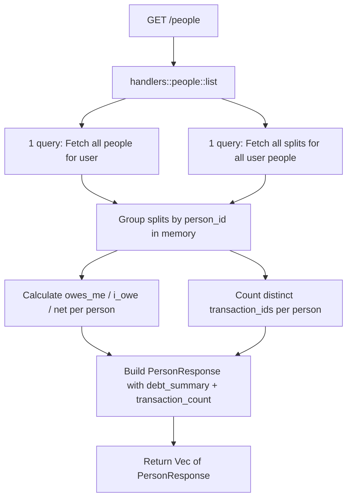

# Fix Person Debt Summary — Design

**Requirements**: [requirements.md](./requirements.md)
**Date**: 2026-04-01

## 1. Overview

The fix requires adding `debt_summary` and `transaction_count` fields to the backend `PersonResponse` struct, then populating them in the `list` and `get` handlers by leveraging existing debt calculation logic.

No database migrations are needed — all required data already exists in the `transaction_splits` table.

## 2. Architecture



This uses **2 queries total** (not N+1) — one for people, one for all their splits. For `GET /people/:id`, it's also 2 queries (one for the person, one for their splits).

## 3. Database Changes

**None.** All data is already available in the `transaction_splits` table. Each split has:

- `person_id` — links to the person
- `amount` — positive means they owe you, negative means you owe them
- `transaction_id` — links to the parent transaction

## 4. API Changes

### 4.1 Modified Endpoints

#### `GET /people` — List all people

**Current response** per person:

```json
{
  "id": "uuid",
  "user_id": "uuid",
  "name": "string",
  "email": "string|null",
  "phone": "string|null",
  "notes": "string|null",
  "split_config": "object|null"
}
```

**New response** per person:

```json
{
  "id": "uuid",
  "user_id": "uuid",
  "name": "string",
  "email": "string|null",
  "phone": "string|null",
  "notes": "string|null",
  "debt_summary": {
    "owes_me": "string",
    "i_owe": "string",
    "net": "string"
  },
  "transaction_count": 0,
  "split_config": "object|null"
}
```

- `debt_summary.owes_me` — sum of positive split amounts (they owe you)
- `debt_summary.i_owe` — sum of absolute values of negative split amounts (you owe them)
- `debt_summary.net` — total sum of all split amounts (positive = net owed to you, negative = net you owe)
- `transaction_count` — number of distinct transactions with splits for this person
- `debt_summary` is always present (not optional) — defaults to zeros if no splits exist

#### `GET /people/:id` — Get single person

Same changes as above for the single person response.

## 5. Backend Changes

### 5.1 Model Changes — [`backend/src/models/person.rs`](backend/src/models/person.rs)

Add a new `DebtSummaryResponse` struct:

```rust
#[derive(Debug, Clone, Serialize, Deserialize)]
pub struct DebtSummaryResponse {
    pub owes_me: String,
    pub i_owe: String,
    pub net: String,
}
```

Add two fields to `PersonResponse`:

```rust
pub struct PersonResponse {
    // ... existing fields ...
    pub debt_summary: Option<DebtSummaryResponse>,
    pub transaction_count: i64,
    // ... split_config ...
}
```

Update the `From<Person>` impl to default these to `None` / `0`.

Export `DebtSummaryResponse` from [`backend/src/models/mod.rs`](backend/src/models/mod.rs).

### 5.2 Repository Changes — [`backend/src/repositories/person.rs`](backend/src/repositories/person.rs)

Add a new batch function to fetch all splits for multiple people at once:

```rust
pub async fn list_splits_for_people(
    pool: &DbPool,
    person_ids: &[Uuid],
) -> Result<Vec<TransactionSplit>, ApiError>
```

This queries `transaction_splits` table with `WHERE person_id = ANY(person_ids)`, returning all splits in a single query. The handler then groups them by `person_id` in memory.

### 5.3 Handler Changes — [`backend/src/handlers/people.rs`](backend/src/handlers/people.rs)

#### `list` handler

Currently:

```rust
let people = repositories::person::list_by_user(&state.db, user_id).await?;
let responses: Vec<PersonResponse> = people.into_iter().map(|p| p.into()).collect();
```

Updated approach (2 queries total, no N+1):

1. Fetch all people (1 query)
2. Collect all person IDs, fetch all splits in one batch query via `list_splits_for_people` (1 query)
3. Group splits by `person_id` using a `HashMap<Uuid, Vec<TransactionSplit>>`
4. For each person, calculate `owes_me`, `i_owe`, `net` from their grouped splits (using BigDecimal)
5. Count distinct `transaction_id` values per person for `transaction_count`
6. Populate `debt_summary` and `transaction_count` on each `PersonResponse`

#### `get` handler

For a single person (2 queries):

1. Fetch the person (1 query)
2. Fetch their splits via existing `list_splits_for_person` (1 query)
3. Calculate and populate `debt_summary` and `transaction_count`

### 5.4 Debt Calculation Logic

For each person's splits:

- **owes_me**: sum of `split.amount` where `amount > 0`
- **i_owe**: sum of `abs(split.amount)` where `amount < 0`
- **net**: sum of all `split.amount` values
- **transaction_count**: count of distinct `split.transaction_id` values

This matches the existing logic in [`debt_service::calculate_debt_for_person`](backend/src/services/debt_service.rs:22) and [`analytics_service::get_debt_overview`](backend/src/services/analytics_service.rs:357).

## 6. Frontend Changes

### 6.1 Expected: No Changes Needed

The frontend `Person` type already defines:

- `debt_summary?: { owes_me: string, i_owe: string, net: string }`
- `transaction_count: number`

Components [`PersonCard`](frontend/src/components/people/PersonCard.tsx), [`PersonInfoCard`](frontend/src/components/people/PersonInfoCard.tsx), and [`DebtSummary`](frontend/src/components/people/DebtSummary.tsx) already read these fields.

Once the backend returns the data, the frontend should display it correctly without code changes.

### 6.2 Verification

After the backend fix, verify in the browser that:

- People page shows correct balances per person
- Person Detail page shows correct Owes Me / I Owe / Net Balance
- DebtSummary aggregate card shows correct totals

## 7. Error Handling

No new error cases. The existing error handling for database queries applies. If a person has no splits, the debt summary defaults to all zeros.

## 8. Testing Strategy

- Verify the fix manually by checking the People page in the browser
- Existing E2E tests in [`e2e/tests/people/people.spec.ts`](e2e/tests/people/people.spec.ts) should continue to pass
- Backend compilation check to ensure no type mismatches
