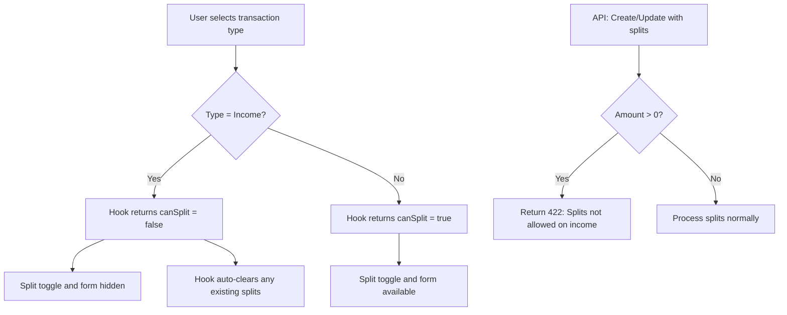

# Hide Split Option for Income Transactions — Design

**Requirements**: [requirements.md](./requirements.md)
**GitHub Issue**: [#53](https://github.com/abhijeet-reddy/master-of-coin/issues/53)
**Date**: 2026-03-11

## 1. Overview

This change prevents splits from being used on income transactions. It spans two layers:

1. **Backend**: Add validation to reject splits when the transaction amount is positive (income) — in both the model-level validator for create and the service layer for update.
2. **Frontend**: Extract split state management into a custom hook that encapsulates the income-awareness logic, then use it in the form modal.

## 2. Architecture

No new database tables, API endpoints, or major components are needed. This is a behavior modification to existing code.



## 3. Database Changes

None required.

## 4. API Changes

### 4.1 Modified Validation — Create

The existing [`validate_transaction_request`](backend/src/models/transaction.rs:114) schema-level validator on `CreateTransactionRequest` will be extended. Before validating individual splits, it will check if the amount is positive and splits are non-empty, returning a validation error if so.

### 4.2 Modified Validation — Update

The [`update_transaction`](backend/src/services/transaction_service.rs:251) service function will add a check after determining the effective amount (updated or existing). If the effective amount is positive and splits are provided, it returns an `ApiError::Validation`.

This follows the Rust rules pattern of keeping validation in the appropriate layer — model-level for create (where all data is available), service-level for update (where we need the existing transaction's amount as context).

## 5. Frontend Changes

### 5.1 New Hook

**`useTransactionSplitState`** — A custom hook in `frontend/src/hooks/usecase/` that encapsulates all split-related state and the income-awareness logic.

**Responsibilities:**

- Manages `isSplitEnabled` and `splits` state (2 useState — within limits for a hook)
- Exposes `canSplit` derived boolean based on transaction type
- Provides `toggleSplit()`, `clearSplits()`, and `setSplits()` actions
- Auto-clears splits when transaction type changes to income
- Initializes from existing transaction data when editing

**Interface:**

```typescript
interface UseTransactionSplitStateProps {
  transactionType: "income" | "expense";
  payerMode: PayerMode;
  initialSplits?: TransactionSplitRequest[];
  isDebtTransaction?: boolean;
}

interface UseTransactionSplitStateReturn {
  isSplitEnabled: boolean;
  splits: TransactionSplitRequest[];
  canSplit: boolean; // false when income or payer_mode !== 'self'
  toggleSplit: () => void;
  setSplits: (splits: TransactionSplitRequest[]) => void;
  clearSplits: () => void;
}
```

This follows React Rule 2 (extract logic to hooks) and Rule 3 (limit useState in components — moves 2 useState out of the component).

### 5.2 Modified Components

#### `TransactionFormModal` ([`frontend/src/components/transactions/TransactionFormModal.tsx`](frontend/src/components/transactions/TransactionFormModal.tsx))

**Changes:**

1. Add `watch('transaction_type')` to existing watches
2. Replace inline `isSplitEnabled`/`splits` state with the new `useTransactionSplitState` hook
3. Use `canSplit` from the hook to conditionally render the split toggle and form
4. Remove the inline `handleSplitToggle` function (replaced by `toggleSplit` from hook)
5. Update `handlePayerModeChange` to call `clearSplits()` from hook instead of directly setting state

This reduces the component's useState count and moves business logic out of the component per React Rules 2 and 3.

## 6. Error Handling

- **Backend Create**: Returns `422 Validation Error` with message `"Splits are not allowed on income transactions"` via the existing `validate_transaction_request` function.
- **Backend Update**: Returns `400 Bad Request` via `ApiError::Validation` with the same message, checked in the service layer after resolving the effective amount.
- **Frontend**: The split UI is hidden for income transactions, so users cannot trigger this error through the UI. The backend validation serves as a safety net for direct API calls.

## 7. Testing Strategy

### Backend

- Add integration test: create income transaction with splits → expect 422 error
- Add integration test: update transaction to income amount with splits → expect validation error
- Verify existing expense-with-splits tests still pass (no regression)

### Frontend

- Manual browser testing per `.agents/testing/testing-front-end.md`:
  - Create income transaction → verify split toggle is not visible
  - Switch expense → income while splits enabled → verify splits cleared and toggle hidden
  - Switch income → expense → verify split toggle reappears and can be enabled
  - Edit existing expense with splits → verify splits display correctly
