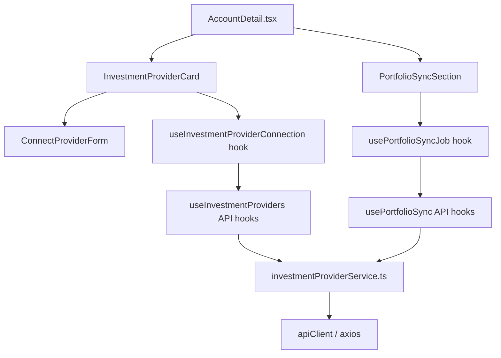

# Investment Portfolio Sync UI — Design

**Requirements**: [requirements.md](./requirements.md)
**GitHub Issue**: [#50](https://github.com/abhijeet-reddy/master-of-coin/issues/50)
**Date**: 2026-03-15

## 1. Overview

The frontend adds an investment provider management section to the Account Detail page for INVESTMENT accounts, and integrates the `PORTFOLIO_SYNC` job type into the existing Jobs and Schedules pages. It follows the established layered architecture: Types → Service → API Hooks → Usecase Hooks → Components → Page Integration.

## 2. Architecture

## 3. New Files

### 3.1 Types

**`frontend/src/types/investmentProvider.ts`** — TypeScript types matching backend DTOs:

- `InvestmentProviderType` enum (`TRADING_212`)
- `InvestmentProvider` interface
- `ConnectInvestmentProviderRequest` interface
- `PortfolioSyncRequest`, `StartPortfolioSyncResponse`, `PortfolioSyncJobResponse`
- `PortfolioSyncReport`, `AccountSyncResult`

### 3.2 Service

**`frontend/src/services/investmentProviderService.ts`** — API client (pattern from `driftService.ts`):

- `connectProvider(request)` → `POST /investment-providers`
- `listProviders()` → `GET /investment-providers`
- `disconnectProvider(id)` → `DELETE /investment-providers/:id`
- `startPortfolioSync(request)` → `POST /portfolio-sync`
- `getPortfolioSyncJob(jobId)` → `GET /portfolio-sync/:jobId`
- `retryPortfolioSync(jobId)` → `POST /portfolio-sync/:jobId/retry`

### 3.3 Hooks

**API Hooks** (`frontend/src/hooks/api/useInvestmentProviders.ts` and `usePortfolioSync.ts`):

- `useInvestmentProviders()` — React Query query
- `useConnectInvestmentProvider()` — mutation
- `useDisconnectInvestmentProvider()` — mutation
- `useStartPortfolioSync()` — mutation
- `usePortfolioSyncJob(jobId)` — query with polling
- `useRetryPortfolioSync()` — mutation

**Usecase Hooks** (`frontend/src/hooks/usecase/`):

- `useInvestmentProviderConnection(accountId)` — connect/disconnect lifecycle with toasts
- `usePortfolioSyncJob(accountId)` — sync trigger → poll → display result

### 3.4 Components

**`frontend/src/components/accounts/ConnectProviderForm.tsx`** — Form with API Key, API Secret, Environment inputs
**`frontend/src/components/accounts/InvestmentProviderCard.tsx`** — Provider status card with connect/disconnect
**`frontend/src/components/accounts/PortfolioSyncSection.tsx`** — Sync button, status display, result card

## 4. Modified Files

### 4.1 Types

**`frontend/src/types/jobs.ts`** — Add `PORTFOLIO_SYNC = 'PORTFOLIO_SYNC'` to `JobType` enum
**`frontend/src/types/index.ts`** — Add `export * from './investmentProvider'`

### 4.2 Jobs Page Components

**`frontend/src/pages/Jobs.tsx`** — Add `PORTFOLIO_SYNC` to job type filter options
**`frontend/src/components/jobs/JobTypeBadge.tsx`** — Add `PORTFOLIO_SYNC` config (label + color)
**`frontend/src/components/jobs/JobHistoryList.tsx`** — Add `PORTFOLIO_SYNC` route mapping and summary formatter

### 4.3 Schedules Page Components

**`frontend/src/components/schedules/ScheduleFormModal.tsx`** — Add `PORTFOLIO_SYNC` to job type dropdown
**`frontend/src/components/schedules/ScheduleCard.tsx`** — Add `PORTFOLIO_SYNC` config (label + color)
**`frontend/src/pages/ScheduleDetail.tsx`** — Add `PORTFOLIO_SYNC` to job type labels

### 4.4 Account Detail Page

**`frontend/src/pages/AccountDetail.tsx`** — Conditionally render investment provider section for INVESTMENT accounts

## 5. Key Design Decisions

1. **Components fetch their own data** — `InvestmentProviderCard` and `PortfolioSyncSection` take only `accountId` as a prop
2. **Polling for sync status** — React Query `refetchInterval` while job is PENDING/RUNNING
3. **Toast notifications** — Success/error toasts for connect, disconnect, and sync operations
4. **Reuse existing patterns** — Schedule form already supports job types; just add the new enum value
