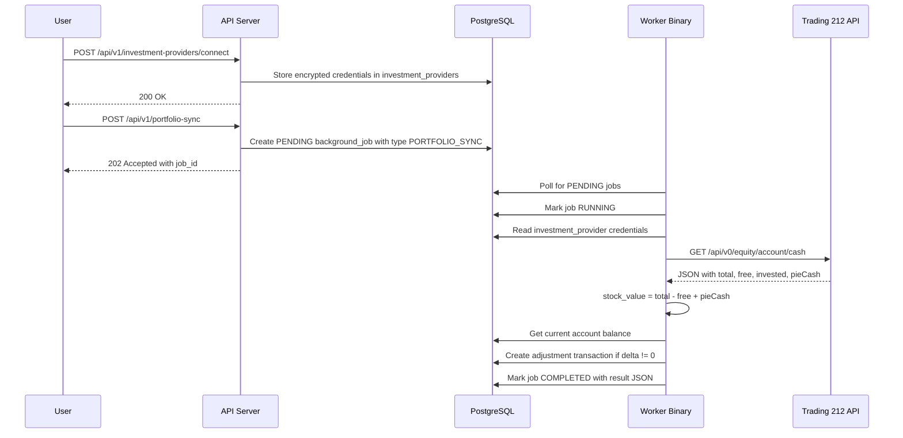

# Investment Portfolio Sync — Design

**Requirements**: [requirements.md](./requirements.md)
**GitHub Issue**: [#50](https://github.com/abhijeet-reddy/master-of-coin/issues/50)
**Date**: 2026-03-14

## 1. Overview

This feature adds a new background job type (`PORTFOLIO_SYNC`) that fetches the current invested stock value (excluding uninvested cash) from a brokerage API and reconciles the investment account balance by creating an adjustment transaction. The architecture follows a pluggable provider pattern — a Rust trait `InvestmentProvider` with a Trading 212 implementation — mirroring the existing `SplitProvider` pattern used for Splitwise/SplitPro integrations.

### High-Level Flow



## 2. Architecture

### 2.1 Investment Provider Trait

A new trait `InvestmentProvider` defines the interface for brokerage integrations. This is intentionally simpler than `SplitProvider` since we only need to read portfolio values.

```rust
#[async_trait]
pub trait InvestmentProvider: Send + Sync {
    /// Provider name identifier
    fn provider_type(&self) -> InvestmentProviderType;

    /// Fetch the total invested stock value from the brokerage.
    /// Returns only the stock/position value (excludes uninvested cash).
    async fn get_portfolio_value(
        &self,
        credentials: &serde_json::Value,
    ) -> Result<PortfolioSnapshot, InvestmentProviderError>;
}
```

### 2.2 Trading 212 Provider

The Trading 212 provider calls a single endpoint:

- `GET /api/v0/equity/account/cash` — Returns account cash breakdown

**Authentication**: `authWithSecretKey` scheme — HTTP Basic Auth where the API Key is the username and the API Secret is the password. The header is constructed as:

```
Authorization: Basic base64(API_KEY:API_SECRET)
```

For example, with API Key `40084515Zsml...` and API Secret `4A_rv5lZ7i1-...`:

```
Authorization: Basic base64("40084515Zsml...:4A_rv5lZ7i1-...")
```

Users generate their API Key and API Secret from the Trading 212 app settings.

> **Note**: This is the `authWithSecretKey` scheme, NOT the legacy `legacyApiKeyHeader` scheme which uses a single token in the Authorization header.

**Base URL**: `https://live.trading212.com` (live) or `https://demo.trading212.com` (demo)

**Rate Limits**: Per-account limits; we respect `x-ratelimit-remaining` and `x-ratelimit-reset` headers.

**Response fields from `/equity/account/cash`**:

- `total` — Total account value (stocks + cash)
- `free` — Uninvested cash available
- `invested` — Original amount invested (cost basis)
- `pieCash` — Cash allocated to pies but not yet invested

**Stock Value Calculation**: `stock_value = total - free + pieCash`

This gives us the current market value of all stock positions, excluding uninvested cash.

### 2.3 Balance Reconciliation Strategy

Rather than directly setting the account balance (which is derived from transaction sums), the sync creates an **adjustment transaction**:

1. Fetch current stock value from provider → `provider_value` (= `total - free + pieCash`)
2. Calculate current account balance from transactions → `current_balance`
3. Compute `delta = provider_value - current_balance`
4. If `|delta| > 0.01` (threshold to avoid floating point noise):
   - Create a transaction titled "Portfolio Value Adjustment" with `amount = delta`
   - Positive delta = portfolio gained value; negative = lost value
5. Store the snapshot in the job result JSON for audit trail

Sync history (last synced time, previous values) is available through the `background_jobs` table — no need to duplicate it on the provider record.

## 3. Database Changes

### 3.1 New Enums

#### `investment_provider_type`

PostgreSQL enum for type-safe provider identification (same pattern as `job_type`, `account_type`).

```sql
CREATE TYPE investment_provider_type AS ENUM ('TRADING_212');
```

Future providers are added via `ALTER TYPE investment_provider_type ADD VALUE 'NEW_PROVIDER';`

### 3.2 New Tables

#### `investment_providers`

Stores brokerage API credentials linked to a specific investment account. Kept minimal — sync history is tracked via `background_jobs`.

| Column          | Type                       | Constraints                     | Description                      |
| --------------- | -------------------------- | ------------------------------- | -------------------------------- |
| `id`            | UUID                       | PK, DEFAULT gen_random_uuid     | Provider config ID               |
| `user_id`       | UUID                       | FK → users, NOT NULL            | Owner                            |
| `account_id`    | UUID                       | FK → accounts, NOT NULL, UNIQUE | Linked investment account        |
| `provider_type` | `investment_provider_type` | NOT NULL                        | Provider enum (e.g. TRADING_212) |
| `credentials`   | JSONB                      | NOT NULL                        | Encrypted API credentials        |
| `is_active`     | BOOLEAN                    | NOT NULL, DEFAULT true          | Whether sync is enabled          |
| `created_at`    | TIMESTAMPTZ                | NOT NULL, DEFAULT NOW           | Record creation time             |
| `updated_at`    | TIMESTAMPTZ                | NOT NULL, DEFAULT NOW           | Last update time                 |

**Indexes**: `(user_id)`, `(account_id)` unique

### 3.3 Migrations

1. **Add `PORTFOLIO_SYNC` to `job_type` enum**: `ALTER TYPE job_type ADD VALUE 'PORTFOLIO_SYNC';`
2. **Create `investment_provider_type` enum**: `CREATE TYPE investment_provider_type AS ENUM ('TRADING_212');`
3. **Create `investment_providers` table**: Standard CREATE TABLE with FK constraints, enum column, and trigger for `updated_at`

### 3.4 Models

```rust
// PostgreSQL ENUM: investment_provider_type
#[derive(Debug, Clone, Copy, PartialEq, Eq, Hash, Serialize, Deserialize,
         diesel::AsExpression, diesel::FromSqlRow)]
#[diesel(sql_type = crate::schema::sql_types::InvestmentProviderType)]
#[serde(rename_all = "SCREAMING_SNAKE_CASE")]
pub enum InvestmentProviderType {
    Trading212,
}

// New model: InvestmentProvider
pub struct InvestmentProviderRecord {
    pub id: Uuid,
    pub user_id: Uuid,
    pub account_id: Uuid,
    pub provider_type: InvestmentProviderType,
    pub credentials: serde_json::Value,
    pub is_active: bool,
    pub created_at: DateTime<Utc>,
    pub updated_at: DateTime<Utc>,
}

// Portfolio snapshot returned by providers (stock value only, no cash)
pub struct PortfolioSnapshot {
    pub stock_value: BigDecimal,       // Current market value of stock positions
    pub invested_amount: BigDecimal,   // Original cost basis (amount invested)
    pub currency: String,              // Account primary currency
    pub timestamp: DateTime<Utc>,      // When the snapshot was taken
}
```

## 4. API Changes

### 4.1 New Endpoints

| Method | Path                                   | Description                                  | Request Body                                         | Response                                   |
| ------ | -------------------------------------- | -------------------------------------------- | ---------------------------------------------------- | ------------------------------------------ |
| POST   | `/api/v1/investment-providers`         | Connect a brokerage to an investment account | `{ account_id, provider_type, api_key, api_secret }` | `{ id, account_id, provider_type }`        |
| GET    | `/api/v1/investment-providers`         | List connected providers for current user    | —                                                    | `[{ id, account_id, provider_type, ... }]` |
| DELETE | `/api/v1/investment-providers/:id`     | Disconnect a provider                        | —                                                    | 204 No Content                             |
| POST   | `/api/v1/portfolio-sync`               | Trigger a manual portfolio sync job          | `{ account_id? }` (optional, syncs all if omitted)   | `{ job_id, status }`                       |
| GET    | `/api/v1/portfolio-sync/:job_id`       | Get sync job status and result               | —                                                    | `{ job_id, status, result?, error? }`      |
| POST   | `/api/v1/portfolio-sync/:job_id/retry` | Retry a failed sync job                      | —                                                    | `{ job_id, status }`                       |

The `provider_type` field in the request body accepts `"TRADING_212"` (matching the enum).

### 4.2 Modified Endpoints

- **Worker `execute_job()`**: Add `JobType::PortfolioSync` match arm
- **Worker `build_job_input()`**: Add `JobType::PortfolioSync` match arm for schedule-triggered jobs
- **Handler `parse_job_type()`** in `jobs.rs` and `schedules.rs`: Add `"PORTFOLIO_SYNC"` variant

## 5. Service Layer

### 5.1 Investment Provider Module

```
backend/src/services/investment_provider/
├── mod.rs              # Trait definition + re-exports
├── types.rs            # PortfolioSnapshot, InvestmentProviderError
├── trading212.rs       # Trading 212 implementation
└── mock.rs             # Mock provider for testing
```

### 5.2 Portfolio Sync Service

```
backend/src/services/portfolio_sync_service.rs
```

Free functions (same pattern as `drift_detection_service`):

- `execute_portfolio_sync(pool, providers, user_id, input) -> Result<Value, String>`
  1. Parse input to get optional `account_id`
  2. Query `investment_providers` for the user (filtered by account_id if provided)
  3. For each provider: decrypt credentials, look up provider implementation by `InvestmentProviderType`, call `get_portfolio_value()`
  4. Compare with current balance, create adjustment transaction if needed
  5. Return a `PortfolioSyncReport` as JSON (stored in `background_jobs.result`)

### 5.3 Portfolio Sync Report

```rust
pub struct PortfolioSyncReport {
    pub synced_accounts: Vec<AccountSyncResult>,
    pub total_synced: i64,
    pub total_failed: i64,
}

pub struct AccountSyncResult {
    pub account_id: Uuid,
    pub account_name: String,
    pub provider_type: InvestmentProviderType,
    pub previous_balance: String,
    pub new_value: String,
    pub adjustment_amount: String,
    pub adjustment_transaction_id: Option<Uuid>,
    pub status: String, // "synced", "no_change", "failed"
    pub error: Option<String>,
}
```

## 6. Error Handling

### 6.1 Provider Errors

```rust
pub enum InvestmentProviderError {
    AuthenticationFailed(String),
    RateLimited(Option<DateTime<Utc>>),
    ApiError(String),
    NetworkError(String),
    InvalidResponse(String),
}
```

With `is_retryable()` method (same pattern as `SplitProviderError`).

### 6.2 Retry Logic

The worker uses exponential backoff (1s, 2s, 4s) for retryable errors, up to 3 attempts per provider call. Non-retryable errors fail the job immediately.

### 6.3 Credential Validation

On connect, we make a test API call (`GET /equity/account/cash`) using the `authWithSecretKey` scheme to validate the credentials before storing them. If validation fails, return 400 Bad Request.

## 7. Testing Strategy

### 7.1 Integration Tests

- **API tests** (`test_portfolio_sync.rs`):
  - Connect/disconnect investment provider
  - Trigger manual sync job
  - Get sync job status
  - Retry failed job
  - Validation: only investment accounts can have providers
  - Validation: credentials are encrypted in DB

- **Service tests**:
  - Portfolio sync with mock provider
  - Adjustment transaction creation logic
  - Delta threshold handling
  - Multiple account sync in one job

### 7.2 Mock Provider

A `MockInvestmentProvider` for testing that returns configurable portfolio values without making real API calls.

## 8. Security Considerations

- API key and secret are encrypted at rest using the existing `encryption::encrypt_credentials()` / `decrypt_credentials()` utilities
- Credentials are never returned in API responses (only provider_type and connection status)
- Only the account owner can connect/disconnect providers
- The `account_id` in `investment_providers` must reference an `INVESTMENT` type account
