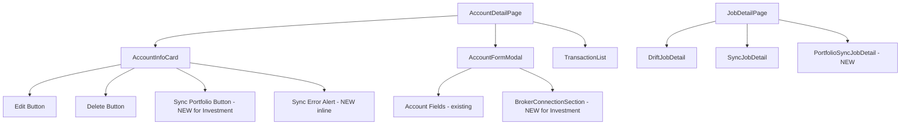
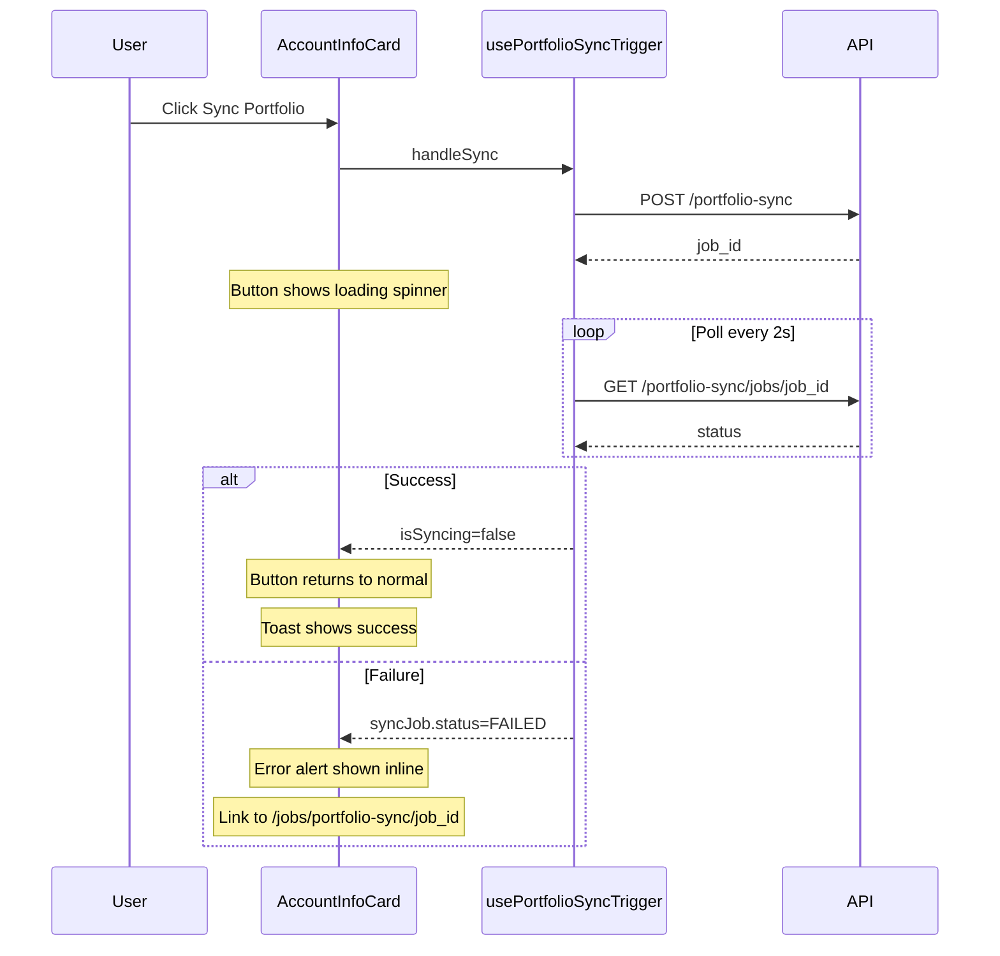

# Investment Account UI Enhancement — Design

**Requirements**: [requirements.md](./requirements.md)
**GitHub Issue**: [#50](https://github.com/abhijeet-reddy/master-of-coin/issues/50) (follow-up)
**Date**: 2026-03-15

## 1. Overview

This is a frontend-only enhancement. No backend or database changes are needed — all APIs and hooks already exist. The work involves:

1. **Restructuring the Account Detail page** to remove the `InvestmentProviderCard` and `PortfolioSyncSection` cards, replacing them with a compact "Sync Portfolio" button in the `AccountInfoCard` header area.
2. **Adding inline sync failure feedback** with an error alert on the account detail page and a link to the job detail page.
3. **Enhancing the Account Form Modal** to include a brokerage provider connection section when the account type is Investment.
4. **Fixing the Job Detail page** to handle the `portfolio-sync` job type.

## 2. Architecture

### 2.1 Component Changes Overview

### 2.2 Data Flow for Sync Button

## 3. Database Changes

None — this is a frontend-only enhancement.

## 4. API Changes

None — all required endpoints already exist.

## 5. Frontend Changes

### 5.1 Modified Components

#### 5.1.1 `AccountInfoCard` — Add Sync Portfolio button

**File**: `frontend/src/components/accounts/AccountInfoCard.tsx`

**Changes**:

- Add new props: `onSync`, `isSyncing`, `syncError`, `syncJobId`, `isProviderConnected`, `isInvestment`
- Add a "Sync Portfolio" button next to the Edit button (only visible when `isInvestment && isProviderConnected`)
- The button shows a loading spinner when `isSyncing` is true
- Below the card, show an inline error alert when `syncError` is set, with a "View Job Details" link to `/jobs/portfolio-sync/{syncJobId}`

#### 5.1.2 `AccountDetailPage` — Remove separate cards, wire up sync

**File**: `frontend/src/pages/AccountDetail.tsx`

**Changes**:

- Remove the `<InvestmentProviderCard>` and `<PortfolioSyncSection>` components from the render
- Import and use `usePortfolioSyncTrigger` hook
- Import and use `useInvestmentProviderConnection` hook (just to check `isConnected`)
- Pass sync-related props to `AccountInfoCard`
- Add inline sync failure alert below `AccountInfoCard` when sync fails

#### 5.1.3 `AccountFormModal` — Add broker connection section

**File**: `frontend/src/components/accounts/AccountFormModal.tsx`

**Changes**:

- Watch the `type` field value using react-hook-form's `watch`
- When `type === 'INVESTMENT'`, show a "Brokerage Connection" section below the Notes field
- For **edit mode** (account exists):
  - Use `useInvestmentProviderConnection` to check if a provider is already connected
  - If connected: show provider info (Trading 212, connected since date) with a Disconnect button
  - If not connected: show the `ConnectProviderForm` inline (API key, secret, environment fields)
- For **create mode** (new account):
  - Show an info message: "You can connect a brokerage provider after creating the account."
  - Rationale: The account must exist first to have an `account_id` for the provider connection API

#### 5.1.4 `JobDetailPage` — Add portfolio-sync support

**File**: `frontend/src/pages/JobDetail.tsx`

**Changes**:

- Add `'portfolio-sync'` to the `JobDetailType` union type
- Add `'portfolio-sync': 'Portfolio Sync'` to the `titleMap`
- Create a new `PortfolioSyncJobDetail` component (similar to `SyncJobDetail` but using `usePortfolioSyncJob` and displaying `PortfolioSyncReport` data)
- Add the `portfolio-sync` case to the routing switch in the render

### 5.2 New Components

#### 5.2.1 `PortfolioSyncJobDetail` (inline in JobDetail.tsx)

A new component within `JobDetail.tsx` that handles the `portfolio-sync` job type:

- Uses `usePortfolioSyncJob` hook to fetch job data
- Shows `JobHeaderCard` with status, timestamps
- Shows `JobProgressCard` while PENDING/RUNNING
- Shows sync results (synced accounts table with previous balance, new value, adjustment) when COMPLETED
- Shows error alert with retry button when FAILED

#### 5.2.2 `PortfolioSyncReportView` (new component)

**File**: `frontend/src/components/jobs/PortfolioSyncReportView.tsx`

Displays the portfolio sync report results in a clean table format:

- Account name, provider type, previous balance, new value, adjustment amount, status
- Color-coded adjustment amounts (green for positive, red for negative)

### 5.3 Modified Hooks

No new hooks needed. Existing hooks are reused:

- `usePortfolioSyncTrigger` — already handles sync lifecycle
- `useInvestmentProviderConnection` — already handles provider connection state

The `usePortfolioSyncTrigger` hook will be used in `AccountDetailPage` instead of `PortfolioSyncSection`.

### 5.4 Components to Remove/Deprecate

- `InvestmentProviderCard` — functionality moves into `AccountFormModal`
- `PortfolioSyncSection` — functionality moves into `AccountInfoCard` button + inline error

These components can be deleted or kept for reference. The barrel export in `frontend/src/components/accounts/index.ts` should be updated.

## 6. Error Handling

- **Sync failure on Account Detail page**: When `syncJob?.status === JobStatus.FAILED`, display an `ErrorAlert` below the `AccountInfoCard` with the error message and a "View Job Details" button that navigates to `/jobs/portfolio-sync/{jobId}`
- **Provider connection failure**: Already handled by `useInvestmentProviderConnection` with toast notifications
- **Job Detail page unknown type**: Already handled — the existing error message for unknown types will no longer trigger for `portfolio-sync`

## 7. Testing Strategy

- **Manual browser testing**: Verify all three scenarios (account detail cleanup, form modal provider section, job detail page) in Docker
- **E2E consideration**: The investment provider features require API keys, so E2E testing is limited to verifying the UI renders correctly without actual provider connections
