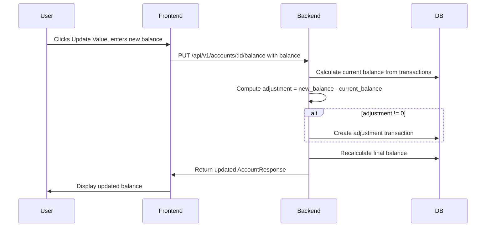

# Manual Investment Value Update — Design

**Requirements**: [requirements.md](./requirements.md)
**Date**: 2026-04-04

## 1. Overview

This feature adds a backend endpoint to set an investment account's balance by creating an adjustment transaction, and updates the frontend to show an "Update Value" button for investment accounts while hiding the "Add Transaction" button.

The approach: when a user sets a new balance, the backend calculates the difference between the current balance and the desired balance, then creates an adjustment transaction for that difference. This keeps the transaction-based balance calculation consistent across all account types.

## 2. Architecture



## 3. Database Changes

### 3.1 New Tables

None — no schema changes required.

### 3.2 Migrations

None — we reuse the existing transactions table for adjustment entries.

### 3.3 Models

Add to [`backend/src/models/account.rs`](backend/src/models/account.rs):

```rust
/// Request to manually set the balance of an investment account.
/// The server calculates the difference between the current balance and the
/// requested balance, then creates an adjustment transaction if needed.
#[derive(Debug, Deserialize, validator::Validate)]
pub struct SetBalanceRequest {
    /// The new total balance for the account
    pub balance: f64,
}
```

Export `SetBalanceRequest` from [`backend/src/models/mod.rs`](backend/src/models/mod.rs).

## 4. API Changes

### 4.1 New Endpoints

| Method | Path                         | Description                              | Request Body             | Response          |
| ------ | ---------------------------- | ---------------------------------------- | ------------------------ | ----------------- |
| PUT    | /api/v1/accounts/:id/balance | Set the balance of an investment account | `{ "balance": 1500.00 }` | `AccountResponse` |

**Behavior:**

- Validates the account exists and belongs to the user
- Validates the account is of type `INVESTMENT`
- Calculates `current_balance` as the sum of all transactions for this account
- Computes `adjustment = request.balance - current_balance`
- **Conditional transaction creation**: Only creates an adjustment transaction if `adjustment != 0`. If the sum already matches the requested balance, no transaction is created and the account is returned as-is.
- When a transaction is created, it uses title "Balance Adjustment" and the computed adjustment amount
- Returns the updated `AccountResponse` with the new balance

**Error cases:**

- 404: Account not found
- 403: Account belongs to another user
- 400: Account is not an investment account

### 4.2 Modified Endpoints

None.

## 5. Frontend Changes

### 5.1 New Components

None — the update value UI will be added inline to the existing `AccountInfoCard` component.

### 5.2 New Hooks

- [`useUpdateAccountBalance`](frontend/src/hooks/api/useUpdateAccountBalance.ts) — React Query mutation hook that calls the new `PUT /accounts/:id/balance` endpoint and invalidates account/dashboard queries on success.

### 5.3 New Services

Add to [`frontend/src/services/accountService.ts`](frontend/src/services/accountService.ts):

```typescript
export async function updateAccountBalance(
  id: string,
  balance: number,
): Promise<Account> {
  const response = await apiClient.put<Account>(`/accounts/${id}/balance`, {
    balance,
  });
  return response.data;
}
```

### 5.4 Modified Components

#### [`AccountInfoCard`](frontend/src/components/accounts/AccountInfoCard.tsx)

- Add new props: `isInvestment`, `onUpdateValue`, `isUpdatingValue`
- When `isInvestment` is true, show a pencil icon next to the balance
- Clicking the pencil icon toggles an inline input field with the current balance pre-filled
- Submitting calls `onUpdateValue` with the new balance number
- Pressing Escape or clicking Cancel reverts to display mode

#### [`AccountDetail`](frontend/src/pages/AccountDetail.tsx)

- Conditionally hide the "Add Transaction" button when `account.account_type === AccountType.INVESTMENT`
- Pass `isInvestment`, `onUpdateValue`, and `isUpdatingValue` props to `AccountInfoCard`
- Wire up the `useUpdateAccountBalance` hook

## 6. Error Handling

- **Backend**: Returns appropriate HTTP status codes:
  - 400 for non-investment accounts
  - 403 for unauthorized access
  - 404 for account not found
- **Frontend**: Errors displayed via toaster notifications using existing patterns

## 7. Testing Strategy

- **Backend**: Integration test for `PUT /accounts/:id/balance` covering:
  - Successful balance update for investment account
  - Rejection for non-investment account types
  - Zero-adjustment case (no transaction created)
  - Ownership verification
- **Frontend**: Manual browser testing via Docker to verify:
  - Update Value button appears only for investment accounts
  - Add Transaction button is hidden for investment accounts
  - Balance updates correctly after submission
