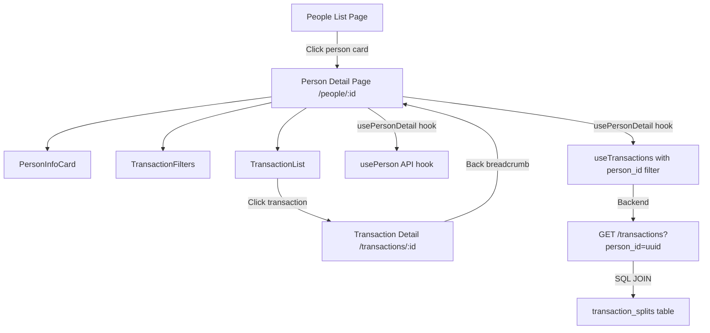

# Person Transaction View — Design

**Requirements**: [requirements.md](./requirements.md)
**Date**: 2026-03-17

## 1. Overview

Add a Person Detail page following the established pattern from AccountDetail and CategoryDetail. The page displays a person info card with actions and a paginated, filterable transaction list. The backend `TransactionFilter` is extended with a `person_id` field that JOINs to `transaction_splits` to find all transactions involving that person.

## 2. Architecture



### 2.1 Pattern: Detail Page with Transactions

This follows the exact same pattern as `AccountDetailPage` and `CategoryDetailPage`:

- A **usecase hook** (`usePersonDetail`) orchestrates all data fetching and state
- The **page component** (`PersonDetail`) renders the info card, filters, and transaction list
- The **info card** (`PersonInfoCard`) shows entity details with edit/delete/settle actions
- The existing `TransactionList` and `TransactionFilters` components are reused

## 3. Database Changes

### 3.1 No New Tables

No database schema changes needed. The `transaction_splits` table already has a `person_id` column that links transactions to people.

### 3.2 No Migrations

No migrations required.

## 4. API Changes

### 4.1 Modified Endpoints

| Method | Path          | Change                                                                 |
| ------ | ------------- | ---------------------------------------------------------------------- |
| GET    | /transactions | Add optional `person_id` query parameter to `TransactionFilter` struct |

#### Backend Filter Change

The `TransactionFilter` struct in [`backend/src/models/transaction.rs`](backend/src/models/transaction.rs:180) gains a new field:

```rust
pub struct TransactionFilter {
    // ... existing fields ...
    pub person_id: Option<Uuid>,  // NEW: filter by person via transaction_splits
}
```

When `person_id` is provided, the query JOINs to `transaction_splits` and filters:

```rust
if let Some(person_id) = filters.person_id {
    // Sub-select: find transaction IDs that have a split for this person
    let split_txn_ids = transaction_splits::table
        .filter(transaction_splits::person_id.eq(person_id))
        .select(transaction_splits::transaction_id);
    query = query.filter(transactions::id.eq_any(split_txn_ids));
}
```

This approach uses a subquery rather than a JOIN to avoid duplicating rows or complicating the existing LEFT JOIN structure for debt metadata.

### 4.2 Frontend QueryParams Change

Add `person_id` to the frontend [`QueryParams`](frontend/src/types/api.ts:26) type:

```typescript
export interface QueryParams {
  // ... existing fields ...
  person_id?: string; // NEW
}
```

## 5. Frontend Changes

### 5.1 New Components

- **`PersonInfoCard`** — Card displaying person details: name, email, phone, notes, debt summary, with Edit/Delete/Settle actions. Located at `frontend/src/components/people/PersonInfoCard.tsx`.

### 5.2 New Pages

- **`PersonDetail`** — Detail page at `/people/:id`. Located at `frontend/src/pages/PersonDetail.tsx`. Follows the same structure as `CategoryDetailPage`.

### 5.3 New Hooks

- **`usePersonDetail`** — Usecase hook managing all state for the Person Detail page. Located at `frontend/src/hooks/usecase/usePersonDetail.ts`. Orchestrates:
  - `usePerson(id)` for person data
  - `useTransactions({ person_id: id })` for paginated transactions
  - `useEnrichedTransactions()` for enrichment
  - Client-side filters
  - Delete mutation

### 5.4 Modified Files

| File                                                                                             | Change                                              |
| ------------------------------------------------------------------------------------------------ | --------------------------------------------------- |
| [`frontend/src/types/api.ts`](frontend/src/types/api.ts)                                         | Add `person_id` to `QueryParams`                    |
| [`frontend/src/types/navigation.ts`](frontend/src/types/navigation.ts)                           | Add `PERSON` to `NavigationSourceType` enum         |
| [`frontend/src/App.tsx`](frontend/src/App.tsx)                                                   | Add route `people/:id` → `PersonDetailPage`         |
| [`frontend/src/components/people/PersonCard.tsx`](frontend/src/components/people/PersonCard.tsx) | Make card clickable to navigate to `/people/:id`    |
| [`frontend/src/components/people/index.ts`](frontend/src/components/people/index.ts)             | Export `PersonInfoCard`                             |
| [`frontend/src/hooks/usecase/index.ts`](frontend/src/hooks/usecase/index.ts)                     | Export `usePersonDetail`                            |
| [`backend/src/models/transaction.rs`](backend/src/models/transaction.rs)                         | Add `person_id` to `TransactionFilter`              |
| [`backend/src/repositories/transaction.rs`](backend/src/repositories/transaction.rs)             | Add `person_id` filter logic in `list_transactions` |

## 6. Error Handling

- **Person not found**: Show "Person not found" error alert with breadcrumb back to People list
- **API errors**: Show `ErrorAlert` component (same pattern as AccountDetail)
- **Delete errors**: Show inline error alert above content
- **Loading states**: Show `LoadingSpinner` while person data loads, skeleton while transactions load

## 7. Testing Strategy

- Manual browser testing via Docker (per frontend testing guidelines)
- Verify person detail page loads correctly
- Verify transaction list shows only transactions with splits for the selected person
- Verify filters work correctly
- Verify navigation breadcrumbs work
- Verify edit/delete/settle actions work from the detail page
