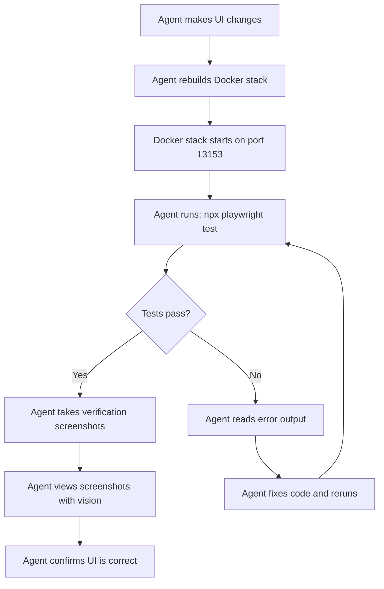
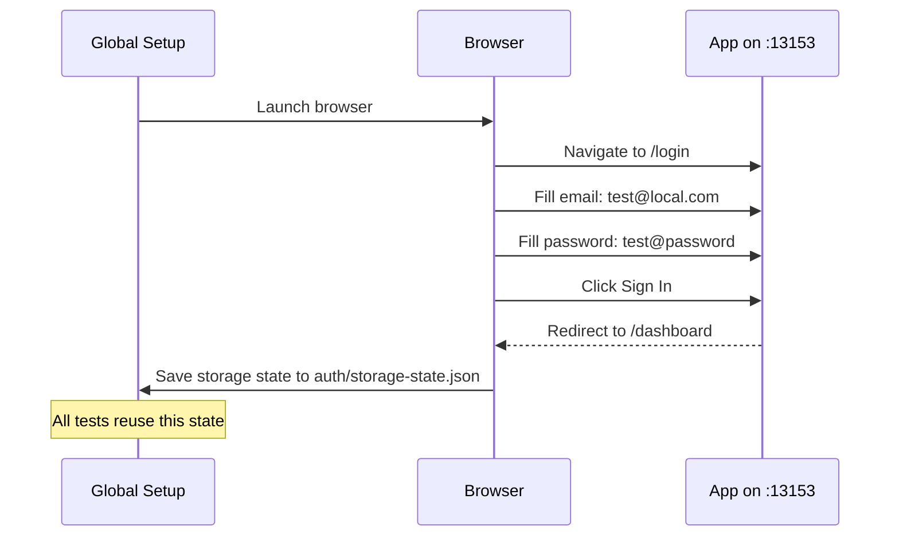
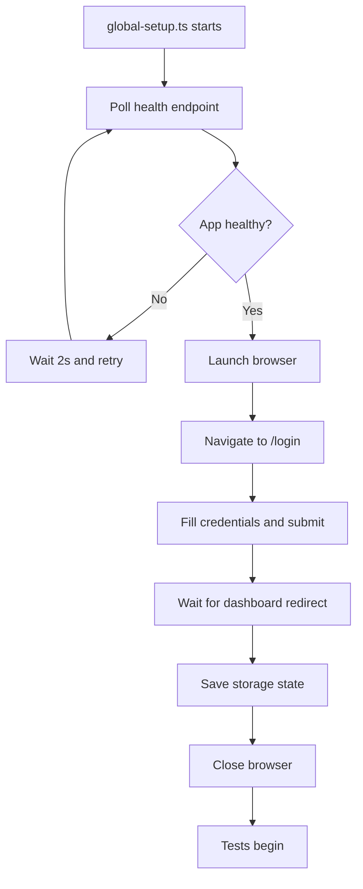

# Playwright E2E Testing — Technical Design

## Architecture Overview



## Directory Structure

```
e2e/
├── playwright.config.ts          # Playwright configuration
├── package.json                  # Separate package.json for e2e deps
├── tsconfig.json                 # TypeScript config for e2e tests
├── global-setup.ts               # Global setup - waits for Docker, authenticates
├── global-teardown.ts            # Global teardown - cleanup
├── auth/
│   └── storage-state.json        # Saved auth state - gitignored
├── fixtures/
│   └── test-fixtures.ts          # Custom test fixtures - authenticated page, etc.
├── helpers/
│   ├── auth.ts                   # Login helper functions
│   ├── navigation.ts             # Page navigation helpers
│   ├── assertions.ts             # Custom assertion helpers
│   └── screenshots.ts            # Screenshot capture and comparison helpers
├── tests/
│   ├── auth/
│   │   ├── login.spec.ts         # Login flow tests
│   │   └── register.spec.ts      # Registration flow tests
│   ├── dashboard/
│   │   └── dashboard.spec.ts     # Dashboard rendering and widgets
│   ├── accounts/
│   │   └── accounts.spec.ts      # Account CRUD operations
│   ├── transactions/
│   │   └── transactions.spec.ts  # Transaction CRUD and filtering
│   ├── budgets/
│   │   └── budgets.spec.ts       # Budget CRUD operations
│   ├── categories/
│   │   └── categories.spec.ts    # Category CRUD operations
│   ├── people/
│   │   └── people.spec.ts        # People management
│   └── smoke/
│       └── smoke.spec.ts         # Quick smoke test - all pages load
├── screenshots/
│   ├── baseline/                 # Baseline screenshots for comparison - committed
│   │   ├── dashboard.png
│   │   ├── accounts.png
│   │   └── ...
│   ├── actual/                   # Current test run screenshots - gitignored
│   └── diff/                     # Visual diff images - gitignored
└── test-results/                 # Playwright test artifacts - gitignored
```

## Key Design Decisions

### 1. Separate `e2e/` Directory at Project Root

**Rationale:** Keeps E2E tests isolated from the frontend source code. E2E tests have different dependencies (Playwright) and run against the full stack, not just the frontend. This avoids polluting the frontend `package.json` and keeps concerns separated.

### 2. Authentication via Storage State

**Rationale:** Playwright supports saving browser authentication state (cookies, localStorage) to a JSON file. The global setup logs in once, saves the state, and all tests reuse it. This avoids logging in for every test, making tests faster.



### 3. Screenshot Strategy

Two types of screenshots:

1. **Verification Screenshots** — Taken on-demand by the agent after making changes. Saved to `screenshots/actual/`. The agent views these with its vision capabilities to confirm the UI looks correct.

2. **Baseline Comparison** — Optional visual regression. Baseline images committed to `screenshots/baseline/`. Tests compare current screenshots against baselines using pixel-diff thresholds.

### 4. Docker Health Check Before Tests

The `global-setup.ts` will poll `http://localhost:13153/health` until the Docker stack is ready before running any tests. This ensures tests don't fail due to slow container startup.

### 5. Test Fixtures Pattern

Custom Playwright fixtures provide pre-configured test contexts:

```typescript
// fixtures/test-fixtures.ts
import { test as base } from '@playwright/test';

type TestFixtures = {
  authenticatedPage: Page;
};

export const test = base.extend<TestFixtures>({
  authenticatedPage: async { browser }, use => {
    const context = await browser.newContext({
      storageState: 'e2e/auth/storage-state.json',
    });
    const page = await context.newPage();
    await use(page);
    await context.close();
  },
});
```

## Configuration

### `playwright.config.ts`

Key settings:

- **baseURL:** `http://localhost:13153`
- **headless:** `true` — always headless for agent execution
- **retries:** `1` — one retry for flaky tests
- **workers:** `1` — sequential execution to avoid race conditions on shared DB state
- **timeout:** `30000` — 30s per test
- **screenshot:** `only-on-failure` — automatic screenshots on failure
- **trace:** `retain-on-failure` — Playwright traces for debugging failures
- **projects:** Single Chromium project (sufficient for agent testing)

### Global Setup Flow



## Agent Workflow — Step by Step

### When the Agent Makes a UI Change:

1. **Rebuild and start Docker:**

   ```bash
   docker-compose down && docker-compose build && docker-compose up -d
   ```

2. **Run all E2E tests:**

   ```bash
   cd e2e && npx playwright test
   ```

3. **Run specific test file:**

   ```bash
   cd e2e && npx playwright test tests/dashboard/dashboard.spec.ts
   ```

4. **Take a screenshot of a specific page:**

   ```bash
   cd e2e && npx playwright test tests/smoke/smoke.spec.ts --grep "screenshot"
   ```

5. **View test results:**
   - Terminal output shows pass/fail with error details
   - Failed test screenshots saved to `test-results/`
   - Agent reads screenshot files using vision capabilities

6. **Update baseline screenshots:**
   ```bash
   cd e2e && npx playwright test --update-snapshots
   ```

### Quick Verification Script

A convenience script `e2e/verify.sh` that the agent can run:

```bash
#!/bin/bash
# Quick verification: rebuild, start, test, report
docker-compose down
docker-compose build
docker-compose up -d
cd e2e
npx playwright test tests/smoke/smoke.spec.ts
echo "Screenshots saved to e2e/screenshots/actual/"
```

## Test Patterns

### Smoke Test Pattern

Visits every major page and asserts it loads without errors:

```typescript
test('dashboard loads correctly', async { authenticatedPage } => {
  await authenticatedPage.goto('/dashboard');
  await expect(authenticatedPage.locator('text=Dashboard')).toBeVisible();
  await expect(authenticatedPage.locator('text=Overview')).toBeVisible();
  // No console errors
  // Take screenshot for agent verification
  await authenticatedPage.screenshot({
    path: 'screenshots/actual/dashboard.png',
    fullPage: true,
  });
});
```

### CRUD Test Pattern

Tests create, read, update, delete operations:

```typescript
test('can create a new account', async { authenticatedPage } => {
  await authenticatedPage.goto('/accounts');
  await authenticatedPage.click('text=Add Account');
  await authenticatedPage.fill('[name="name"]', 'Test Savings');
  await authenticatedPage.selectOption('[name="account_type"]', 'savings');
  await authenticatedPage.fill('[name="balance"]', '1000');
  await authenticatedPage.click('text=Save');
  await expect(authenticatedPage.locator('text=Test Savings')).toBeVisible();
});
```

### Screenshot Comparison Pattern

Compares current page against a baseline:

```typescript
test('dashboard matches baseline', async { authenticatedPage } => {
  await authenticatedPage.goto('/dashboard');
  await authenticatedPage.waitForLoadState('networkidle');
  await expect(authenticatedPage).toHaveScreenshot('dashboard.png', {
    maxDiffPixelRatio: 0.05, // Allow 5% pixel difference
  });
});
```

## Error Reporting for Agent

When tests fail, the agent gets:

1. **Terminal output** — Which test failed, assertion error message, expected vs actual
2. **Screenshot on failure** — Saved to `test-results/` automatically
3. **Trace file** — Can be opened with `npx playwright show-trace` but agent can also read the JSON
4. **Diff image** — For visual regression failures, a diff image highlighting changes

## Dependencies

New packages to install in `e2e/package.json`:

- `@playwright/test` — Playwright test runner
- `typescript` — TypeScript support

## Integration with Existing Workflow

The existing `.agents/testing/testing-front-end.md` will be updated to include:

1. The automated Playwright testing workflow as the **primary** testing method for agents
2. Manual browser testing remains as a **supplementary** option for humans
3. A clear checklist for agents to follow when making UI changes
