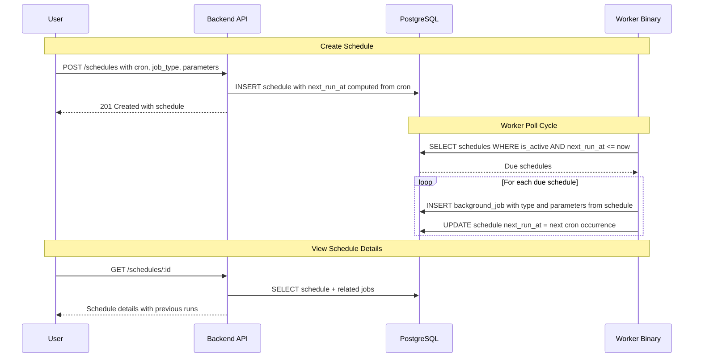

# Scheduled Sync — Design

**Requirements**: [requirements.md](./requirements.md)
**GitHub Issue**: [#41](https://github.com/abhijeet-reddy/master-of-coin/issues/41) (Sub-feature C)
**Date**: 2026-02-22

## 1. Overview

A generic scheduling system that stores cron expressions, computes next run times, and automatically creates background jobs when schedules are due. The worker checks schedules on each poll cycle and the frontend provides a schedules management UI with simple presets and advanced cron editing.

## 2. Architecture

### 2.1 High-Level Flow



### 2.2 Worker Schedule Checking

The worker already has a poll loop that runs every N seconds. On each cycle, after checking for pending jobs, it also checks for due schedules:

1. Query: `SELECT * FROM schedules WHERE is_active = true AND next_run_at <= NOW()`
2. For each due schedule, in a **single database transaction**:
   a. INSERT a `background_job` with `job_type` from the schedule and `input` built from the schedule parameters
   b. UPDATE the schedule's `next_run_at` to the next cron occurrence
3. The transaction ensures atomicity — either both the job is created AND `next_run_at` is updated, or neither happens. This prevents duplicate jobs from being created if the worker crashes between the two operations.

### 2.3 Cron Expression Handling

Use the `cron` Rust crate for parsing and computing next occurrences. The cron expression format is standard 5-field: `minute hour day_of_month month day_of_week`.

## 3. Database Changes

### 3.1 New Table: `schedules`

| Column        | Type          | Constraints                 | Description                                     |
| ------------- | ------------- | --------------------------- | ----------------------------------------------- |
| `id`          | `UUID`        | PK, DEFAULT gen_random_uuid | Schedule ID                                     |
| `user_id`     | `UUID`        | NOT NULL, FK -> users       | Owner                                           |
| `name`        | `TEXT`        | NOT NULL                    | User-given name for the schedule                |
| `job_type`    | `job_type`    | NOT NULL                    | Which job type to create (reuses existing enum) |
| `cron_expr`   | `TEXT`        | NOT NULL                    | Cron expression (5-field)                       |
| `parameters`  | `JSONB`       | NULL                        | Type-specific parameters (e.g., lookback_days)  |
| `is_active`   | `BOOLEAN`     | NOT NULL, DEFAULT true      | Active/inactive toggle                          |
| `next_run_at` | `TIMESTAMPTZ` | NULL                        | Next computed execution time                    |
| `last_run_at` | `TIMESTAMPTZ` | NULL                        | When the schedule last triggered a job          |
| `created_at`  | `TIMESTAMPTZ` | NOT NULL, DEFAULT now       | When created                                    |
| `updated_at`  | `TIMESTAMPTZ` | NOT NULL, DEFAULT now       | When last modified                              |

**Indexes:**

- `idx_schedules_user_id` on `(user_id)`
- `idx_schedules_active_next_run` on `(is_active, next_run_at)` — for the worker query

### 3.2 Background Jobs Link

Jobs created by schedules include `schedule_id` in their `input` JSONB field:

```json
{
  "schedule_id": "uuid",
  "start_date": "2026-02-15T00:00:00Z",
  "end_date": "2026-02-22T23:59:59Z"
}
```

This allows querying jobs by schedule: `SELECT * FROM background_jobs WHERE input->>'schedule_id' = :schedule_id`.

### 3.3 Migration

New migration: `create_schedules_table`

**up.sql:**

```sql
CREATE TABLE schedules (
    id UUID PRIMARY KEY DEFAULT gen_random_uuid(),
    user_id UUID NOT NULL REFERENCES users(id) ON DELETE CASCADE,
    name TEXT NOT NULL,
    job_type job_type NOT NULL,
    cron_expr TEXT NOT NULL,
    parameters JSONB,
    is_active BOOLEAN NOT NULL DEFAULT true,
    next_run_at TIMESTAMPTZ,
    last_run_at TIMESTAMPTZ,
    created_at TIMESTAMPTZ NOT NULL DEFAULT NOW(),
    updated_at TIMESTAMPTZ NOT NULL DEFAULT NOW()
);

CREATE INDEX idx_schedules_user_id ON schedules(user_id);
CREATE INDEX idx_schedules_active_next_run ON schedules(is_active, next_run_at);
```

**down.sql:**

```sql
DROP TABLE IF EXISTS schedules;
```

## 4. API Changes

### 4.1 New Endpoints

| Method | Path                    | Description           | Request                            | Response               |
| ------ | ----------------------- | --------------------- | ---------------------------------- | ---------------------- |
| POST   | `/api/v1/schedules`     | Create a schedule     | JSON: name, job_type, cron, params | 201 with schedule      |
| GET    | `/api/v1/schedules`     | List user's schedules | None                               | `Vec<Schedule>`        |
| GET    | `/api/v1/schedules/:id` | Get schedule details  | None                               | Schedule + recent jobs |
| PUT    | `/api/v1/schedules/:id` | Update a schedule     | JSON: partial update               | Updated schedule       |
| DELETE | `/api/v1/schedules/:id` | Delete a schedule     | None                               | 204 No Content         |

### 4.2 POST — Create Schedule

```json
{
  "name": "Weekly drift check",
  "job_type": "DRIFT_DETECTION",
  "cron_expr": "0 0 * * 0",
  "parameters": {
    "lookback_days": 7
  }
}
```

**Response** (201 Created):

```json
{
  "id": "uuid",
  "name": "Weekly drift check",
  "job_type": "DRIFT_DETECTION",
  "cron_expr": "0 0 * * 0",
  "cron_description": "Every Sunday at 00:00",
  "parameters": { "lookback_days": 7 },
  "is_active": true,
  "next_run_at": "2026-02-23T00:00:00Z",
  "last_run_at": null,
  "created_at": "2026-02-22T16:00:00Z",
  "updated_at": "2026-02-22T16:00:00Z"
}
```

**Validation:**

- `cron_expr` must be a valid 5-field cron expression
- `cron_expr` must have at least 1 hour between occurrences (minimum frequency)
- `job_type` must be a valid job type
- `name` must not be empty

### 4.3 GET — List Schedules

Returns all schedules for the current user, ordered by `created_at DESC`.

### 4.4 GET — Schedule Details

Returns the schedule plus the last N jobs triggered by this schedule (queried via `input->>'schedule_id'`).

```json
{
  "schedule": {
    "id": "uuid",
    "name": "Weekly drift check",
    "job_type": "DRIFT_DETECTION",
    "cron_expr": "0 0 * * 0",
    "cron_description": "Every Sunday at 00:00",
    "parameters": { "lookback_days": 7 },
    "is_active": true,
    "next_run_at": "2026-02-23T00:00:00Z",
    "last_run_at": "2026-02-16T00:00:00Z",
    "created_at": "2026-02-22T16:00:00Z",
    "updated_at": "2026-02-22T16:00:00Z"
  },
  "recent_jobs": [...],
  "upcoming_runs": ["2026-02-23T00:00:00Z", "2026-03-02T00:00:00Z", ...]
}
```

### 4.5 PUT — Update Schedule

Partial update — can update `name`, `cron_expr`, `parameters`, `is_active`. When `cron_expr` changes, `next_run_at` is recomputed.

### 4.6 DELETE — Delete Schedule

Deletes the schedule. Jobs already created by this schedule are NOT deleted — they remain in the jobs history.

## 5. Backend Changes

### 5.1 New Model: Schedule

In `backend/src/models/schedule.rs`:

- `Schedule` — Queryable struct matching the `schedules` table
- `NewSchedule` — Insertable struct
- `UpdateSchedule` — Changeset for partial updates
- `ScheduleResponse` — API response with `cron_description` field
- `ScheduleDetailResponse` — Schedule + recent_jobs + upcoming_runs
- `CreateScheduleRequest` — Request body with validation

### 5.2 New Repository: schedule

In `backend/src/repositories/schedule.rs`:

- `create(pool, new_schedule)` → `Schedule`
- `list_by_user(pool, user_id)` → `Vec<Schedule>`
- `find_by_id(pool, schedule_id)` → `Option<Schedule>`
- `update(pool, schedule_id, changeset)` → `Schedule`
- `delete(pool, schedule_id)` → `usize`
- `find_due_schedules(pool)` → `Vec<Schedule>` — WHERE `is_active = true AND next_run_at <= NOW()`
- `trigger_schedule(pool, schedule_id, new_job, next_run_at)` → `BackgroundJob` — **transactional**: INSERT job + UPDATE schedule `next_run_at` and `last_run_at = NOW()` in a single DB transaction

### 5.3 New Handler: schedules

In `backend/src/handlers/schedules.rs`:

- `create_schedule` — POST handler, validates cron, computes initial `next_run_at`
- `list_schedules` — GET list handler
- `get_schedule` — GET detail handler, includes recent jobs and upcoming runs
- `update_schedule` — PUT handler, recomputes `next_run_at` if cron changes
- `delete_schedule` — DELETE handler

### 5.4 Route Registration

```rust
// Schedules CRUD
.route("/schedules", post(handlers::schedules::create_schedule))
.route("/schedules", get(handlers::schedules::list_schedules))
.route("/schedules/:id", get(handlers::schedules::get_schedule))
.route("/schedules/:id", put(handlers::schedules::update_schedule))
.route("/schedules/:id", delete(handlers::schedules::delete_schedule))
```

All with `Transactions:Write` scope for mutations, `Transactions:Read` for reads.

### 5.5 Cron Utilities

New utility module `backend/src/utils/cron.rs`:

- `compute_next_run(cron_expr: &str) -> Result<DateTime<Utc>, String>` — parses the cron expression and returns the next occurrence after `now()`
- `compute_next_run_after(cron_expr: &str, after: DateTime<Utc>) -> Result<DateTime<Utc>, String>` — returns the next occurrence after a given timestamp
- `compute_upcoming_runs(cron_expr: &str, count: usize) -> Result<Vec<DateTime<Utc>>, String>` — returns the next N occurrences (for schedule preview)
- `describe_cron(cron_expr: &str) -> String` — returns a human-readable description (pattern matching for common presets, raw expression for custom)
- `validate_cron(cron_expr: &str) -> Result<(), String>` — validates a cron expression without computing

Used by:

- **Handlers**: `create_schedule` and `update_schedule` call `compute_next_run()` to set initial `next_run_at`, and `validate_cron()` for input validation
- **Worker**: `check_and_trigger_schedules` calls `compute_next_run()` after triggering a job
- **Schedule detail API**: `compute_upcoming_runs()` for the upcoming runs list
- **Schedule response**: `describe_cron()` for the `cron_description` field

### 5.6 Worker Changes

In `backend/src/bin/worker.rs`:

- Add schedule checking as a **parallel task** in the poll loop — runs concurrently with job execution via `tokio::spawn`
- New function `check_and_trigger_schedules(pool)`:
  1. Call `ScheduleRepository::find_due_schedules(pool)`
  2. For each due schedule, build the job input from schedule parameters
  3. Call `ScheduleRepository::trigger_schedule()` (transactional: INSERT job + UPDATE schedule)
- Schedule-triggered jobs are picked up in the next poll cycle by the normal job dispatch
- Add `cron` crate dependency to `Cargo.toml`

### 5.7 Validation Rules

- **Minimum frequency**: Cron expressions that resolve to more than once per hour are rejected. Validation checks that the next 2 occurrences are at least 60 minutes apart.
- **Valid cron**: Must be a parseable 5-field cron expression
- **Valid job_type**: Must be a known job type enum value
- **Name required**: Non-empty schedule name

## 6. Frontend Changes

### 6.1 New Routes

```tsx
<Route path="schedules" element={<SchedulesPage />} />
<Route path="schedules/:id" element={<ScheduleDetailPage />} />
```

### 6.2 Sidebar

Add "Schedules" nav item (icon: `MdSchedule`) after "Jobs", before "Settings".

### 6.3 New Types

`frontend/src/types/schedule.ts`:

- `Schedule`, `CreateScheduleRequest`, `UpdateScheduleRequest`
- `ScheduleDetailResponse` (schedule + recent_jobs + upcoming_runs)
- Cron preset types

### 6.4 New Services

`frontend/src/services/scheduleService.ts`:

- `createSchedule()`, `listSchedules()`, `getSchedule()`, `updateSchedule()`, `deleteSchedule()`

### 6.5 New Hooks

`frontend/src/hooks/api/useSchedules.ts`:

- `useSchedules()` — list query
- `useSchedule(id)` — detail query
- `useCreateSchedule()` — mutation
- `useUpdateSchedule()` — mutation
- `useDeleteSchedule()` — mutation

### 6.6 New Components

**Schedules page** (`frontend/src/pages/Schedules.tsx`):

- List of schedules with job type badge, cron description, next run time, active/inactive toggle, delete button

**Schedule detail page** (`frontend/src/pages/ScheduleDetail.tsx`):

- Schedule configuration details
- Previous job runs (linked from `background_jobs` via `schedule_id`)
- Upcoming execution times (computed from cron)

**Create schedule form** (`frontend/src/components/schedules/CreateScheduleModal.tsx`):

- Job type selector
- Type-specific parameter fields (e.g., lookback_days for drift detection)
- Simple mode: preset dropdown (Hourly, Daily, Weekly, Monthly)
- Advanced mode: cron field editor (Minutes, Hours, Days of Month, Days of Week, Months)
- Schedule preview showing next N execution times

**Shared components:**

- `ScheduleCard.tsx` — schedule summary card for the list
- `CronPresetSelector.tsx` — simple preset dropdown
- `CronAdvancedEditor.tsx` — advanced cron field editor
- `SchedulePreview.tsx` — shows next N execution times from a cron expression

### 6.7 Jobs Page Enhancement

Jobs triggered by a schedule show a small "Scheduled" badge with the schedule name. The badge links to the schedule detail page.

## 7. Error Handling

| Scenario                  | Error / Behavior                            |
| ------------------------- | ------------------------------------------- |
| Invalid cron expression   | 400 Bad Request — "Invalid cron expression" |
| Schedule not found        | 404 Not Found                               |
| Schedule belongs to other | 404 Not Found (security)                    |
| Empty name                | 400 Bad Request — "Name is required"        |
| Invalid job_type          | 400 Bad Request — "Invalid job type"        |
| Delete schedule with jobs | Schedule deleted, existing jobs preserved   |

## 8. Testing Strategy

### 8.1 Backend Integration Tests

- Schedule CRUD: create, list, get, update, delete
- Schedule ownership: User A can't see User B's schedules
- Cron validation: invalid expressions rejected
- Active/inactive toggle
- Schedule detail includes recent jobs
- Worker trigger: create a due schedule, verify job is created and next_run_at updated

### 8.2 Frontend Testing

- Schedules list page renders
- Create schedule form with presets and advanced mode
- Schedule detail page shows previous runs and upcoming times
- Active/inactive toggle works
- Delete confirmation
