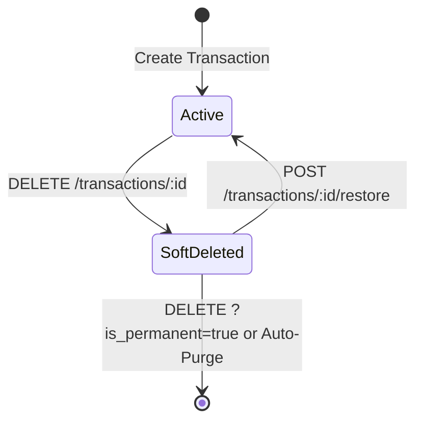
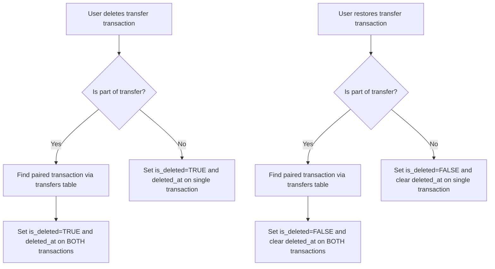
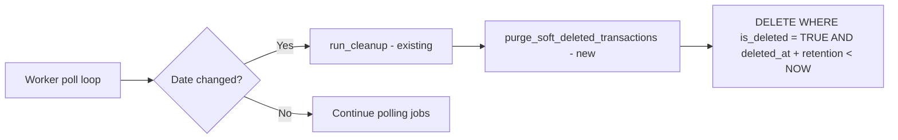

# Soft Delete Transactions — Design

**Requirements**: [requirements.md](./requirements.md)
**GitHub Issue**: N/A (user request)
**Date**: 2026-03-15

## 1. Overview

The soft delete feature adds two columns to the `transactions` table: `is_deleted` (boolean flag for fast filtering) and `deleted_at` (timestamp for tracking when the deletion occurred and computing purge eligibility). When a user deletes a transaction, instead of removing the row, we set `is_deleted = TRUE` and `deleted_at = NOW()`. All existing queries filter out rows where `is_deleted = TRUE`. A new restore endpoint allows recovering trashed transactions, while the existing list endpoint gains an `is_deleted` filter flag for viewing trash. The existing worker binary purges expired soft-deleted transactions during its daily cleanup cycle.

## 2. Architecture

### 2.1 Soft Delete Pattern

The core pattern uses two columns on the `transactions` table:

- `is_deleted = FALSE` → active transaction (visible in normal views)
- `is_deleted = TRUE` with `deleted_at` set → soft-deleted transaction (only visible in trash)
- `is_deleted = TRUE` and `deleted_at + retention_period < NOW()` → expired, eligible for permanent purge



### 2.2 Transfer Pair Handling

When a transaction is part of a transfer, both the `from_transaction` and `to_transaction` must be soft-deleted/restored together. The service layer looks up the `transfers` table to find the paired transaction and applies the same operation to both.



### 2.3 Purge Flow

The worker binary already runs a daily cleanup cycle in its poll loop (date change detection in [`worker.rs`](../../backend/src/bin/worker.rs)). A new `purge_soft_deleted_transactions` function will be called alongside the existing `run_cleanup` during this daily cycle.



## 3. Database Changes

### 3.1 Migration: Add Soft Delete Columns

Add `is_deleted` boolean and `deleted_at` nullable timestamp to the `transactions` table:

```sql
-- up.sql
ALTER TABLE transactions
    ADD COLUMN is_deleted BOOLEAN NOT NULL DEFAULT FALSE,
    ADD COLUMN deleted_at TIMESTAMP WITH TIME ZONE DEFAULT NULL;

-- Partial index for efficient filtering of active transactions in all normal queries
CREATE INDEX idx_transactions_is_deleted ON transactions(is_deleted)
    WHERE is_deleted = FALSE;
```

```sql
-- down.sql
DROP INDEX IF EXISTS idx_transactions_is_deleted;
ALTER TABLE transactions DROP COLUMN IF EXISTS deleted_at;
ALTER TABLE transactions DROP COLUMN IF EXISTS is_deleted;
```

**Why two columns?**

- `is_deleted` (boolean): Simple, fast filtering condition for all normal queries.
- `deleted_at` (timestamp): Records exactly when the transaction was deleted. Used to compute the purge deadline and display "deleted on" / "permanently deleted on" dates in the UI.

### 3.2 Schema Update

After running the migration, `diesel print-schema` will add both columns to the `transactions` table definition in [`schema.rs`](../../backend/src/schema.rs):

```rust
diesel::table! {
    transactions (id) {
        // ... existing columns ...
        is_deleted -> Bool,
        deleted_at -> Nullable<Timestamptz>,
    }
}
```

### 3.3 Model Changes

**`Transaction` struct** in [`transaction.rs`](../../backend/src/models/transaction.rs):

- Add `is_deleted: bool` field
- Add `deleted_at: Option<DateTime<Utc>>` field

**`NewTransaction` struct**:

- No changes needed — `is_deleted` defaults to `FALSE` and `deleted_at` defaults to `NULL` at the database level

**`TransactionResponse` struct**:

- Add `deleted_at: Option<DateTime<Utc>>` field (skip serializing if None)
- Add `permanent_delete_at: Option<DateTime<Utc>>` computed field (= `deleted_at + retention_days`, skip serializing if None)

**`TransactionFilter` struct**:

- Add `is_deleted: Option<bool>` field (default: `false` when not provided)

**New `DeleteTransactionQuery` struct**:

- `is_permanent: Option<bool>` — query parameter for `DELETE /transactions/:id?is_permanent=true`

## 4. Configuration Changes

### 4.1 Environment Variable

| Variable                     | Default | Description                                                               |
| ---------------------------- | ------- | ------------------------------------------------------------------------- |
| `SOFT_DELETE_RETENTION_DAYS` | `30`    | Number of days to retain soft-deleted transactions before permanent purge |

### 4.2 Config Struct Change

Add `soft_delete_retention_days: i64` directly to the main `Config` struct in [`config/mod.rs`](../../backend/src/config/mod.rs):

```rust
pub struct Config {
    // ... existing fields ...
    pub soft_delete_retention_days: i64,  // NEW
}
```

Parse from `SOFT_DELETE_RETENTION_DAYS` env var with default of 30 in `Config::from_env()`. Validate that `soft_delete_retention_days > 0` in `Config::validate()`.

### 4.3 .env.example Update

Add to [`.env.example`](../../.env.example):

```
# Soft Delete Configuration
# Number of days to retain deleted transactions before permanent purge (default: 30)
SOFT_DELETE_RETENTION_DAYS=30
```

## 5. API Changes

### 5.1 Modified Endpoints

| Method | Path                     | Change                                                                                                                                                                                                                                      |
| ------ | ------------------------ | ------------------------------------------------------------------------------------------------------------------------------------------------------------------------------------------------------------------------------------------- |
| DELETE | /api/v1/transactions/:id | Default: soft delete (sets `is_deleted=TRUE`, `deleted_at=NOW()`). With `?is_permanent=true`: hard delete (only allowed on already soft-deleted transactions). Returns 200 with transaction response for soft delete, 204 for permanent delete |
| GET    | /api/v1/transactions     | Adds `is_deleted` query param. Defaults to `false` (active only). Pass `is_deleted=true` to list trashed transactions                                                                                                                       |
| GET    | /api/v1/transactions/:id | Returns 404 for soft-deleted transactions in normal access                                                                                                                                                                                  |
| GET    | /api/v1/dashboard        | Existing dashboard query must exclude soft-deleted transactions (`is_deleted = FALSE`)                                                                                                                                                      |

### 5.2 New Endpoints

| Method | Path                             | Description                                                                    | Request Body | Response              |
| ------ | -------------------------------- | ------------------------------------------------------------------------------ | ------------ | --------------------- |
| POST   | /api/v1/transactions/:id/restore | Restore a soft-deleted transaction. If part of a transfer, restores both sides | None         | `TransactionResponse` |

### 5.3 Delete Endpoint Behavior

```
DELETE /api/v1/transactions/:id
  → Soft delete: sets is_deleted=TRUE, deleted_at=NOW()
  → Returns 200 with TransactionResponse (including deleted_at, permanent_delete_at)
  → If transfer: soft-deletes both sides

DELETE /api/v1/transactions/:id?is_permanent=true
  → Only works on already soft-deleted transactions (is_deleted=TRUE)
  → Hard deletes the transaction and all associated data
  → Returns 204 No Content
  → If transfer: hard-deletes both sides
  → Returns 400 if transaction is not already soft-deleted
```

### 5.4 Response Changes

The `TransactionResponse` gains two new optional fields:

```json
{
  "id": "...",
  "title": "...",
  "deleted_at": "2026-03-15T20:00:00Z",
  "permanent_delete_at": "2026-04-14T20:00:00Z"
}
```

- `deleted_at`: absent for active transactions, timestamp for soft-deleted ones
- `permanent_delete_at`: computed as `deleted_at + retention_days`, only present when `deleted_at` is set

Both fields use `#[serde(skip_serializing_if = "Option::is_none")]` to keep active transaction responses clean.

## 6. Frontend Changes

### 6.1 New Components

- **`TrashPage`** — New page at `/trash` showing soft-deleted transactions. Uses `GET /transactions?is_deleted=true`. Displays:
  - Transaction title, amount, date, account name
  - "Deleted on" date and "Permanently deleted on" countdown/date
  - Restore button per transaction
  - Permanent delete button per transaction
  - Empty state when trash is empty

- **`TrashTransactionRow`** — Row component for the trash list, similar to `TransactionRow` but with restore/permanent-delete actions instead of edit/delete

### 6.2 New Hooks

- **`useTrashTransactions`** — React Query hook calling `GET /transactions?is_deleted=true` with query key `['transactions', 'trash']`
- **`useRestoreTransaction`** — Mutation hook calling `POST /transactions/:id/restore`, invalidates `['transactions']` and `['transactions', 'trash']` on success
- **`usePermanentDeleteTransaction`** — Mutation hook calling `DELETE /transactions/:id?is_permanent=true`, invalidates `['transactions', 'trash']` on success

### 6.3 Service Changes

Add new functions to the existing [`transactionService.ts`](../../frontend/src/services/transactionService.ts) (follows existing pattern — all transaction API calls in one service file):

- `getTrashTransactions(params?)` → `GET /transactions?is_deleted=true`
- `restoreTransaction(id)` → `POST /transactions/:id/restore`
- `permanentDeleteTransaction(id)` → `DELETE /transactions/:id?is_permanent=true`

### 6.4 Modified Components

- **`Transaction` type** in [`models.ts`](../../frontend/src/types/models.ts): Add `deleted_at?: string` and `permanent_delete_at?: string` fields

- **`Transactions.tsx`** delete confirmation dialog: Update message from "This action cannot be undone" to "This transaction will be moved to trash and permanently deleted after X days"

- **`TransactionDetail.tsx`** delete confirmation dialog: Same message update

- **Navigation/Sidebar**: Add a "Trash" link with trash icon and optionally a badge showing count of trashed items

- **`useDeleteTransaction` hook**: Update `onSuccess` to show a toast with "Transaction moved to trash" instead of silent success

### 6.5 Routing

Add new route in the router configuration:

- `/trash` → `TrashPage`

## 7. Worker Changes

### 7.1 Purge Function

Add a new function to the worker binary that permanently deletes expired soft-deleted transactions:

```
purge_soft_deleted_transactions(pool, retention_days)
  1. Find all transactions WHERE is_deleted = TRUE
     AND deleted_at < NOW() - retention_days
  2. For each expired transaction:
     a. If part of a transfer → delete transfer record, both transactions, and associated splits/debt metadata
     b. If standalone → delete splits, debt metadata, then the transaction
  3. Log the count of purged transactions
```

This function is called in the worker's daily cleanup cycle alongside the existing `run_cleanup()`.

### 7.2 Configuration

The worker reads `SOFT_DELETE_RETENTION_DAYS` from the environment via `Config::from_env()`.

## 8. Error Handling

| Scenario                                                  | Error                         | HTTP Status     |
| --------------------------------------------------------- | ----------------------------- | --------------- |
| Restore a transaction that is not soft-deleted            | "Transaction is not in trash" | 400 Bad Request |
| Restore a transaction that doesn't exist                  | "Transaction not found"       | 404 Not Found   |
| Permanent delete a transaction that is not soft-deleted   | "Transaction is not in trash" | 400 Bad Request |
| Permanent delete a transaction that doesn't exist         | "Transaction not found"       | 404 Not Found   |
| Access soft-deleted transaction via GET /transactions/:id | "Transaction not found"       | 404 Not Found   |

## 9. Testing Strategy

### 9.1 Backend Tests

- **Repository tests**: Verify `is_deleted` filtering in list queries, verify purge query correctness
- **Service tests**: Verify soft delete sets `is_deleted` and `deleted_at`, verify restore clears both, verify transfer pair handling
- **Handler tests**: Verify endpoints return correct status codes and responses
- **Worker tests**: Verify purge function deletes only expired transactions

### 9.2 Frontend Tests

- **E2E tests**: Delete a transaction → verify it appears in trash → restore it → verify it's back in the transaction list
- **Visual verification**: Trash page renders correctly with transaction list, restore/delete buttons, empty state

### 9.3 Manual Testing

- Verify soft-deleted transactions don't appear in dashboard totals
- Verify soft-deleted transactions don't appear in budget calculations
- Verify transfer pair soft-delete/restore works correctly
- Verify permanent delete from trash works
