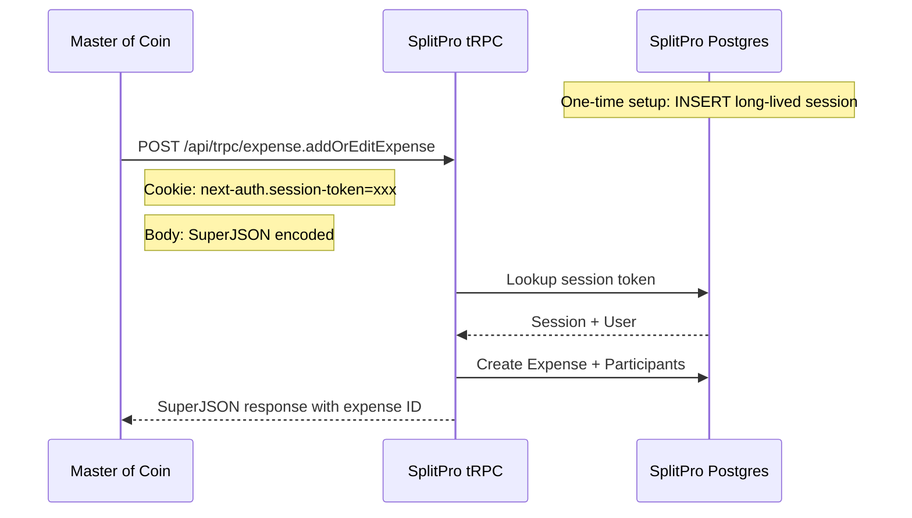
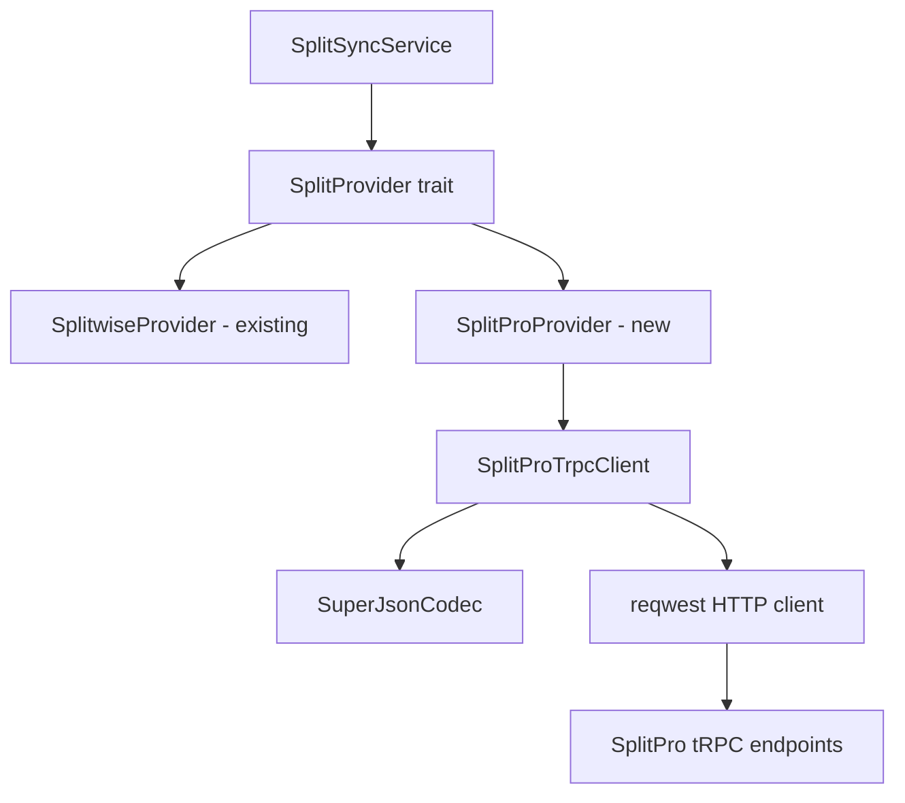
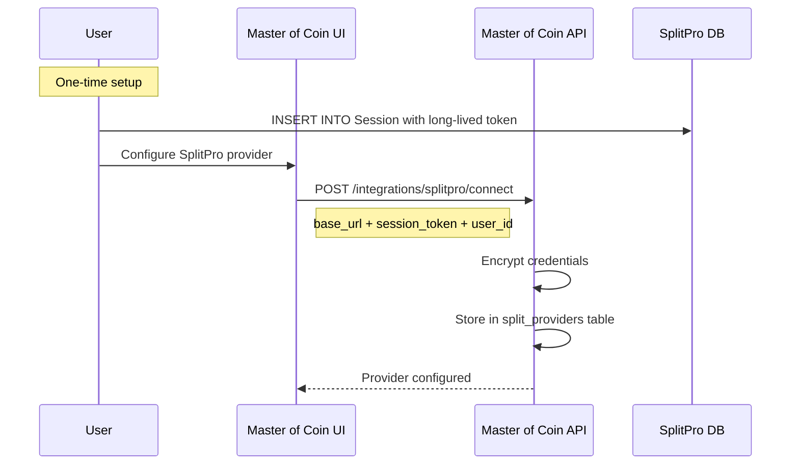

# SplitPro Integration — Design

**Requirements**: [requirements.md](./requirements.md)
**Date**: 2026-03-01

## 1. Overview

Implement a `SplitProProvider` that communicates with a self-hosted SplitPro instance via raw HTTP calls to its tRPC endpoints. Authentication uses a long-lived NextAuth session token inserted directly into SplitPro's `Session` database table.

The provider implements the existing [`SplitProvider`](../../backend/src/services/split_provider/mod.rs:18) trait, fitting into the same infrastructure as the [`SplitwiseProvider`](../../backend/src/services/split_provider/splitwise.rs:13).

## 2. Architecture

### 2.1 High-Level Flow



### 2.2 Component Architecture



### 2.3 Key Design Decisions

1. **tRPC over HTTP** - SplitPro has no REST API. We call tRPC endpoints directly via HTTP POST with SuperJSON-encoded bodies.

2. **Session-based auth** - A long-lived session is manually inserted into SplitPro's `Session` table. The session token is stored encrypted in Master of Coin's `split_providers.credentials` field.

3. **SuperJSON codec** - SplitPro's tRPC uses SuperJSON transformer which encodes BigInt values specially. We implement a Rust codec for encoding/decoding.

4. **Credentials format** - SplitPro credentials are stored as:
   ```json
   {
     "base_url": "http://splitkeep:3002",
     "session_token": "moc-api-token-xxxxx",
     "splitpro_user_id": 1
   }
   ```

## 3. Database Changes

### 3.1 No New Tables

No database migrations needed. The existing `split_providers` table already supports arbitrary `provider_type` values and JSON `credentials`.

### 3.2 Credentials Model

New Rust struct for SplitPro-specific credentials:

```rust
/// SplitPro credential structure stored in split_providers.credentials
#[derive(Debug, Serialize, Deserialize)]
pub struct SplitProCredentials {
    /// Base URL of the SplitPro instance, e.g. http://splitkeep:3002
    pub base_url: String,
    /// NextAuth session token for authentication
    pub session_token: String,
    /// SplitPro user ID for the authenticated user
    pub splitpro_user_id: i64,
}
```

## 4. Backend Changes

### 4.1 New Files

| File                                               | Description                                           |
| -------------------------------------------------- | ----------------------------------------------------- |
| `backend/src/services/split_provider/splitpro.rs`  | `SplitProProvider` implementing `SplitProvider` trait |
| `backend/src/services/split_provider/superjson.rs` | SuperJSON encoding/decoding utilities                 |

### 4.2 Modified Files

| File                                         | Change                                      |
| -------------------------------------------- | ------------------------------------------- |
| `backend/src/services/split_provider/mod.rs` | Export `SplitProProvider`                   |
| `backend/src/services/split_sync_service.rs` | Register SplitPro provider                  |
| `backend/src/models/split_provider.rs`       | Add `SplitProCredentials` struct            |
| `backend/src/handlers/split_providers.rs`    | Add SplitPro friends endpoint support       |
| `backend/src/handlers/split_sync.rs`         | Update external URL generation for SplitPro |

### 4.3 SplitProProvider Implementation

The provider wraps a `SplitProTrpcClient` that handles HTTP communication:

```rust
pub struct SplitProProvider {
    http_client: Client,
}

impl SplitProProvider {
    pub fn new() -> Self {
        Self {
            http_client: Client::new(),
        }
    }
}
```

### 4.4 tRPC Endpoint Mapping

| SplitProvider Method   | tRPC Procedure                  | HTTP Method | Path                                      |
| ---------------------- | ------------------------------- | ----------- | ----------------------------------------- |
| `create_expense`       | `expense.addOrEditExpense`      | POST        | `/api/trpc/expense.addOrEditExpense`      |
| `update_expense`       | `expense.addOrEditExpense`      | POST        | `/api/trpc/expense.addOrEditExpense`      |
| `delete_expense`       | `expense.deleteExpense`         | POST        | `/api/trpc/expense.deleteExpense`         |
| `get_expenses`         | `expense.getExpensesWithFriend` | GET         | `/api/trpc/expense.getExpensesWithFriend` |
| `get_expense_by_id`    | `expense.getExpenseDetails`     | GET         | `/api/trpc/expense.getExpenseDetails`     |
| `validate_credentials` | `user.me`                       | GET         | `/api/trpc/user.me`                       |
| `refresh_credentials`  | N/A                             | N/A         | Sessions don't expire                     |

### 4.5 SuperJSON Encoding

SplitPro's tRPC uses SuperJSON which encodes special types like BigInt. The encoding format:

**Request body for mutations:**

```json
{
  "json": {
    "paidBy": 1,
    "name": "Groceries",
    "category": "general",
    "amount": "5000",
    "groupId": null,
    "splitType": "EQUAL",
    "currency": "EUR",
    "participants": [
      { "userId": 1, "amount": "2500" },
      { "userId": 2, "amount": "2500" }
    ]
  },
  "meta": {
    "values": {
      "amount": ["bigint"],
      "participants.0.amount": ["bigint"],
      "participants.1.amount": ["bigint"]
    }
  }
}
```

**Query input for queries (URL-encoded):**

```
/api/trpc/expense.getExpenseDetails?input={"json":{"expenseId":"uuid-here"}}
```

The SuperJSON codec needs to:

1. **Encode**: Convert Rust BigDecimal amounts to BigInt strings with metadata paths
2. **Decode**: Parse SuperJSON responses back to Rust types, handling BigInt deserialization

### 4.6 Amount Conversion

SplitPro stores amounts as **BigInt in the smallest currency unit** (e.g., cents). Master of Coin uses BigDecimal with string representation like "100.00".

Conversion: `"100.00"` → multiply by 100 → `10000n` (BigInt)

The conversion factor depends on currency precision (most currencies use 2 decimal places).

### 4.7 Authentication Flow



### 4.8 Friends/Users Endpoint

SplitPro doesn't have a direct "get friends" endpoint like Splitwise. Instead, we use `user.getFriends` tRPC procedure which returns users that have balance relationships with the authenticated user.

```
GET /api/trpc/user.getFriends?input={"json":{}}
```

## 5. API Changes

### 5.1 New Endpoints

| Method | Path                                    | Description               | Request Body                                  | Response                |
| ------ | --------------------------------------- | ------------------------- | --------------------------------------------- | ----------------------- |
| POST   | `/api/v1/integrations/splitpro/connect` | Connect SplitPro provider | `{base_url, session_token, splitpro_user_id}` | `SplitProviderResponse` |

### 5.2 Modified Endpoints

| Method | Path                                         | Change                                   |
| ------ | -------------------------------------------- | ---------------------------------------- |
| GET    | `/api/v1/integrations/providers/:id/friends` | Add SplitPro support alongside Splitwise |

## 6. Frontend Changes

### 6.1 New Components

- `SplitProConnectionForm` — Form to input SplitPro base URL, session token, and user ID

### 6.2 Modified Components

- `Settings` page — Add SplitPro connection section alongside Splitwise
- `SplitProviderConfig` — Support selecting SplitPro friends when mapping people

### 6.3 New Services

- `splitProService.ts` — API calls for SplitPro connection

### 6.4 Modified Services

- `integrationService.ts` — Add `connectSplitPro` function

## 7. Error Handling

### 7.1 tRPC Error Mapping

| tRPC Error Code         | SplitProviderError     |
| ----------------------- | ---------------------- |
| `UNAUTHORIZED`          | `AuthenticationFailed` |
| `NOT_FOUND`             | `NotFound`             |
| `BAD_REQUEST`           | `ApiError`             |
| `INTERNAL_SERVER_ERROR` | `ApiError`             |
| `TOO_MANY_REQUESTS`     | `RateLimited`          |
| Network error           | `NetworkError`         |
| Invalid SuperJSON       | `InvalidResponse`      |

### 7.2 tRPC Error Response Format

```json
{
  "error": {
    "message": "...",
    "code": -32600,
    "data": {
      "code": "UNAUTHORIZED",
      "httpStatus": 401,
      "stack": "...",
      "path": "expense.addOrEditExpense"
    }
  }
}
```

## 8. Testing Strategy

### 8.1 Unit Tests

- SuperJSON encoding/decoding for various types (BigInt, dates, nested objects)
- Amount conversion between BigDecimal and BigInt
- Credential extraction and validation
- tRPC request building
- tRPC response parsing (success + error cases)

### 8.2 Integration Tests

- Mock HTTP server simulating tRPC responses
- Full `SplitProvider` trait method testing
- Error handling for various HTTP status codes
- SuperJSON round-trip encoding/decoding

### 8.3 Manual Testing

- Connect to real SplitPro instance
- Create, update, delete expenses
- Verify expenses appear correctly in SplitPro UI
- Verify friends list fetching
