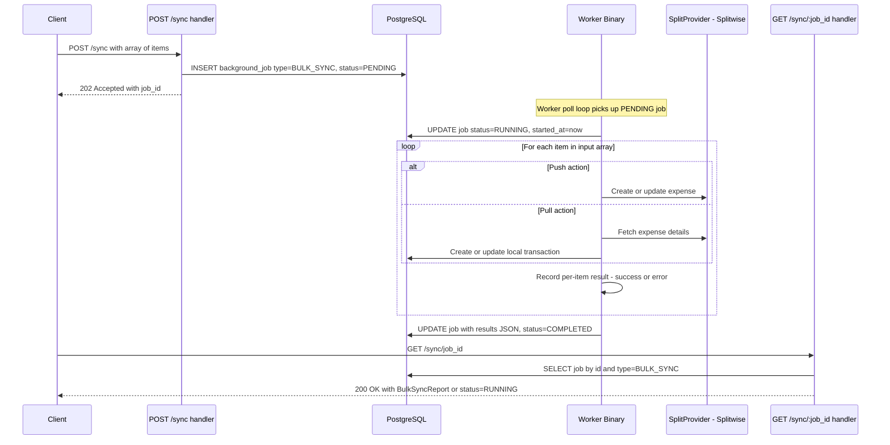

# Sync API — Design

**Requirements**: [requirements.md](./requirements.md)
**GitHub Issue**: [#41](https://github.com/abhijeet-reddy/master-of-coin/issues/41) (Sub-feature A)
**Date**: 2026-02-21

## 1. Overview

An **async bulk sync API** that accepts an array of push/pull operations, creates a `BULK_SYNC` background job, and processes them via the worker binary. This reuses the existing `background_jobs` infrastructure from drift detection and the existing `SplitSyncService` for actual push/pull logic.

The flow mirrors drift detection:

1. `POST /api/v1/sync` — accepts array of sync items, creates a PENDING job, returns 202 with job_id
2. `GET /api/v1/sync/:job_id` — polls for job status and per-item results
3. Worker picks up the job, processes items sequentially, stores results

## 2. Architecture

### 2.1 High-Level Flow



### 2.2 Worker Integration

The worker already has a dispatch-by-job-type pattern. Adding `BULK_SYNC` follows the same structure:

1. Worker creates a `SplitSyncService::new(pool)` at startup — same initialization as `AppState::new()`
2. When a `BULK_SYNC` job is picked up, the worker parses the input array and iterates through items
3. For each item, it calls the appropriate `SplitSyncService` method
4. Per-item results are collected into a `BulkSyncReport` and stored as the job result

The worker already supports one-per-type concurrency, so `BULK_SYNC` and `DRIFT_DETECTION` jobs can run simultaneously, but two `BULK_SYNC` jobs run sequentially.

### 2.3 Push/Pull Dispatch Logic

Each item in the input array specifies an `action` and an identifier. The worker dispatches to existing `SplitSyncService` methods:

| Action | Identifier            | Existing Method                               | Behavior                                                                          |
| ------ | --------------------- | --------------------------------------------- | --------------------------------------------------------------------------------- |
| `push` | `transaction_id`      | `sync_transaction` then `resolve_mismatch`    | If unlinked: creates expense. If linked and mismatched: force-pushes local data   |
| `pull` | `external_expense_id` | `sync_external_expense` or `resolve_mismatch` | If unlinked: imports as local transaction. If linked: updates local from external |

**Push flow detail:**

1. Call `sync_service.sync_transaction(transaction_id)` — handles both create and update
2. If result is `"mismatch"`, automatically follow up with `resolve_mismatch(transaction_id, external_expense_id, "push")` to force-push local data
3. Record the result

**Pull flow detail:**

1. Check if the external expense is already linked via `split_sync_records`
2. If linked: call `resolve_mismatch(transaction_id, external_expense_id, "pull")` to update local from external
3. If not linked: fetch the expense from provider, then call `sync_external_expense(user_id, expense, provider_id)` to import
4. Record the result

### 2.4 Error Isolation

Each item is processed in a try/catch. If one item fails (provider error, not found, etc.), the error is recorded for that item and processing continues to the next. The job only gets `status=FAILED` if there is a systemic error (e.g., database connection failure). Individual item failures result in `status=COMPLETED` with per-item error details in the result.

## 3. Database Changes

### 3.1 Migration: Add BULK_SYNC to job_type

New migration: `add_bulk_sync_job_type`

**up.sql**:

```sql
ALTER TYPE job_type ADD VALUE 'BULK_SYNC';
```

**down.sql**:

```sql
-- PostgreSQL does not support removing enum values directly.
-- To roll back, recreate the enum without BULK_SYNC.

BEGIN;

DELETE FROM background_jobs WHERE job_type = 'BULK_SYNC';

ALTER TABLE background_jobs ALTER COLUMN job_type TYPE TEXT;
DROP TYPE job_type;
CREATE TYPE job_type AS ENUM ('DRIFT_DETECTION');
ALTER TABLE background_jobs ALTER COLUMN job_type TYPE job_type USING job_type::job_type;

COMMIT;
```

### 3.2 No New Tables

No new tables needed. The `background_jobs` table stores everything — the input array in `input` JSONB and per-item results in `result` JSONB.

## 4. API Changes

### 4.1 New Endpoints

| Method | Path                         | Description                   | Request                   | Response              |
| ------ | ---------------------------- | ----------------------------- | ------------------------- | --------------------- |
| POST   | `/api/v1/sync`               | Start a bulk sync job         | JSON: array of sync items | 202 with `job_id`     |
| GET    | `/api/v1/sync/:job_id`       | Get job status and results    | None                      | `BulkSyncJobResponse` |
| POST   | `/api/v1/sync/:job_id/retry` | Retry failed items from a job | None                      | 202 with new `job_id` |

### 4.2 POST — Start Bulk Sync Job

```
POST /api/v1/sync
Authorization: Bearer <token>
Content-Type: application/json

{
  "items": [
    {
      "action": "push",
      "transaction_id": "uuid-1"
    },
    {
      "action": "pull",
      "external_expense_id": "12345"
    },
    {
      "action": "push",
      "transaction_id": "uuid-2"
    }
  ]
}
```

**Response** (202 Accepted):

```json
{
  "job_id": "uuid",
  "status": "PENDING",
  "message": "Bulk sync job started",
  "total_items": 3
}
```

**Validation:**

- `items` array must not be empty
- Each item must have `action` = `"push"` or `"pull"`
- Push items must have `transaction_id`
- Pull items must have `external_expense_id`

### 4.3 GET — Poll for Results

```
GET /api/v1/sync/<job_id>
Authorization: Bearer <token>
```

**Response when RUNNING** (200 OK):

```json
{
  "job_id": "uuid",
  "status": "RUNNING",
  "created_at": "2026-02-21T12:00:00Z",
  "started_at": "2026-02-21T12:00:01Z"
}
```

**Response when COMPLETED** (200 OK):

```json
{
  "job_id": "uuid",
  "status": "COMPLETED",
  "created_at": "2026-02-21T12:00:00Z",
  "started_at": "2026-02-21T12:00:01Z",
  "completed_at": "2026-02-21T12:00:05Z",
  "result": {
    "summary": {
      "total": 3,
      "succeeded": 2,
      "failed": 1
    },
    "items": [
      {
        "action": "push",
        "transaction_id": "uuid-1",
        "status": "success",
        "detail": {
          "sync_status": "created",
          "external_expense_id": "67890"
        }
      },
      {
        "action": "pull",
        "external_expense_id": "12345",
        "status": "success",
        "detail": {
          "sync_status": "imported",
          "transaction_id": "uuid-new"
        }
      },
      {
        "action": "push",
        "transaction_id": "uuid-2",
        "status": "failed",
        "error": "Transaction has no splits to sync"
      }
    ]
  }
}
```

**Response when FAILED** (200 OK):

```json
{
  "job_id": "uuid",
  "status": "FAILED",
  "created_at": "2026-02-21T12:00:00Z",
  "started_at": "2026-02-21T12:00:01Z",
  "completed_at": "2026-02-21T12:00:02Z",
  "error": "Systemic failure: database connection lost"
}
```

### 4.4 POST — Retry Failed Items

```
POST /api/v1/sync/<job_id>/retry
Authorization: Bearer <token>
```

**Logic:**

1. Validates the original job exists, belongs to the user, has `job_type=BULK_SYNC`, and has `status=COMPLETED`
2. Reads the original job's `result` to extract items with `status: "failed"`
3. If no failed items exist, returns 400 — "No failed items to retry"
4. Creates a **new** job with only the failed items as input and `previous_job_id` pointing to the original
5. Returns the new job_id with `status=PENDING`

**Response** (202 Accepted):

```json
{
  "job_id": "new-uuid",
  "status": "PENDING",
  "message": "Bulk sync retry job started",
  "total_items": 1
}
```

Returns 400 if the original job has no failed items or is not COMPLETED. Returns 404 if job not found or belongs to another user.

> **Note**: Unlike drift detection retry which only retries FAILED jobs, bulk sync retry works on COMPLETED jobs — because the job itself completed successfully, but individual items within it may have failed.

### 4.5 Modified Endpoints

None.

## 5. Backend Changes

### 5.1 JobType Enum Extension

In [`backend/src/types/job_types.rs`](backend/src/types/job_types.rs):

Add `BulkSync` variant to `JobType`:

```rust
pub enum JobType {
    DriftDetection,
    BulkSync,
}
```

Update `ToSql` to handle `JobType::BulkSync => out.write_all(b"BULK_SYNC")?` and `FromSql` to handle `b"BULK_SYNC" => Ok(JobType::BulkSync)`.

### 5.2 New Models: Bulk Sync Types

In `backend/src/models/bulk_sync.rs`:

```rust
/// Request body for POST /api/v1/sync
#[derive(Debug, Clone, Serialize, Deserialize, Validate)]
pub struct BulkSyncRequest {
    #[validate(length(min = 1, message = "items array must not be empty"))]
    pub items: Vec<SyncItem>,
}

/// A single sync operation in the bulk request
#[derive(Debug, Clone, Serialize, Deserialize)]
pub struct SyncItem {
    pub action: SyncAction,
    #[serde(skip_serializing_if = "Option::is_none")]
    pub transaction_id: Option<Uuid>,
    #[serde(skip_serializing_if = "Option::is_none")]
    pub external_expense_id: Option<String>,
}

/// The action to perform
#[derive(Debug, Clone, Serialize, Deserialize, PartialEq)]
#[serde(rename_all = "lowercase")]
pub enum SyncAction {
    Push,
    Pull,
}

/// Response for POST /api/v1/sync (202 Accepted)
#[derive(Debug, Clone, Serialize, Deserialize)]
pub struct StartSyncJobResponse {
    pub job_id: Uuid,
    pub status: JobStatus,
    pub message: String,
    pub total_items: usize,
}

/// Response for GET /api/v1/sync/:job_id
#[derive(Debug, Clone, Serialize, Deserialize)]
pub struct BulkSyncJobResponse {
    pub job_id: Uuid,
    pub status: JobStatus,
    pub created_at: DateTime<Utc>,
    #[serde(skip_serializing_if = "Option::is_none")]
    pub started_at: Option<DateTime<Utc>>,
    #[serde(skip_serializing_if = "Option::is_none")]
    pub completed_at: Option<DateTime<Utc>>,
    #[serde(skip_serializing_if = "Option::is_none")]
    pub result: Option<BulkSyncReport>,
    #[serde(skip_serializing_if = "Option::is_none")]
    pub error: Option<String>,
}

/// The full bulk sync report stored as JSONB in background_jobs.result
#[derive(Debug, Clone, Serialize, Deserialize)]
pub struct BulkSyncReport {
    pub summary: BulkSyncSummary,
    pub items: Vec<SyncItemResult>,
}

/// Summary counts
#[derive(Debug, Clone, Serialize, Deserialize)]
pub struct BulkSyncSummary {
    pub total: usize,
    pub succeeded: usize,
    pub failed: usize,
}

/// Per-item result
#[derive(Debug, Clone, Serialize, Deserialize)]
pub struct SyncItemResult {
    pub action: SyncAction,
    #[serde(skip_serializing_if = "Option::is_none")]
    pub transaction_id: Option<Uuid>,
    #[serde(skip_serializing_if = "Option::is_none")]
    pub external_expense_id: Option<String>,
    pub status: String,  // "success" or "failed"
    #[serde(skip_serializing_if = "Option::is_none")]
    pub detail: Option<serde_json::Value>,
    #[serde(skip_serializing_if = "Option::is_none")]
    pub error: Option<String>,
}
```

### 5.3 New Service: `BulkSyncService`

In `backend/src/services/bulk_sync_service.rs`:

A module with a single public function that the worker calls:

```rust
/// Execute a bulk sync job.
///
/// Iterates through each item, dispatches to the appropriate
/// SplitSyncService method, and collects per-item results.
///
/// Individual item failures are captured but do not stop processing.
pub async fn execute_bulk_sync(
    sync_service: &SplitSyncService,
    user_id: Uuid,
    items: Vec<SyncItem>,
) -> BulkSyncReport
```

**Internal flow per item:**

For `push`:

1. Call `sync_service.sync_transaction(transaction_id)`
2. If result status is `"mismatch"`, extract `external_expense_id` from the mismatch response and call `sync_service.resolve_mismatch(transaction_id, &external_expense_id, "push")`
3. Record success with the sync result details

For `pull`:

1. Look up `split_sync_records` to check if `external_expense_id` is already linked to a local transaction
2. If linked: call `sync_service.resolve_mismatch(transaction_id, &external_expense_id, "pull")`
3. If not linked: need to fetch the expense from the provider, then call `sync_service.sync_external_expense(user_id, &expense, provider_id)`
4. Record success with the import/update details

### 5.4 Worker Changes

In [`backend/src/bin/worker.rs`](backend/src/bin/worker.rs):

1. Create a `SplitSyncService` at startup alongside the existing providers
2. Add `JobType::BulkSync` to the dispatch match in `execute_job()`
3. New `execute_bulk_sync_job()` function that parses input, calls the service, and returns the serialized report

```rust
// In main():
let sync_service = SplitSyncService::new(pool.clone());

// In execute_job() match:
JobType::BulkSync => execute_bulk_sync_job(&sync_service, user_id, input).await,
```

### 5.5 New Handler

In `backend/src/handlers/bulk_sync.rs`:

Three handler functions:

- **`start_bulk_sync`** — POST handler
  - Validates the request body (items not empty, each item has correct fields for its action)
  - Creates `background_jobs` row: `job_type=BULK_SYNC`, `status=PENDING`, `input={items}`
  - Returns 202 with job_id and total_items count

- **`get_bulk_sync`** — GET handler
  - Reads job from DB, validates `job_type=BULK_SYNC` and user ownership
  - Deserializes `result` JSONB into `BulkSyncReport` if COMPLETED
  - Returns current status + result/error

- **`retry_bulk_sync`** — POST retry handler
  - Validates original job is COMPLETED, belongs to user, and is BULK_SYNC type
  - Reads `result` from original job, extracts items with `status: "failed"`
  - Reconstructs `SyncItem` objects from the failed items
  - Creates new job with only failed items as input and `previous_job_id` = original job ID
  - Returns 202 with new job_id

### 5.6 Route Registration

Add to [`routes.rs`](backend/src/api/routes.rs):

```rust
// Bulk sync - async job-based
.route(
    "/sync",
    post(handlers::bulk_sync::start_bulk_sync).layer(middleware::from_fn(
        |auth, req, next| {
            require_scope(ResourceType::Transactions, OperationType::Write, auth, req, next)
        },
    )),
)
.route(
    "/sync/:job_id",
    get(handlers::bulk_sync::get_bulk_sync).layer(middleware::from_fn(
        |auth, req, next| {
            require_scope(ResourceType::Transactions, OperationType::Read, auth, req, next)
        },
    )),
)
.route(
    "/sync/:job_id/retry",
    post(handlers::bulk_sync::retry_bulk_sync).layer(middleware::from_fn(
        |auth, req, next| {
            require_scope(ResourceType::Transactions, OperationType::Write, auth, req, next)
        },
    )),
)
```

Note: POST uses `Write` scope since it modifies data. GET uses `Read` scope. Retry uses `Write` since it creates a new job that will perform sync operations.

### 5.7 Module Registration

- Add `pub mod bulk_sync;` to [`handlers/mod.rs`](backend/src/handlers/mod.rs)
- Add `pub mod bulk_sync;` to [`models/mod.rs`](backend/src/models/mod.rs)
- Add `pub mod bulk_sync_service;` to [`services/mod.rs`](backend/src/services/mod.rs)

## 6. Error Handling

| Scenario                         | Error / Behavior                                             |
| -------------------------------- | ------------------------------------------------------------ |
| Empty items array                | 400 Bad Request — "items array must not be empty"            |
| Push without transaction_id      | 400 Bad Request — "push action requires transaction_id"      |
| Pull without external_expense_id | 400 Bad Request — "pull action requires external_expense_id" |
| Job not found                    | 404 Not Found — "Job not found"                              |
| Job belongs to different user    | 404 Not Found — same as not found for security               |
| Job is wrong type                | 404 Not Found — filtered by BULK_SYNC                        |
| Item: transaction not found      | Item result: failed with error message                       |
| Item: no splits                  | Item result: failed with "Transaction has no splits"         |
| Item: provider error             | Item result: failed with provider error message              |
| Item: no provider configured     | Item result: failed with "No provider configured"            |
| Systemic DB failure mid-job      | Job status: FAILED with error message                        |
| Retry: job not COMPLETED         | 400 Bad Request — "Only COMPLETED jobs can be retried"       |
| Retry: no failed items           | 400 Bad Request — "No failed items to retry"                 |
| Retry: job not found/wrong user  | 404 Not Found — "Job not found"                              |

## 7. Testing Strategy

### 7.1 Integration Tests

New test file: `backend/tests/integration/api/test_bulk_sync.rs`

Tests:

1. **Start and poll job**: POST returns 202 with job_id, GET returns PENDING then COMPLETED
2. **Push unlinked transaction**: Creates expense on provider, returns success
3. **Push linked transaction**: Updates expense on provider
4. **Pull unlinked expense**: Imports as local transaction
5. **Pull linked expense**: Updates local transaction from external
6. **Mixed push+pull**: Multiple items with different actions all processed
7. **Partial failure**: Some items succeed, some fail — job still COMPLETED with per-item results
8. **Empty items**: Returns 400
9. **Invalid action fields**: Push without transaction_id returns 400
10. **Job not found**: GET with invalid job_id returns 404
11. **Job ownership**: User A cannot see User B's job
12. **Retry creates new job with failed items only**: Retry on a job with mixed results creates a new job containing only the failed items, with `previous_job_id` set
13. **Retry with no failed items**: Retry on a fully-successful job returns 400
14. **Retry non-COMPLETED job**: Retry on a PENDING/RUNNING job returns 400

### 7.2 Unit Tests

The `execute_bulk_sync()` function can be tested with constructed data if needed, but integration tests with the full stack are preferred given the existing test patterns.
