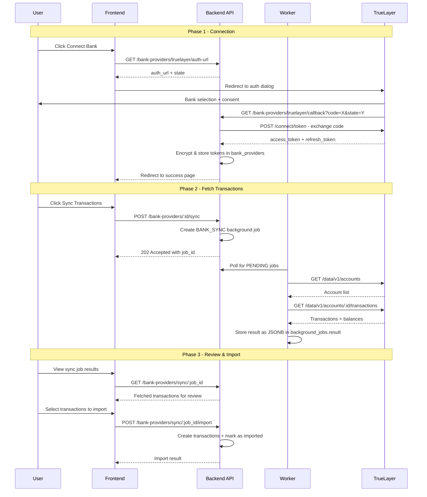

# Open Banking Integration — Design

**Requirements**: [requirements.md](./requirements.md)
**GitHub Issue**: N/A
**Date**: 2026-03-16

## 1. Overview

This feature introduces a generic **bank provider** abstraction for Open Banking integrations, with TrueLayer as the first implementation. The design follows the same trait-based pattern used by `SplitProvider` and `InvestmentProvider` in the existing codebase.

The flow is:

1. User initiates OAuth via the UI → redirected to TrueLayer auth dialog → bank consent granted
2. Callback exchanges code for tokens → stored encrypted in `bank_providers` table
3. User triggers a `BANK_SYNC` background job → worker fetches transactions from TrueLayer Data API
4. Job result contains fetched transactions as JSONB → user reviews in UI
5. User approves selected transactions → created as regular transactions in the linked account

## 2. Architecture

### 2.1 High-Level Flow



### 2.2 Generic BankProvider Trait

Following the `InvestmentProvider` and `SplitProvider` patterns:

```rust
#[async_trait]
pub trait BankProvider: Send + Sync {
    /// Provider type identifier
    fn provider_type(&self) -> BankProviderType;

    /// Generate OAuth authorization URL for bank connection
    fn generate_auth_url(&self, state: &str, redirect_uri: &str) -> Result<String, BankProviderError>;

    /// Exchange authorization code for access/refresh tokens
    async fn exchange_code(&self, code: &str, redirect_uri: &str) -> Result<BankTokens, BankProviderError>;

    /// Refresh an expired access token
    async fn refresh_token(&self, refresh_token: &str) -> Result<BankTokens, BankProviderError>;

    /// Fetch all accounts from the connected bank
    async fn fetch_accounts(&self, access_token: &str) -> Result<Vec<BankAccount>, BankProviderError>;

    /// Fetch transactions for a specific bank account
    async fn fetch_transactions(
        &self,
        access_token: &str,
        account_id: &str,
        from: DateTime<Utc>,
        to: DateTime<Utc>,
    ) -> Result<Vec<BankTransaction>, BankProviderError>;

    /// Fetch balance for a specific bank account
    async fn fetch_balance(&self, access_token: &str, account_id: &str) -> Result<BankBalance, BankProviderError>;
}
```

### 2.3 Provider Registry

```rust
/// Canonical registry of all bank providers.
/// Adding a new provider only requires adding it here.
pub fn all_bank_providers() -> HashMap<BankProviderType, Arc<dyn BankProvider>> {
    let mut providers = HashMap::new();
    providers.insert(
        BankProviderType::TrueLayer,
        Arc::new(TrueLayerProvider::from_env()) as Arc<dyn BankProvider>,
    );
    // Future: providers.insert(BankProviderType::Plaid, Arc::new(PlaidProvider::from_env()));
    providers
}
```

## 3. Database Changes

### 3.1 New Enum: `bank_provider_type`

```sql
CREATE TYPE bank_provider_type AS ENUM ('TRUELAYER');
-- Future: ALTER TYPE bank_provider_type ADD VALUE 'PLAID';
```

### 3.2 New Enum Value for `job_type`

```sql
ALTER TYPE job_type ADD VALUE 'BANK_SYNC';
```

### 3.3 New Table: `bank_providers`

Links a Master of Coin account to a bank provider connection. Follows the same pattern as `investment_providers` and `split_providers`.

```sql
CREATE TABLE bank_providers (
    id UUID PRIMARY KEY DEFAULT gen_random_uuid(),
    user_id UUID NOT NULL REFERENCES users(id),
    -- UNIQUE enforces one bank connection per account at the DB level
    account_id UUID NOT NULL UNIQUE REFERENCES accounts(id),
    provider_type bank_provider_type NOT NULL,
    -- Encrypted JSONB containing: access_token, refresh_token, token_expires_at,
    -- external_account_id (the bank account ID on the provider side)
    credentials JSONB NOT NULL,
    -- The bank account ID on the provider side (for quick lookups without decrypting)
    external_account_id VARCHAR(255),
    is_active BOOLEAN NOT NULL DEFAULT TRUE,
    last_sync_at TIMESTAMPTZ,
    created_at TIMESTAMPTZ NOT NULL DEFAULT NOW(),
    updated_at TIMESTAMPTZ NOT NULL DEFAULT NOW()
);
```

### 3.4 New Table: `bank_sync_records`

Tracks which external transactions have been imported to prevent duplicates.

```sql
CREATE TABLE bank_sync_records (
    id UUID PRIMARY KEY DEFAULT gen_random_uuid(),
    bank_provider_id UUID NOT NULL REFERENCES bank_providers(id) ON DELETE CASCADE,
    external_transaction_id VARCHAR(255) NOT NULL,
    transaction_id UUID REFERENCES transactions(id) ON DELETE SET NULL,
    imported_at TIMESTAMPTZ NOT NULL DEFAULT NOW(),
    -- Prevents double-importing the same bank transaction.
    -- PostgreSQL creates an implicit composite index on (bank_provider_id, external_transaction_id)
    -- for this UNIQUE constraint. This index also efficiently serves queries filtering on
    -- bank_provider_id alone (e.g., "load all imported IDs for this provider"), so no
    -- separate index on bank_provider_id is needed.
    UNIQUE(bank_provider_id, external_transaction_id)
);
```

### 3.5 Models

```rust
// --- Database model ---
#[derive(Debug, Clone, Queryable, Selectable, Identifiable)]
#[diesel(table_name = bank_providers)]
pub struct BankProviderRecord {
    pub id: Uuid,
    pub user_id: Uuid,
    pub account_id: Uuid,
    pub provider_type: BankProviderType,
    pub credentials: serde_json::Value,
    pub external_account_id: Option<String>,
    pub is_active: bool,
    pub last_sync_at: Option<DateTime<Utc>>,
    pub created_at: DateTime<Utc>,
    pub updated_at: DateTime<Utc>,
}

#[derive(Debug, Insertable)]
#[diesel(table_name = bank_providers)]
pub struct NewBankProvider {
    pub user_id: Uuid,
    pub account_id: Uuid,
    pub provider_type: BankProviderType,
    pub credentials: serde_json::Value,
    pub external_account_id: Option<String>,
    pub is_active: bool,
}

// --- Sync record ---
#[derive(Debug, Clone, Queryable, Selectable, Identifiable)]
#[diesel(table_name = bank_sync_records)]
pub struct BankSyncRecord {
    pub id: Uuid,
    pub bank_provider_id: Uuid,
    pub external_transaction_id: String,
    pub transaction_id: Option<Uuid>,
    pub imported_at: DateTime<Utc>,
}
```

## 4. API Changes

### 4.1 New Endpoints

| Method | Path                                       | Description                                      | Request Body               | Response                           |
| ------ | ------------------------------------------ | ------------------------------------------------ | -------------------------- | ---------------------------------- |
| GET    | /api/v1/bank-providers                     | List all bank provider connections for user      | -                          | `BankProviderResponse[]`           |
| GET    | /api/v1/bank-providers/truelayer/auth-url  | Get TrueLayer OAuth auth URL                     | `{ account_id }`           | `{ auth_url, state }`              |
| GET    | /api/v1/bank-providers/truelayer/callback  | OAuth callback - exchanges code for tokens       | query: code, state         | Redirect to frontend               |
| DELETE | /api/v1/bank-providers/:id                 | Disconnect a bank provider                       | -                          | 204 No Content                     |
| POST   | /api/v1/bank-providers/:id/sync            | Start a BANK_SYNC background job                 | `{ from_date?, to_date? }` | `{ job_id, status }`               |
| GET    | /api/v1/bank-providers/sync/:job_id        | Get sync job status and results                  | -                          | `BankSyncJobResponse`              |
| POST   | /api/v1/bank-providers/sync/:job_id/import | Import selected transactions from sync results   | `{ transaction_ids: [] }`  | `{ imported_count, skipped }`      |
| GET    | /api/v1/bank-providers/:id/balance         | Fetch current balance from provider              | -                          | `{ current, available, currency }` |
| GET    | /api/v1/bank-providers/:id/accounts        | List bank accounts from provider (for selection) | -                          | `BankAccountResponse[]`            |
| PUT    | /api/v1/bank-providers/:id/link-account    | Link a specific external bank account            | `{ external_account_id }`  | `BankProviderResponse`             |

### 4.2 Auth URL Flow Detail

The `auth-url` endpoint generates a TrueLayer auth link:

```
https://auth.truelayer-sandbox.com/
  ?response_type=code
  &client_id={TRUELAYER_CLIENT_ID}
  &redirect_uri={TRUELAYER_REDIRECT_URI}
  &scope=info accounts balance transactions offline_access
  &state={encrypted_state_with_user_id_and_account_id}
  &providers=uk-cs-mock uk-ob-all
```

The `state` parameter encodes the user_id and account_id so the callback can associate the connection.

### 4.3 Response DTOs

```rust
#[derive(Serialize)]
pub struct BankProviderResponse {
    pub id: Uuid,
    pub user_id: Uuid,
    pub account_id: Uuid,
    pub provider_type: BankProviderType,
    pub external_account_id: Option<String>,
    pub is_active: bool,
    pub last_sync_at: Option<DateTime<Utc>>,
    pub created_at: DateTime<Utc>,
    pub updated_at: DateTime<Utc>,
    // Note: credentials never exposed
}

#[derive(Serialize)]
pub struct BankSyncJobResponse {
    pub job_id: Uuid,
    pub status: JobStatus,
    pub created_at: DateTime<Utc>,
    pub started_at: Option<DateTime<Utc>>,
    pub completed_at: Option<DateTime<Utc>>,
    pub result: Option<BankSyncReport>,
    pub error: Option<String>,
}

#[derive(Serialize, Deserialize)]
pub struct BankSyncReport {
    pub provider_type: BankProviderType,
    pub account_name: String,
    pub balance: Option<BankBalanceInfo>,
    pub transactions: Vec<FetchedBankTransaction>,
    pub summary: BankSyncSummary,
}

#[derive(Serialize, Deserialize)]
pub struct BankSyncSummary {
    pub total_fetched: i64,
    pub already_imported: i64,
    pub new_transactions: i64,
}

#[derive(Serialize, Deserialize)]
pub struct FetchedBankTransaction {
    pub external_id: String,
    pub description: String,
    pub amount: String,
    pub currency: String,
    pub date: DateTime<Utc>,
    pub transaction_type: String,  // "DEBIT" or "CREDIT"
    pub merchant_name: Option<String>,
    pub category: Option<String>,  // TrueLayer's category
    pub already_imported: bool,
}

#[derive(Serialize, Deserialize)]
pub struct BankBalanceInfo {
    pub current: String,
    pub available: Option<String>,
    pub currency: String,
    pub updated_at: DateTime<Utc>,
}
```

## 5. Frontend Changes

### 5.1 New Components

- `BankProviderConnection` — Shows connection status for an account, with connect/disconnect buttons
- `BankSyncReview` — Review page for fetched transactions (similar to drift detection review)
- `BankTransactionList` — List of fetched transactions with checkboxes for selection
- `BankBalanceDisplay` — Shows current/available balance from the bank
- `BankAccountSelector` — After OAuth, lets user pick which external bank account to link

### 5.2 New Hooks

- `useBankProviders` — Fetches list of bank provider connections
- `useBankSync` — Manages sync job lifecycle (start, poll, review)
- `useBankBalance` — Fetches balance for a connected account
- `useBankImport` — Handles importing selected transactions

### 5.3 New Services

- `bankProviderService.ts` — API client for all bank provider endpoints

### 5.4 Modified Components

- Account detail view — Add "Bank Connection" section showing provider status, sync button, and balance
- Account settings — Add ability to connect/disconnect bank provider

## 6. Error Handling

| Error Scenario                   | Handling                                                      |
| -------------------------------- | ------------------------------------------------------------- |
| OAuth flow cancelled by user     | Redirect to frontend with error query param, show toast       |
| Token exchange fails             | Log error, redirect with error, user can retry                |
| Access token expired during sync | Auto-refresh using refresh_token, retry the request           |
| Refresh token expired            | Mark provider as inactive, prompt user to re-authenticate     |
| TrueLayer API rate limit         | Retry with backoff in worker, mark job as failed if exhausted |
| TrueLayer API error              | Store error in job result, show to user                       |
| Duplicate transaction detected   | Skip silently, mark as `already_imported` in review UI        |
| Network error during sync        | Retry in worker, fail job after max retries                   |

## 7. Testing Strategy

### Backend Integration Tests

- Test OAuth callback handler (mock TrueLayer token exchange)
- Test bank provider CRUD operations
- Test sync job creation and status retrieval
- Test transaction import with duplicate detection
- Test token refresh flow

### Frontend Testing

- Test bank connection flow UI
- Test sync review page with mock data
- Test transaction selection and import
- Test balance display
- Test error states (expired consent, failed sync)

## 8. Environment Variables

```env
# TrueLayer Configuration
TRUELAYER_CLIENT_ID=your_client_id
TRUELAYER_CLIENT_SECRET=your_client_secret
TRUELAYER_REDIRECT_URI=http://localhost:13153/api/v1/bank-providers/truelayer/callback

# Environment: "sandbox" or "production"
TRUELAYER_ENVIRONMENT=sandbox
# Sandbox URLs (auto-selected based on environment):
#   Auth: https://auth.truelayer-sandbox.com
#   API:  https://api.truelayer-sandbox.com
# Production URLs:
#   Auth: https://auth.truelayer.com
#   API:  https://api.truelayer.com
```

## 9. File Structure

```
backend/src/
├── services/
│   └── bank_provider/
│       ├── mod.rs              # BankProvider trait + registry
│       ├── types.rs            # BankTokens, BankAccount, BankTransaction, BankBalance, errors
│       └── truelayer.rs        # TrueLayer implementation
├── handlers/
│   └── bank_providers.rs       # HTTP handlers for all bank provider endpoints
├── models/
│   ├── bank_provider.rs        # DB models + request/response DTOs
│   └── bank_sync.rs            # Sync record model + sync report DTOs
├── repositories/
│   ├── bank_provider.rs        # DB queries for bank_providers table
│   └── bank_sync.rs            # DB queries for bank_sync_records table
├── types/
│   └── bank_provider_type.rs   # BankProviderType enum
└── bin/
    └── worker.rs               # Add BANK_SYNC job dispatch

frontend/src/
├── services/
│   └── bankProviderService.ts  # API client
├── hooks/usecase/
│   ├── useBankProviders.ts
│   ├── useBankSync.ts
│   ├── useBankBalance.ts
│   └── useBankImport.ts
├── components/bank/
│   ├── BankProviderConnection.tsx
│   ├── BankSyncReview.tsx
│   ├── BankTransactionList.tsx
│   ├── BankBalanceDisplay.tsx
│   └── BankAccountSelector.tsx
└── types/
    └── bankProvider.ts         # TypeScript types
```
