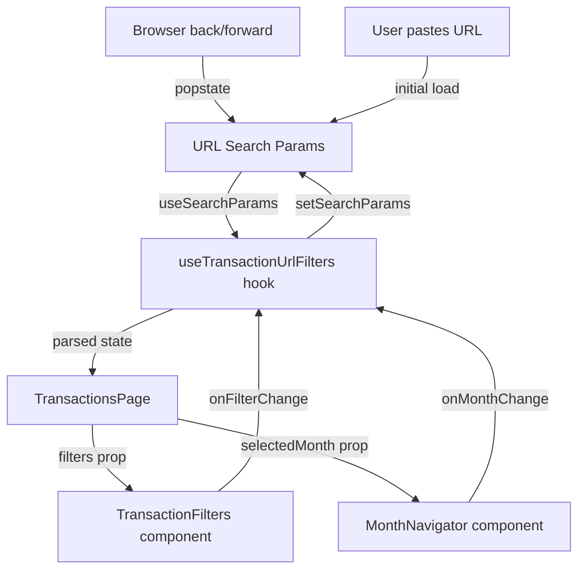

# URL Filter Sync for Transactions Page — Design

**Requirements**: [requirements.md](./requirements.md)
**Date**: 2026-04-11

## 1. Overview

This feature replaces the `useState`-based filter and month state in [`TransactionsPage`](frontend/src/pages/Transactions.tsx) with URL search parameters using React Router's `useSearchParams`. A new custom hook `useTransactionUrlFilters` will serve as the single source of truth — reading filter state from the URL and providing setter functions that update the URL. This ensures the URL always reflects the current filter state and vice versa.

## 2. Architecture

### 2.1 Data Flow



### 2.2 URL Parameter Schema

| Filter Field     | URL Param      | Format                    | Default / Omit Rule     |
| ---------------- | -------------- | ------------------------- | ----------------------- |
| Selected month   | `month`        | `YYYY-MM` e.g. `2026-04`  | Omit when current month |
| Account IDs      | `accounts`     | Comma-separated UUIDs     | Omit when empty         |
| Category IDs     | `categories`   | Comma-separated UUIDs     | Omit when empty         |
| Transaction type | `type`         | `income` or `expense`     | Omit when `all`         |
| Start date       | `startDate`    | `YYYY-MM-DD`              | Omit when not set       |
| End date         | `endDate`      | `YYYY-MM-DD`              | Omit when not set       |
| Min amount       | `minAmount`    | Numeric string e.g. `10`  | Omit when not set       |
| Max amount       | `maxAmount`    | Numeric string e.g. `500` | Omit when not set       |
| Paid by others   | `paidByOthers` | `only` or `exclude`       | Omit when `all`         |

**Example URL**: `/transactions?month=2026-03&accounts=abc-123,def-456&type=expense&minAmount=50`

### 2.3 Key Design Decisions

1. **Single custom hook** — All URL ↔ state logic lives in `useTransactionUrlFilters`. The page component becomes a thin consumer.
2. **Omit default values** — Parameters at their default value are not included in the URL, keeping URLs clean. A bare `/transactions` means "current month, no filters."
3. **Comma-separated arrays** — Account and category IDs use comma-separated values in a single param rather than repeated params, for cleaner URLs.
4. **`replace` for filter changes** — Filter changes use `setSearchParams(..., { replace: true })` to avoid polluting browser history with every filter toggle. Month changes use `push` (no replace) so back/forward navigates between months.

## 3. Database Changes

None — this is a frontend-only feature.

## 4. API Changes

None — filtering is done client-side on already-fetched data.

## 5. Frontend Changes

### 5.1 New Hook

#### `useTransactionUrlFilters`

**File**: `frontend/src/hooks/ui/useTransactionUrlFilters.ts`

```typescript
interface UseTransactionUrlFiltersReturn {
  // Parsed state from URL
  selectedMonth: Date;
  filters: TransactionFilterValues;
  showFilters: boolean;

  // Setters that update URL
  setSelectedMonth: (date: Date) => void;
  setFilters: (filters: TransactionFilterValues) => void;
  clearFilters: () => void;
}
```

**Responsibilities:**

- Read `searchParams` via `useSearchParams()`
- Parse each param into the appropriate type using pure helper functions
- Derive `showFilters` — `true` when any non-month filter param is present in the URL
- Provide `setSelectedMonth` that updates the `month` param (push navigation)
- Provide `setFilters` that serializes `TransactionFilterValues` to URL params (replace navigation)
- Provide `clearFilters` that removes all filter params, keeping only `month` if non-default

### 5.2 New Utility Functions

**File**: `frontend/src/utils/urlFilterParams.ts`

Pure functions for serializing/deserializing filter state to/from `URLSearchParams`:

- `filtersToSearchParams(filters, selectedMonth)` → `URLSearchParams`
- `searchParamsToFilters(params)` → `TransactionFilterValues`
- `searchParamsToMonth(params)` → `Date`
- `isCurrentMonth(date)` → `boolean`
- `hasActiveFilterParams(params)` → `boolean`

### 5.3 Modified Components

#### [`TransactionsPage`](frontend/src/pages/Transactions.tsx)

**Changes:**

- Remove `useState` for `selectedMonth`, `showFilters`, and `filters`
- Import and use `useTransactionUrlFilters` hook instead
- All existing logic remains the same — only the state source changes

**Before:**

```typescript
const [selectedMonth, setSelectedMonth] = useState(new Date());
const [showFilters, setShowFilters] = useState(false);
const [filters, setFilters] = useState<TransactionFilterValues>({
  accountIds: [],
  categoryIds: [],
  transactionType: "all",
});
```

**After:**

```typescript
const {
  selectedMonth,
  setSelectedMonth,
  filters,
  setFilters,
  showFilters,
  clearFilters,
} = useTransactionUrlFilters();
```

- The filter toggle button will still allow manually toggling the filter panel visibility, but it will auto-open when URL has filter params
- `handleClearFilters` calls `clearFilters()` from the hook

#### [`MonthNavigator`](frontend/src/components/transactions/MonthNavigator.tsx)

No changes needed — it already accepts `selectedMonth` and `onMonthChange` as props. The parent just passes the URL-backed versions.

#### [`TransactionFilters`](frontend/src/components/transactions/TransactionFilters.tsx)

No changes needed — it already accepts `filters`, `onFilterChange`, and `onClear` as props.

## 6. Error Handling

- **Invalid URL params**: If a URL contains invalid values (e.g., `month=invalid`, `type=foo`), the parser falls back to defaults silently. No error is shown to the user.
- **Non-existent account/category IDs**: If the URL contains account or category IDs that don't exist in the fetched data, they are still passed as filter values. The filter logic already handles this gracefully — transactions simply won't match non-existent IDs, resulting in an empty or reduced list.

## 7. Testing Strategy

- **Manual testing**: Verify URL updates when filters change, verify filters restore from URL on page load, verify browser back/forward behavior
- **E2E tests**: Add Playwright tests that navigate to `/transactions?type=expense&month=2026-03` and verify the filter UI reflects the correct state
- **Unit tests** (optional): Test the pure `urlFilterParams.ts` utility functions for serialization/deserialization edge cases
