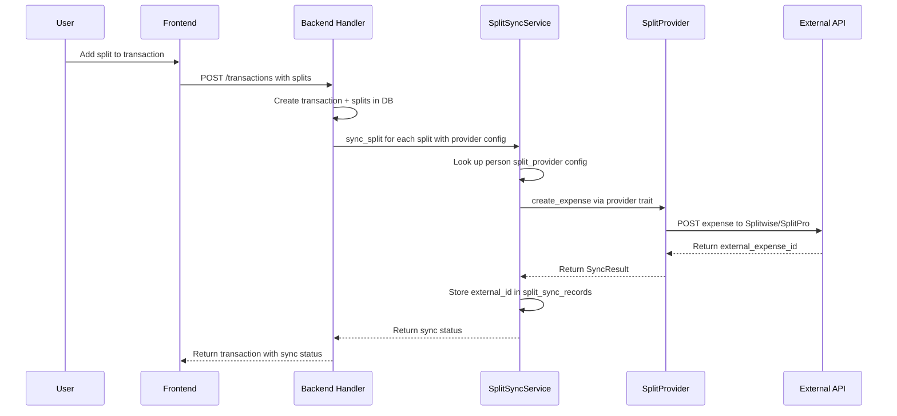
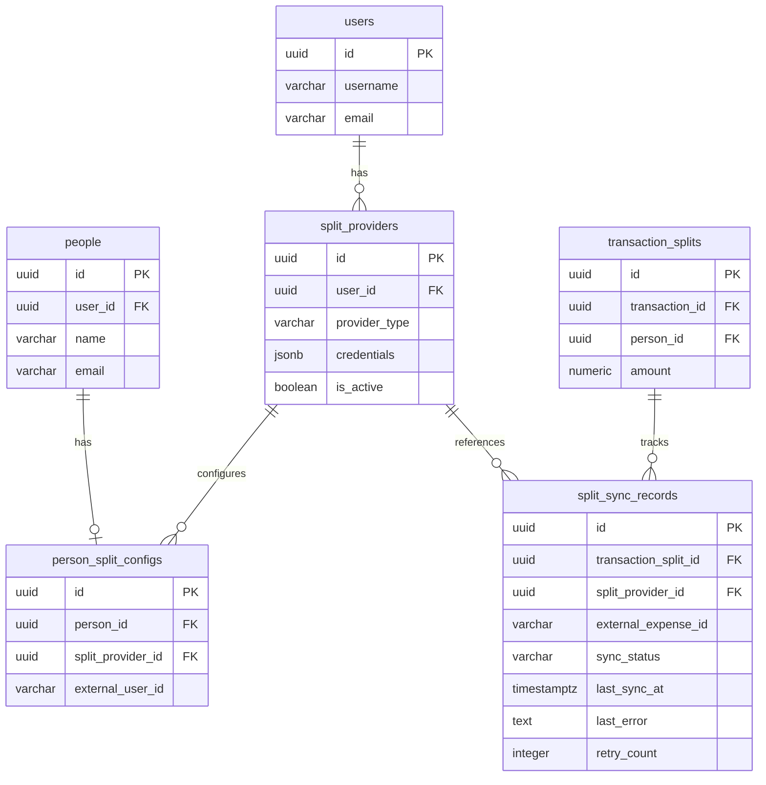
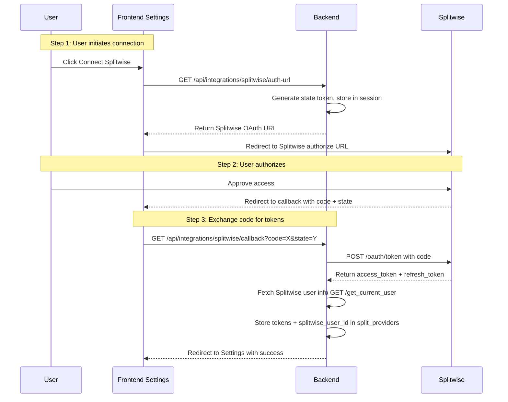

# Split Provider Integration Design

**GitHub Issue**: [#34 - Sync transactions to Splitwise, SplitPro when a split is added](https://github.com/abhijeet-reddy/master-of-coin/issues/34)

**Date**: 2026-02-11

## 1. Overview

This feature enables Master of Coin to sync transaction splits to external split-tracking platforms (Splitwise, SplitPro, and future providers). When a user adds a split to a transaction, the system creates a corresponding expense on the configured external platform.

### User Stories

1. As a user, I can configure Splitwise integration in Settings (OAuth2 flow)
2. As a user, I can assign a split provider (Splitwise/SplitPro) and external identifier to each Person
3. As a user, when I add a split to a transaction, it automatically creates an expense on the corresponding platform
4. As a user, I can see the sync status of each split (synced/pending/failed)
5. As a user, when I update or delete a split, the external platform is updated accordingly

### Scope

| Feature                                  | In Scope | Future                 |
| ---------------------------------------- | -------- | ---------------------- |
| Splitwise OAuth2 integration             | ✅       |                        |
| One-way sync (MoC → Provider)            | ✅       |                        |
| Create expense on split add              | ✅       |                        |
| Update expense on split edit             | ✅       |                        |
| Delete expense on split delete           | ✅       |                        |
| Provider trait for extensibility         | ✅       |                        |
| SplitPro provider implementation         |          | ✅ (no public API yet) |
| Bi-directional sync (poll from provider) |          | ✅                     |
| Bulk historical sync                     |          | ✅                     |

---

## 2. Architecture

### 2.1 Provider Trait Pattern

We use a Rust trait to abstract split providers, allowing new providers to be added without modifying core logic.

```
┌─────────────────────────────────────────────────────┐
│                  Master of Coin                      │
│                                                      │
│  ┌──────────────┐    ┌───────────────────────────┐  │
│  │ Transaction   │───▶│  SplitSyncService         │  │
│  │ Handler       │    │                           │  │
│  └──────────────┘    │  ┌─────────────────────┐  │  │
│                      │  │ SplitProviderTrait   │  │  │
│                      │  │  - create_expense    │  │  │
│                      │  │  - update_expense    │  │  │
│                      │  │  - delete_expense    │  │  │
│                      │  └──────┬──────────────┘  │  │
│                      │         │                  │  │
│                      │    ┌────┴────┐             │  │
│                      │    │         │             │  │
│                      │  ┌─┴──┐  ┌──┴───┐         │  │
│                      │  │ SW │  │ SP   │         │  │
│                      │  └─┬──┘  └──┬───┘         │  │
│                      └────┼────────┼─────────────┘  │
└───────────────────────────┼────────┼────────────────┘
                            │        │
                   ┌────────┴─┐  ┌───┴──────┐
                   │Splitwise │  │ SplitPro │
                   │  API     │  │  (future)│
                   └──────────┘  └──────────┘
```

### 2.2 Sync Flow



---

## 3. Database Changes

### 3.1 New Tables

#### `split_providers` - Stores user-level provider configurations

```sql
CREATE TABLE split_providers (
    id UUID PRIMARY KEY DEFAULT gen_random_uuid(),
    user_id UUID NOT NULL REFERENCES users(id) ON DELETE CASCADE,
    provider_type VARCHAR(50) NOT NULL,  -- 'splitwise', 'splitpro'
    -- Encrypted credentials stored as JSONB
    -- Splitwise: { "access_token": "...", "refresh_token": "...", "token_expires_at": "...", "splitwise_user_id": 12345 }
    -- SplitPro: { "base_url": "...", "api_key": "..." }  (future)
    credentials JSONB NOT NULL DEFAULT '{}',
    is_active BOOLEAN NOT NULL DEFAULT true,
    created_at TIMESTAMPTZ NOT NULL DEFAULT NOW(),
    updated_at TIMESTAMPTZ NOT NULL DEFAULT NOW(),
    UNIQUE(user_id, provider_type)
);

CREATE INDEX idx_split_providers_user_id ON split_providers(user_id);
```

#### `person_split_configs` - Maps each person to their split provider identity

```sql
CREATE TABLE person_split_configs (
    id UUID PRIMARY KEY DEFAULT gen_random_uuid(),
    person_id UUID NOT NULL REFERENCES people(id) ON DELETE CASCADE,
    split_provider_id UUID NOT NULL REFERENCES split_providers(id) ON DELETE CASCADE,
    -- The identifier on the external platform
    -- Splitwise: the Splitwise friend user ID (integer stored as string)
    -- SplitPro: email or user ID on the SplitPro instance
    external_user_id VARCHAR(255) NOT NULL,
    created_at TIMESTAMPTZ NOT NULL DEFAULT NOW(),
    updated_at TIMESTAMPTZ NOT NULL DEFAULT NOW(),
    UNIQUE(person_id)  -- One provider config per person
);

CREATE INDEX idx_person_split_configs_person_id ON person_split_configs(person_id);
CREATE INDEX idx_person_split_configs_provider_id ON person_split_configs(split_provider_id);
```

#### `split_sync_records` - Tracks sync state for each split

```sql
CREATE TABLE split_sync_records (
    id UUID PRIMARY KEY DEFAULT gen_random_uuid(),
    transaction_split_id UUID NOT NULL REFERENCES transaction_splits(id) ON DELETE CASCADE,
    split_provider_id UUID NOT NULL REFERENCES split_providers(id) ON DELETE CASCADE,
    -- The expense ID on the external platform
    external_expense_id VARCHAR(255),
    -- Sync status
    sync_status VARCHAR(20) NOT NULL DEFAULT 'pending',
    -- CHECK (sync_status IN ('pending', 'synced', 'failed', 'deleted'))
    last_sync_at TIMESTAMPTZ,
    last_error TEXT,
    retry_count INTEGER NOT NULL DEFAULT 0,
    created_at TIMESTAMPTZ NOT NULL DEFAULT NOW(),
    updated_at TIMESTAMPTZ NOT NULL DEFAULT NOW(),
    UNIQUE(transaction_split_id, split_provider_id)
);

CREATE INDEX idx_split_sync_records_split_id ON split_sync_records(transaction_split_id);
CREATE INDEX idx_split_sync_records_status ON split_sync_records(sync_status);
```

### 3.2 Entity Relationship Diagram



---

## 4. Backend Design

### 4.1 Provider Trait

```rust
// src/services/split_provider.rs

#[async_trait]
pub trait SplitProvider: Send + Sync {
    /// Provider name identifier
    fn provider_type(&self) -> &str;

    /// Create an expense on the external platform
    async fn create_expense(
        &self,
        credentials: &serde_json::Value,
        request: CreateExternalExpense,
    ) -> Result<ExternalExpenseResult, SplitProviderError>;

    /// Update an existing expense
    async fn update_expense(
        &self,
        credentials: &serde_json::Value,
        external_expense_id: &str,
        request: UpdateExternalExpense,
    ) -> Result<ExternalExpenseResult, SplitProviderError>;

    /// Delete an expense
    async fn delete_expense(
        &self,
        credentials: &serde_json::Value,
        external_expense_id: &str,
    ) -> Result<(), SplitProviderError>;

    /// Validate that credentials are still valid
    async fn validate_credentials(
        &self,
        credentials: &serde_json::Value,
    ) -> Result<bool, SplitProviderError>;

    /// Refresh credentials if needed (e.g., OAuth token refresh)
    async fn refresh_credentials(
        &self,
        credentials: &serde_json::Value,
    ) -> Result<Option<serde_json::Value>, SplitProviderError>;
}
```

### 4.2 Data Types

```rust
pub struct CreateExternalExpense {
    pub description: String,       // Transaction title
    pub cost: String,              // Total transaction amount as string "100.00"
    pub currency_code: String,     // "USD", "EUR", etc.
    pub date: DateTime<Utc>,
    pub group_id: Option<i64>,     // Optional Splitwise group ID
    pub users: Vec<ExpenseUser>,   // All users involved (payer + owed)
    pub notes: Option<String>,
}

pub struct ExpenseUser {
    pub external_user_id: String,  // Splitwise user ID
    pub paid_share: String,        // Amount this user paid "100.00"
    pub owed_share: String,        // Amount this user owes "30.00"
}

pub struct UpdateExternalExpense {
    pub description: Option<String>,
    pub cost: Option<String>,
    pub date: Option<DateTime<Utc>>,
    pub users: Option<Vec<ExpenseUser>>,  // Update all users if provided
    pub notes: Option<String>,
}

pub struct ExternalExpenseResult {
    pub external_expense_id: String,
    pub external_url: Option<String>,
}

pub enum SplitProviderError {
    AuthenticationFailed,
    TokenExpired,
    RateLimited,
    NotFound(String),
    ApiError(String),
    NetworkError(String),
}
```

### 4.3 Splitwise Provider Implementation

```rust
// src/services/splitwise_provider.rs

pub struct SplitwiseProvider {
    http_client: reqwest::Client,
}

impl SplitwiseProvider {
    const BASE_URL: &'static str = "https://secure.splitwise.com/api/v3.0";
}

#[async_trait]
impl SplitProvider for SplitwiseProvider {
    fn provider_type(&self) -> &str { "splitwise" }

    async fn create_expense(&self, credentials, request) -> Result<...> {
        // POST https://secure.splitwise.com/api/v3.0/create_expense
        // Uses users__0__user_id, users__0__paid_share, users__0__owed_share format
        // Bearer token from credentials.access_token
    }

    async fn update_expense(&self, credentials, id, request) -> Result<...> {
        // POST https://secure.splitwise.com/api/v3.0/update_expense/{id}
    }

    async fn delete_expense(&self, credentials, id) -> Result<...> {
        // POST https://secure.splitwise.com/api/v3.0/delete_expense/{id}
    }
}
```

### 4.4 Splitwise OAuth2 Flow

The user must register an app at [https://secure.splitwise.com/oauth_clients](https://secure.splitwise.com/oauth_clients) to get a `client_id` and `client_secret`.



**Environment variables needed** (stored in `.env`):

```
SPLITWISE_CLIENT_ID=your_client_id
SPLITWISE_CLIENT_SECRET=your_client_secret
SPLITWISE_REDIRECT_URI=https://your-domain.com/api/integrations/splitwise/callback
```

### 4.5 Split Sync Service

```rust
// src/services/split_sync_service.rs

pub struct SplitSyncService {
    providers: HashMap<String, Box<dyn SplitProvider>>,
}

impl SplitSyncService {
    /// Called after a split is created
    pub async fn on_split_created(
        &self,
        pool: &DbPool,
        split: &TransactionSplit,
        transaction: &Transaction,
    ) -> Result<(), ApiError> {
        // 1. Look up person_split_config for split.person_id
        // 2. If no config, skip (person not linked to any provider)
        // 3. Get the split_provider and its credentials
        // 4. Get the provider implementation
        // 5. Build CreateExternalExpense from transaction + split data
        // 6. Call provider.create_expense()
        // 7. Store result in split_sync_records
    }

    /// Called after a split is updated
    pub async fn on_split_updated(...) { /* similar flow */ }

    /// Called after a split is deleted
    pub async fn on_split_deleted(...) { /* similar flow */ }
}
```

### 4.6 Handling Multiple Splits Per Transaction

**Design Decision**: When a transaction has multiple splits (split among multiple people), we create **one expense on the external platform with multiple users**.

#### Example Scenario

Transaction: "Dinner at restaurant" - $100 (You paid the full amount)

- Split 1: Alice owes $30
- Split 2: Bob owes $40
- Split 3: Charlie owes $30

#### What Gets Created on Splitwise

We create **1 expense** with 4 users:

```json
{
  "description": "Dinner at restaurant",
  "cost": "100.00",
  "users": [
    { "user_id": "YOU", "paid_share": "100.00", "owed_share": "0.00" },
    { "user_id": "ALICE", "paid_share": "0.00", "owed_share": "30.00" },
    { "user_id": "BOB", "paid_share": "0.00", "owed_share": "40.00" },
    { "user_id": "CHARLIE", "paid_share": "0.00", "owed_share": "30.00" }
  ]
}
```

#### Database Tracking

Since we create **one external expense** for **multiple splits**, we need to track this relationship:

1. **One `split_sync_records` entry per split** - Each split gets its own sync record
2. **Same `external_expense_id` for all splits** - All splits from the same transaction share the same external expense ID
3. **Group sync operations** - When updating/deleting, we must update all splits together

#### Sync Service Logic

```rust
impl SplitSyncService {
    /// Called when ANY split in a transaction is created
    /// Groups all splits for the transaction and creates ONE expense
    pub async fn on_transaction_splits_created(
        &self,
        pool: &DbPool,
        transaction: &Transaction,
        splits: &[TransactionSplit],
    ) -> Result<(), ApiError> {
        // 1. Group splits by provider (all splits must use same provider)
        // 2. Build ExpenseUser for authenticated user (paid_share = transaction.amount, owed_share = 0)
        // 3. Build ExpenseUser for each split (paid_share = 0, owed_share = split.amount)
        // 4. Create ONE expense with all users
        // 5. Store SAME external_expense_id in split_sync_records for ALL splits
    }

    /// Called when ANY split is updated
    /// Must update the ENTIRE expense with all users
    pub async fn on_split_updated(
        &self,
        pool: &DbPool,
        transaction: &Transaction,
        all_splits: &[TransactionSplit],  // ALL splits, not just the updated one
    ) -> Result<(), ApiError> {
        // 1. Fetch external_expense_id from any split_sync_record
        // 2. Rebuild complete ExpenseUser list with updated values
        // 3. Call provider.update_expense() with ALL users
        // 4. Update all split_sync_records
    }

    /// Called when a split is deleted
    /// If last split: delete expense. Otherwise: update expense with remaining users
    pub async fn on_split_deleted(
        &self,
        pool: &DbPool,
        transaction: &Transaction,
        remaining_splits: &[TransactionSplit],
    ) -> Result<(), ApiError> {
        // 1. Fetch external_expense_id
        // 2. If no remaining splits: delete expense
        // 3. Otherwise: update expense with remaining users
        // 4. Delete split_sync_record for deleted split
    }
}
```

#### Constraint: All Splits Must Use Same Provider

**Important**: All people in a transaction's splits must be configured with the **same provider** (all Splitwise or all SplitPro). Mixed providers are not supported because we create one expense.

**Validation**: When adding a split, check that the person's provider matches existing splits' providers (or is the first split).

#### Alternative: Separate Expenses Per Person (Not Chosen)

We could create separate expenses for each person, but:

- ❌ Doesn't match how users think about splits (one dinner = one expense)
- ❌ Clutters the external platform with duplicate expenses
- ❌ Harder to understand the full picture on Splitwise
- ✅ Would allow mixed providers (Alice on Splitwise, Bob on SplitPro)

We chose the single-expense approach because it better represents the real-world scenario and matches Splitwise's native behavior.

### 4.7 New API Endpoints

| Method   | Path                                      | Description                                   |
| -------- | ----------------------------------------- | --------------------------------------------- |
| `GET`    | `/api/integrations/splitwise/auth-url`    | Get Splitwise OAuth authorization URL         |
| `GET`    | `/api/integrations/splitwise/callback`    | OAuth callback handler                        |
| `GET`    | `/api/integrations/providers`             | List configured providers for current user    |
| `DELETE` | `/api/integrations/providers/:id`         | Disconnect a provider                         |
| `GET`    | `/api/integrations/providers/:id/friends` | List friends from the provider (for mapping)  |
| `PUT`    | `/api/people/:id/split-config`            | Set/update split provider config for a person |
| `DELETE` | `/api/people/:id/split-config`            | Remove split provider config from a person    |
| `GET`    | `/api/people/:id/split-config`            | Get split provider config for a person        |
| `GET`    | `/api/splits/:id/sync-status`             | Get sync status for a specific split          |
| `POST`   | `/api/splits/:id/retry-sync`              | Retry a failed sync                           |

---

## 5. Frontend Design

### 5.1 Settings Page - New "Split" Tab

Add a new tab to the existing Settings page with icon `MdCallSplit` or `MdSync`.

```
Settings
├── Profile
├── Preferences
├── Security
├── API Keys
├── Split  ← NEW
│   ├── Splitwise Card
│   │   ├── Status: Connected / Not Connected
│   │   ├── Connect Button → Opens OAuth flow
│   │   ├── Connected user info display
│   │   └── Disconnect Button
│   └── SplitPro Card (future, greyed out)
│       └── "Coming Soon" badge
└── About
```

### 5.2 Person Edit - Split Provider Config

When editing a person, add a new section:

```
Edit Person
├── Name
├── Email
├── Phone
├── Notes
└── Split Provider  ← NEW
    ├── Provider Dropdown: [None | Splitwise | SplitPro]
    ├── If Splitwise selected:
    │   ├── Search/Select from Splitwise friends list
    │   └── Shows: Friend name + email from Splitwise
    └── If SplitPro selected (future):
        └── Enter SplitPro user identifier
```

### 5.3 Transaction Split - Sync Status Indicator

On each split in the transaction view, show a small sync status icon:

- ✅ Green check: Synced successfully
- 🔄 Spinner: Sync pending
- ❌ Red X: Sync failed (with retry button)
- ➖ No icon: Person not linked to any provider

### 5.4 New Frontend Files

```
frontend/src/
├── components/
│   └── settings/
│       ├── IntegrationsList.tsx        # List of provider cards
│       ├── SplitwiseIntegrationCard.tsx # Splitwise connect/disconnect
│       └── SplitProIntegrationCard.tsx  # Future - placeholder
├── components/
│   └── people/
│       └── SplitProviderConfig.tsx      # Provider selector in person edit
├── components/
│   └── transactions/
│       └── SplitSyncStatus.tsx          # Sync status badge on splits
├── hooks/
│   └── api/
│       ├── useIntegrations.ts           # Fetch provider configs
│       ├── useSplitwiseFriends.ts       # Fetch Splitwise friends
│       ├── usePersonSplitConfig.ts      # CRUD person split config
│       └── useSplitSyncStatus.ts        # Fetch sync status
└── services/
    └── integrationService.ts            # API calls for integrations
```

---

## 6. Security Considerations

### 6.1 Token Storage

- Splitwise OAuth tokens are stored **encrypted** in the `credentials` JSONB column
- Use AES-256-GCM encryption with a server-side key from environment variable `ENCRYPTION_KEY`
- Never expose tokens to the frontend

### 6.2 OAuth State Parameter

- Generate a cryptographically random state parameter for each OAuth flow
- Store in a short-lived server-side cache (or signed JWT) to prevent CSRF

### 6.3 Token Refresh

- Splitwise access tokens expire; implement automatic refresh using the refresh token
- If refresh fails, mark the provider as `is_active = false` and notify the user

### 6.4 Credential Rotation

- If `ENCRYPTION_KEY` changes, provide a migration script to re-encrypt all credentials

---

## 7. Error Handling & Resilience

### 7.1 Sync Failures

- Split creation in Master of Coin should **never fail** due to external sync failure
- Sync is **fire-and-forget** with status tracking
- Failed syncs are recorded with error details and can be retried

### 7.2 Retry Strategy

- Max 3 automatic retries with exponential backoff (1s, 5s, 25s)
- After 3 failures, mark as `failed` and require manual retry
- Rate limit errors trigger longer backoff

### 7.3 Token Expiry

- Before each API call, check if token is expired
- If expired, attempt refresh
- If refresh fails, mark sync as `failed` with "Authentication expired" error

---

## 8. Implementation Plan

### Phase 1: Database & Provider Infrastructure

1. Create database migrations for `split_providers`, `person_split_configs`, `split_sync_records`
2. Implement `SplitProvider` trait and data types
3. Implement `SplitSyncService` with provider registry
4. Add encryption utilities for credential storage

### Phase 2: Splitwise Provider

5. Implement `SplitwiseProvider` (create/update/delete expense)
6. Implement Splitwise OAuth2 flow (auth URL, callback, token exchange)
7. Implement Splitwise friends list endpoint
8. Add integration API endpoints (connect, disconnect, list providers)

### Phase 3: Person Configuration

9. Add person split config API endpoints (set/get/delete)
10. Update person model and response DTOs to include split config
11. Frontend: Add split provider selector to person edit form
12. Frontend: Add Splitwise friends search/select component

### Phase 4: Sync on Split CRUD

13. Hook `SplitSyncService` into transaction handler (on split create/update/delete)
14. Implement sync status tracking and recording
15. Frontend: Add sync status indicators on splits
16. Frontend: Add retry button for failed syncs

### Phase 5: Settings UI

17. Frontend: Add "Integrations" tab to Settings page
18. Frontend: Implement Splitwise connection card with OAuth flow
19. Frontend: Add SplitPro placeholder card

### Phase 6: Testing

20. Backend unit tests for provider trait and Splitwise provider
21. Backend integration tests for OAuth flow
22. Backend integration tests for sync service
23. Frontend component tests

---

## 9. Future Considerations

### 9.1 Bi-directional Sync

- Poll Splitwise API periodically for changes to synced expenses
- Compare `updated_at` timestamps to detect external modifications
- Present conflicts to user for resolution
- Requires a background job/scheduler (tokio cron or similar)

### 9.2 SplitPro Integration

- SplitPro currently has no public REST API
- Options when API becomes available:
  - Implement `SplitProvider` trait for SplitPro
  - Authentication likely via API key + base URL (self-hosted)
- Alternative: Direct database integration if SplitPro is co-hosted (not recommended)

### 9.3 Bulk Historical Sync

- Allow users to sync all existing splits to a newly connected provider
- Implement as a background job with progress tracking
- Rate limit awareness for Splitwise API

### 9.4 Webhook Support

- If providers support webhooks, register for expense update events
- Eliminates need for polling in bi-directional sync
