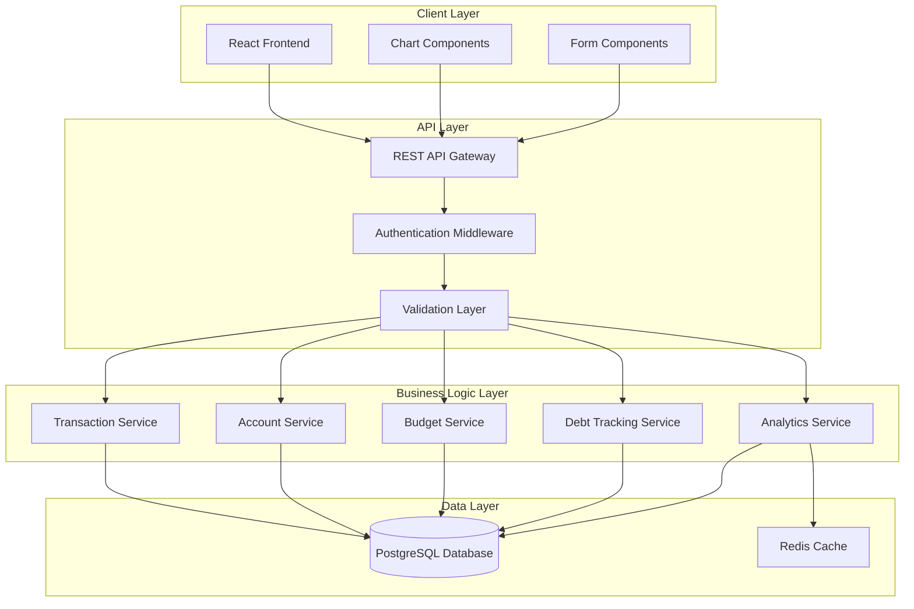
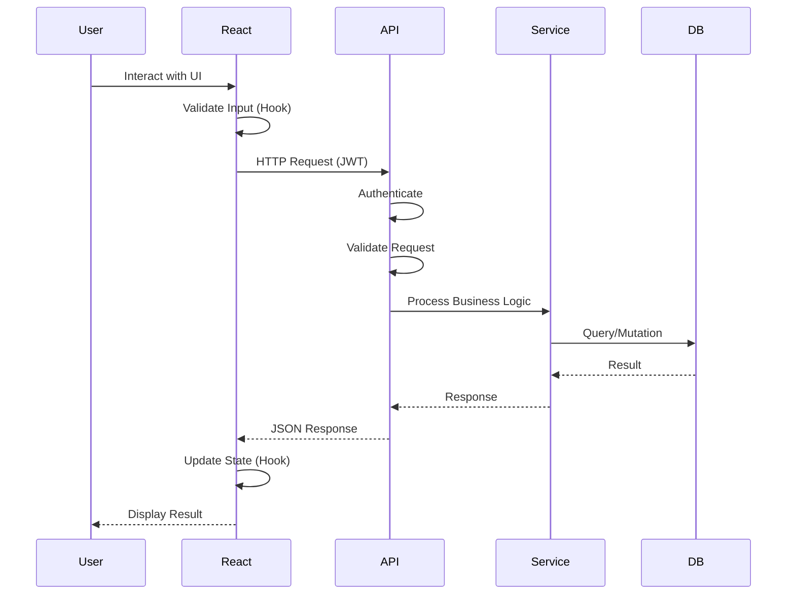
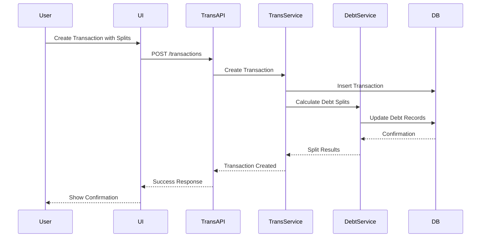
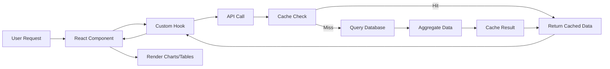
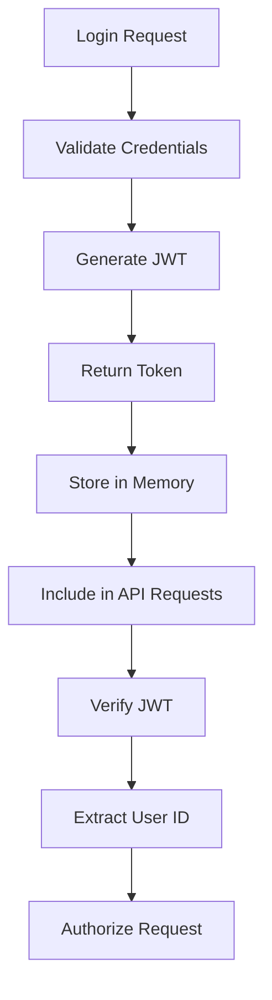
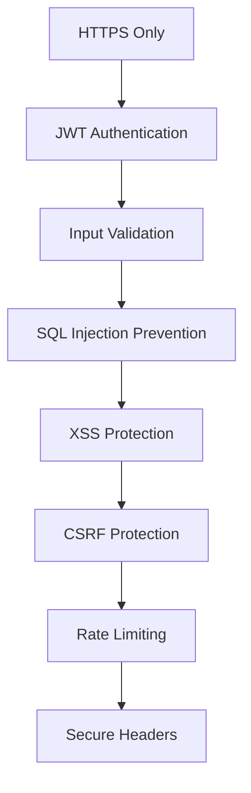
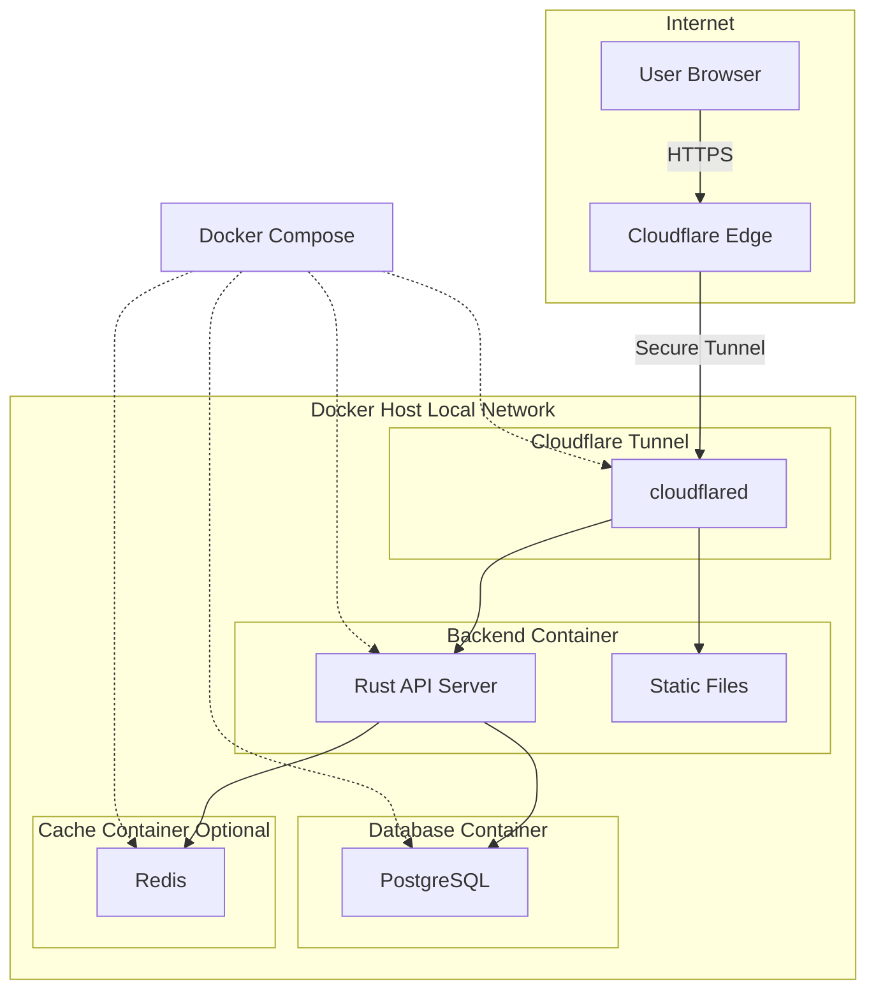
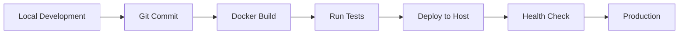

# Architecture Overview

## System Architecture

Master of Coin is a full-stack personal finance tracker designed for 1-2 users with a focus on detailed transaction tracking, split payments, and comprehensive financial analytics.

### High-Level Architecture

### Component Interactions

#### 1. Frontend → Backend Flow

#### 2. Transaction Creation with Split Payment

### Data Flow Architecture

#### 1. Read Operations (Dashboard/Analytics)

#### 2. Write Operations (Transaction Creation)

```mermaid
graph LR
    A[User Input] --> B[Form Component]
    B --> C[Validation Hook]
    C --> D[API Call]
    D --> E[Business Logic]
    E --> F[Transaction Validation]
    F --> G[Split Calculation]
    G --> H[Database Write]
    H --> I[Invalidate Cache]
    I --> J[Return Success]
    J --> K[Update UI State]
    K --> L[Refresh Dashboard]
```

### System Layers

#### 1. Presentation Layer (React Frontend)

- **Responsibility**: User interface, user interactions, client-side validation
- **Technology**: React with functional components and hooks
- **Key Patterns**:
  - Single responsibility hooks
  - Controlled components
  - Optimistic UI updates
  - Error boundaries

#### 2. API Layer (Rust Backend)

- **Responsibility**: Request routing, authentication, input validation
- **Technology**: Actix-web or Axum
- **Key Patterns**:
  - RESTful endpoints
  - JWT-based authentication
  - Request/response middleware
  - Error handling middleware

#### 3. Business Logic Layer (Rust Services)

- **Responsibility**: Core business rules, calculations, data transformations
- **Technology**: Rust modules with trait-based design
- **Key Patterns**:
  - Service layer pattern
  - Repository pattern
  - Domain-driven design
  - Result-based error handling

#### 4. Data Access Layer (Rust Repositories)

- **Responsibility**: Database queries, data persistence
- **Technology**: Diesel ORM
- **Key Patterns**:
  - Repository pattern
  - Type-safe query builder
  - Transaction management
  - Connection pooling with r2d2
  - Async/sync bridge with `spawn_blocking`

#### 5. Data Storage Layer

- **Responsibility**: Data persistence, integrity, performance
- **Technology**: PostgreSQL with Redis cache
- **Key Patterns**:
  - Normalized schema
  - Indexed queries
  - ACID transactions
  - Cache-aside pattern

### Cross-Cutting Concerns

#### Authentication & Authorization

#### Error Handling Strategy

- **Frontend**: Error boundaries, toast notifications, form validation errors
- **Backend**: Result types, custom error enums, structured error responses
- **Database**: Transaction rollbacks, constraint violations, connection errors

#### Logging & Monitoring

- **Frontend**: Console errors, user action tracking
- **Backend**: Structured logging (tracing crate), request/response logging
- **Database**: Query performance logs, slow query analysis

### Scalability Considerations

#### Current Scale (1-2 Users)

- Single Docker container deployment
- Shared PostgreSQL instance
- Minimal caching requirements
- Simple backup strategy

#### Future Scale (If Needed)

- Horizontal scaling with load balancer
- Read replicas for analytics queries
- Enhanced caching layer
- CDN for static assets
- Database partitioning by date

### Security Architecture

### Performance Optimization

#### Frontend

- Code splitting by route
- Lazy loading components
- Memoization of expensive calculations
- Virtual scrolling for large lists
- Debounced search inputs

#### Backend

- Connection pooling
- Query optimization with indexes
- Batch operations where possible
- Caching frequently accessed data
- Async/await for I/O operations

#### Database

- Proper indexing strategy
- Materialized views for complex aggregations
- Partitioning for transaction history
- Regular VACUUM and ANALYZE

### Deployment Architecture

**Key Points**:

- No exposed ports on local network
- Cloudflare Tunnel provides secure access
- Rust backend serves both API and static files
- All traffic encrypted end-to-end
- No need for port forwarding or static IP

### Key Architectural Decisions

1. **Monolithic Backend**: Single Rust application for simplicity given small user base
2. **PostgreSQL**: Chosen for ACID compliance, complex queries, and JSON support
3. **REST API**: Simpler than GraphQL for this use case, easier to cache
4. **JWT Authentication**: Stateless, scalable, works well with SPA
5. **Docker Deployment**: Consistent environments, easy deployment, portable
6. **Redis Cache**: Optional but recommended for dashboard performance
7. **Functional React**: Modern patterns, better performance, easier testing

### Development Workflow

### API Communication Pattern

All communication between frontend and backend follows this pattern:

- **Request**: JSON payload with JWT in Authorization header
- **Response**: JSON with consistent structure (data/error fields)
- **Error Handling**: HTTP status codes + detailed error messages
- **Versioning**: URL-based versioning (/api/v1/)

### State Management Strategy

#### Frontend State Categories

1. **Server State**: Cached API responses (React Query)
2. **UI State**: Form inputs, modal visibility (local useState)
3. **User State**: Authentication, preferences (Context API)
4. **Route State**: URL parameters, navigation (React Router)

#### Backend State Management

- Stateless API design
- Database as single source of truth
- Redis for session/cache data
- No in-memory state (for horizontal scaling)
