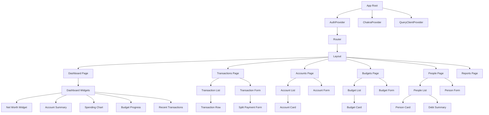

# Frontend Component Architecture

## Overview

This document defines the React component architecture for Master of Coin, following strict functional component patterns with hooks as specified in the requirements.

## Core Architectural Principles

### 1. Functional Components Only
- All components must be functional (no class components)
- Use React hooks for all state and side effects
- Leverage React 18+ features (concurrent rendering, automatic batching)

### 2. Hook Constraints (CRITICAL)
- **Each custom hook MUST have maximum ONE useState**
- **Each custom hook MUST have maximum ONE useEffect**
- **Minimize useEffect usage** - prefer derived state and event handlers
- Logic should live in hooks, not components

### 3. Component Responsibility
- Components handle rendering and user interaction
- Hooks handle business logic, state management, and side effects
- Keep components simple and declarative

### 4. Composition Over Complexity
- Build complex UIs from simple, reusable components
- Use Chakra UI's composition patterns
- Prefer multiple simple hooks over one complex hook

## Component Hierarchy



## Component Categories

### 1. Provider Components

#### App.tsx
```typescript
// Root component - sets up providers
function App() {
  return (
    <ChakraProvider theme={theme}>
      <QueryClientProvider client={queryClient}>
        <AuthProvider>
          <Router>
            <Routes>
              {/* Route definitions */}
            </Routes>
          </Router>
        </AuthProvider>
      </QueryClientProvider>
    </ChakraProvider>
  );
}
```

#### AuthProvider
- Manages authentication state
- Provides auth context to app
- Handles token refresh
- Uses `useAuth` hook internally

### 2. Layout Components

#### Layout
```typescript
// Main layout with sidebar and header
function Layout() {
  return (
    <Box minH="100vh">
      <Sidebar />
      <Box ml={{ base: 0, md: 60 }}>
        <Header />
        <Box p={4}>
          <Outlet /> {/* React Router outlet */}
        </Box>
      </Box>
    </Box>
  );
}
```

#### Sidebar
- Navigation menu
- User profile section
- Responsive (drawer on mobile)

#### Header
- Page title
- Quick actions
- User menu

### 3. Page Components

#### Dashboard Page
```typescript
function DashboardPage() {
  const { data: summary } = useDashboardSummary();
  
  return (
    <Grid templateColumns="repeat(12, 1fr)" gap={4}>
      <GridItem colSpan={{ base: 12, md: 6, lg: 4 }}>
        <NetWorthWidget data={summary?.netWorth} />
      </GridItem>
      <GridItem colSpan={{ base: 12, md: 6, lg: 4 }}>
        <AccountSummary data={summary?.accounts} />
      </GridItem>
      <GridItem colSpan={{ base: 12, md: 6, lg: 4 }}>
        <BudgetProgress data={summary?.budgets} />
      </GridItem>
      <GridItem colSpan={{ base: 12, lg: 6 }}>
        <SpendingChart data={summary?.spending} />
      </GridItem>
      <GridItem colSpan={{ base: 12, lg: 6 }}>
        <CategoryBreakdown data={summary?.categories} />
      </GridItem>
      <GridItem colSpan={12}>
        <RecentTransactions data={summary?.transactions} />
      </GridItem>
    </Grid>
  );
}
```

#### Transactions Page
```typescript
function TransactionsPage() {
  const { filters, setFilters } = useTransactionFilters();
  const { data, isLoading } = useTransactions(filters);
  const { isOpen, onOpen, onClose } = useDisclosure();
  
  return (
    <Box>
      <HStack justify="space-between" mb={4}>
        <Heading>Transactions</Heading>
        <Button onClick={onOpen}>Add Transaction</Button>
      </HStack>
      
      <TransactionFilters filters={filters} onChange={setFilters} />
      <TransactionList transactions={data} isLoading={isLoading} />
      
      <TransactionFormModal isOpen={isOpen} onClose={onClose} />
    </Box>
  );
}
```

### 4. Feature Components

#### TransactionList
```typescript
function TransactionList({ transactions, isLoading }) {
  const { sortBy, sortOrder, handleSort } = useTableSort('date', 'desc');
  
  if (isLoading) return <Spinner />;
  
  return (
    <Table>
      <Thead>
        <Tr>
          <Th onClick={() => handleSort('date')}>Date</Th>
          <Th onClick={() => handleSort('title')}>Title</Th>
          <Th onClick={() => handleSort('amount')}>Amount</Th>
          <Th>Account</Th>
          <Th>Category</Th>
          <Th>Actions</Th>
        </Tr>
      </Thead>
      <Tbody>
        {transactions?.map(transaction => (
          <TransactionRow key={transaction.id} transaction={transaction} />
        ))}
      </Tbody>
    </Table>
  );
}
```

#### TransactionForm
```typescript
function TransactionForm({ transaction, onSuccess }) {
  const { formData, handleChange, handleSubmit, errors } = useTransactionForm(transaction);
  const { isOpen: showSplits, onToggle: toggleSplits } = useDisclosure();
  
  return (
    <form onSubmit={handleSubmit(onSuccess)}>
      <VStack spacing={4} align="stretch">
        <FormControl isInvalid={!!errors.title}>
          <FormLabel>Title</FormLabel>
          <Input
            name="title"
            value={formData.title}
            onChange={handleChange}
          />
          <FormErrorMessage>{errors.title}</FormErrorMessage>
        </FormControl>
        
        <FormControl isInvalid={!!errors.amount}>
          <FormLabel>Amount</FormLabel>
          <NumberInput
            name="amount"
            value={formData.amount}
            onChange={(value) => handleChange({ target: { name: 'amount', value } })}
          />
          <FormErrorMessage>{errors.amount}</FormErrorMessage>
        </FormControl>
        
        <Button onClick={toggleSplits}>
          {showSplits ? 'Hide' : 'Show'} Split Payment
        </Button>
        
        {showSplits && <SplitPaymentForm splits={formData.splits} onChange={handleChange} />}
        
        <Button type="submit" colorScheme="blue">
          Save Transaction
        </Button>
      </VStack>
    </form>
  );
}
```

#### SplitPaymentForm
```typescript
function SplitPaymentForm({ splits, onChange }) {
  const { people } = usePeople();
  const { addSplit, removeSplit, updateSplit } = useSplitManager(splits, onChange);
  
  return (
    <VStack spacing={3} align="stretch">
      <Text fontWeight="bold">Split Payment</Text>
      {splits.map((split, index) => (
        <HStack key={index}>
          <Select
            value={split.personId}
            onChange={(e) => updateSplit(index, 'personId', e.target.value)}
          >
            {people?.map(person => (
              <option key={person.id} value={person.id}>
                {person.name}
              </option>
            ))}
          </Select>
          <NumberInput
            value={split.amount}
            onChange={(value) => updateSplit(index, 'amount', value)}
          />
          <IconButton
            icon={<DeleteIcon />}
            onClick={() => removeSplit(index)}
          />
        </HStack>
      ))}
      <Button onClick={addSplit} size="sm">Add Person</Button>
    </VStack>
  );
}
```

### 5. Widget Components

#### AccountSummary
#### NetWorthWidget
```typescript
function NetWorthWidget({ data }) {
  const { netWorth, change, changePercent } = data ?? {};
  const isPositive = change >= 0;
  
  return (
    <Card>
      <CardHeader>
        <Heading size="md">Net Worth</Heading>
      </CardHeader>
      <CardBody>
        <Stat>
          <StatNumber fontSize="3xl">
            {formatCurrency(netWorth)}
          </StatNumber>
          <StatHelpText>
            <StatArrow type={isPositive ? 'increase' : 'decrease'} />
            {changePercent}% ({formatCurrency(Math.abs(change))})
          </StatHelpText>
          <Text fontSize="sm" color="gray.500" mt={2}>
            Assets - Liabilities
          </Text>
        </Stat>
      </CardBody>
    </Card>
  );
}
```

```typescript
function AccountSummary({ data }) {
  const totalBalance = data?.reduce((sum, acc) => sum + acc.balance, 0) ?? 0;
  
  return (
    <Card>
      <CardHeader>
        <Heading size="md">Total Balance</Heading>
      </CardHeader>
      <CardBody>
        <Stat>
          <StatNumber fontSize="3xl">
            {formatCurrency(totalBalance)}
          </StatNumber>
          <StatHelpText>Across {data?.length ?? 0} accounts</StatHelpText>
        </Stat>
      </CardBody>
    </Card>
  );
}
```

#### SpendingChart
```typescript
function SpendingChart({ data }) {
  const chartData = useChartData(data);
  
  return (
    <Card>
      <CardHeader>
        <Heading size="md">Spending Trend</Heading>
      </CardHeader>
      <CardBody>
        <ResponsiveContainer width="100%" height={300}>
          <LineChart data={chartData}>
            <CartesianGrid strokeDasharray="3 3" />
            <XAxis dataKey="date" />
            <YAxis />
            <Tooltip />
            <Legend />
            <Line type="monotone" dataKey="amount" stroke="#8884d8" />
          </LineChart>
        </ResponsiveContainer>
      </CardBody>
    </Card>
  );
}
```

## Custom Hooks Architecture

### Hook Categories

#### 1. Data Fetching Hooks (React Query)

```typescript
// useTransactions.ts
function useTransactions(filters: TransactionFilters) {
  // ONE useState for local filter state (if needed)
  const [localFilters, setLocalFilters] = useState(filters);
  
  // React Query handles the data fetching
  return useQuery({
    queryKey: ['transactions', localFilters],
    queryFn: () => fetchTransactions(localFilters),
  });
}

// useTransaction.ts
function useTransaction(id: string) {
  return useQuery({
    queryKey: ['transaction', id],
    queryFn: () => fetchTransaction(id),
    enabled: !!id,
  });
}

// useAccounts.ts
function useAccounts() {
  return useQuery({
    queryKey: ['accounts'],
    queryFn: fetchAccounts,
  });
}
```

#### 2. Mutation Hooks (React Query)

```typescript
// useCreateTransaction.ts
function useCreateTransaction() {
  const queryClient = useQueryClient();
  
  return useMutation({
    mutationFn: createTransaction,
    onSuccess: () => {
      queryClient.invalidateQueries({ queryKey: ['transactions'] });
      queryClient.invalidateQueries({ queryKey: ['dashboard'] });
    },
  });
}

// useUpdateTransaction.ts
function useUpdateTransaction() {
  const queryClient = useQueryClient();
  
  return useMutation({
    mutationFn: ({ id, data }) => updateTransaction(id, data),
    onSuccess: (_, variables) => {
      queryClient.invalidateQueries({ queryKey: ['transaction', variables.id] });
      queryClient.invalidateQueries({ queryKey: ['transactions'] });
    },
  });
}
```

#### 3. Form Hooks

```typescript
// useTransactionForm.ts
function useTransactionForm(initialData?: Transaction) {
  // ONE useState for form data
  const [formData, setFormData] = useState(initialData || defaultTransaction);
  
  const handleChange = (e: ChangeEvent<HTMLInputElement>) => {
    const { name, value } = e.target;
    setFormData(prev => ({ ...prev, [name]: value }));
  };
  
  const validate = () => {
    // Validation logic
    return errors;
  };
  
  const handleSubmit = (onSuccess: () => void) => (e: FormEvent) => {
    e.preventDefault();
    const errors = validate();
    if (Object.keys(errors).length === 0) {
      onSuccess();
    }
  };
  
  return { formData, handleChange, handleSubmit, errors: validate() };
}
```

#### 4. UI State Hooks

```typescript
// useTableSort.ts
function useTableSort(initialKey: string, initialOrder: 'asc' | 'desc') {
  // ONE useState for sort state
  const [sortState, setSortState] = useState({ key: initialKey, order: initialOrder });
  
  const handleSort = (key: string) => {
    setSortState(prev => ({
      key,
      order: prev.key === key && prev.order === 'asc' ? 'desc' : 'asc',
    }));
  };
  
  return { ...sortState, handleSort };
}

// useFilters.ts
function useFilters(initialFilters: Filters) {
  // ONE useState for filters
  const [filters, setFilters] = useState(initialFilters);
  
  const updateFilter = (key: string, value: any) => {
    setFilters(prev => ({ ...prev, [key]: value }));
  };
  
  const resetFilters = () => {
    setFilters(initialFilters);
  };
  
  return { filters, updateFilter, resetFilters };
}
```

#### 5. Business Logic Hooks

```typescript
// useSplitCalculator.ts
function useSplitCalculator(totalAmount: number) {
  // ONE useState for splits
  const [splits, setSplits] = useState<Split[]>([]);
  
  const myAmount = totalAmount - splits.reduce((sum, s) => sum + s.amount, 0);
  
  const addSplit = (personId: string, amount: number) => {
    setSplits(prev => [...prev, { personId, amount }]);
  };
  
  const removeSplit = (index: number) => {
    setSplits(prev => prev.filter((_, i) => i !== index));
  };
  
  return { splits, myAmount, addSplit, removeSplit };
}

// useDebtCalculator.ts
function useDebtCalculator(personId: string) {
  const { data: transactions } = useTransactions({ personId });
  
  // Derived state - no useState needed
  const totalOwed = transactions?.reduce((sum, t) => {
    const split = t.splits.find(s => s.personId === personId);
    return sum + (split?.amount ?? 0);
  }, 0) ?? 0;
  
  return { totalOwed };
}
```

#### 6. Effect Hooks (Minimal Usage)

```typescript
// useAutoSave.ts
function useAutoSave(data: any, onSave: (data: any) => void) {
  // ONE useEffect for auto-save
  useEffect(() => {
    const timer = setTimeout(() => {
      onSave(data);
    }, 2000);
    
    return () => clearTimeout(timer);
  }, [data, onSave]);
}

// useDocumentTitle.ts
function useDocumentTitle(title: string) {
  // ONE useEffect for document title
  useEffect(() => {
    document.title = `${title} - Master of Coin`;
    return () => {
      document.title = 'Master of Coin';
    };
  }, [title]);
}
```

## Hook Composition Patterns

### Pattern 1: Combining Multiple Simple Hooks

```typescript
// Instead of one complex hook, use multiple simple hooks
function TransactionPage() {
  const { filters, updateFilter } = useFilters(defaultFilters);
  const { data, isLoading } = useTransactions(filters);
  const { sortBy, sortOrder, handleSort } = useTableSort('date', 'desc');
  const { isOpen, onOpen, onClose } = useDisclosure();
  
  // Component logic
}
```

### Pattern 2: Hook Delegation

```typescript
// Parent hook delegates to child hooks
function useTransactionManager() {
  const { data } = useTransactions();
  const { mutate: create } = useCreateTransaction();
  const { mutate: update } = useUpdateTransaction();
  const { mutate: remove } = useDeleteTransaction();
  
  return { transactions: data, create, update, remove };
}
```

### Pattern 3: Derived State (No useState)

```typescript
// Prefer derived state over useState when possible
function useBudgetStatus(budget: Budget, transactions: Transaction[]) {
  // All derived - no useState
  const spent = transactions
    .filter(t => t.categoryId === budget.categoryId)
    .reduce((sum, t) => sum + t.amount, 0);
  
  const remaining = budget.limit - spent;
  const percentage = (spent / budget.limit) * 100;
  const status = percentage > 100 ? 'over' : percentage > 80 ? 'warning' : 'good';
  
  return { spent, remaining, percentage, status };
}
```

## Component Communication Patterns

### 1. Props Down, Events Up

```typescript
// Parent
function TransactionsPage() {
  const [selectedId, setSelectedId] = useState<string | null>(null);
  
  return (
    <>
      <TransactionList onSelect={setSelectedId} />
      {selectedId && <TransactionDetails id={selectedId} />}
    </>
  );
}

// Child
function TransactionList({ onSelect }) {
  return (
    <Table>
      {transactions.map(t => (
        <Tr key={t.id} onClick={() => onSelect(t.id)}>
          {/* ... */}
        </Tr>
      ))}
    </Table>
  );
}
```

### 2. Context for Deep Props

```typescript
// For deeply nested components, use context
const TransactionContext = createContext<Transaction | null>(null);

function TransactionProvider({ transaction, children }) {
  return (
    <TransactionContext.Provider value={transaction}>
      {children}
    </TransactionContext.Provider>
  );
}

function useTransactionContext() {
  const context = useContext(TransactionContext);
  if (!context) throw new Error('Must be used within TransactionProvider');
  return context;
}
```

### 3. React Query for Server State

```typescript
// Components share server state through React Query cache
function ComponentA() {
  const { data } = useTransactions(); // Fetches and caches
}

function ComponentB() {
  const { data } = useTransactions(); // Uses cache, no refetch
}
```

## Performance Optimization

### 1. Memoization

```typescript
// Memoize expensive calculations
function TransactionList({ transactions }) {
  const sortedTransactions = useMemo(
    () => transactions.sort((a, b) => b.date - a.date),
    [transactions]
  );
  
  return <>{/* render sortedTransactions */}</>;
}

// Memoize callbacks
function TransactionRow({ transaction, onUpdate }) {
  const handleClick = useCallback(() => {
    onUpdate(transaction.id);
  }, [transaction.id, onUpdate]);
  
  return <Tr onClick={handleClick}>{/* ... */}</Tr>;
}
```

### 2. Code Splitting

```typescript
// Lazy load heavy components
const ReportsPage = lazy(() => import('./pages/ReportsPage'));
const ChartsPage = lazy(() => import('./pages/ChartsPage'));

function App() {
  return (
    <Suspense fallback={<Spinner />}>
      <Routes>
        <Route path="/reports" element={<ReportsPage />} />
        <Route path="/charts" element={<ChartsPage />} />
      </Routes>
    </Suspense>
  );
}
```

### 3. Virtual Scrolling

```typescript
// For large transaction lists, use virtual scrolling
import { useVirtualizer } from '@tanstack/react-virtual';

function TransactionList({ transactions }) {
  const parentRef = useRef<HTMLDivElement>(null);
  
  const virtualizer = useVirtualizer({
    count: transactions.length,
    getScrollElement: () => parentRef.current,
    estimateSize: () => 50,
  });
  
  return (
    <Box ref={parentRef} h="600px" overflow="auto">
      <Box h={`${virtualizer.getTotalSize()}px`} position="relative">
        {virtualizer.getVirtualItems().map(item => (
          <Box
            key={item.key}
            position="absolute"
            top={0}
            left={0}
            w="100%"
            h={`${item.size}px`}
            transform={`translateY(${item.start}px)`}
          >
            <TransactionRow transaction={transactions[item.index]} />
          </Box>
        ))}
      </Box>
    </Box>
  );
}
```

## Testing Strategy

### Component Tests

```typescript
// Test components with React Testing Library
describe('TransactionForm', () => {
  it('validates required fields', async () => {
    render(<TransactionForm />);
    
    const submitButton = screen.getByRole('button', { name: /save/i });
    fireEvent.click(submitButton);
    
    expect(await screen.findByText(/title is required/i)).toBeInTheDocument();
  });
  
  it('submits form with valid data', async () => {
    const onSuccess = vi.fn();
    render(<TransactionForm onSuccess={onSuccess} />);
    
    fireEvent.change(screen.getByLabelText(/title/i), {
      target: { value: 'Groceries' },
    });
    fireEvent.change(screen.getByLabelText(/amount/i), {
      target: { value: '50.00' },
    });
    
    fireEvent.click(screen.getByRole('button', { name: /save/i }));
    
    await waitFor(() => expect(onSuccess).toHaveBeenCalled());
  });
});
```

### Hook Tests

```typescript
// Test hooks with @testing-library/react-hooks
describe('useTransactionForm', () => {
  it('updates form data on change', () => {
    const { result } = renderHook(() => useTransactionForm());
    
    act(() => {
      result.current.handleChange({
        target: { name: 'title', value: 'Test' },
      });
    });
    
    expect(result.current.formData.title).toBe('Test');
  });
});
```

## File Structure

```
src/
├── components/
│   ├── layout/
│   │   ├── Layout.tsx
│   │   ├── Sidebar.tsx
│   │   └── Header.tsx
│   ├── transactions/
│   │   ├── TransactionList.tsx
│   │   ├── TransactionRow.tsx
│   │   ├── TransactionForm.tsx
│   │   └── SplitPaymentForm.tsx
│   ├── accounts/
│   │   ├── AccountList.tsx
│   │   ├── AccountCard.tsx
│   │   └── AccountForm.tsx
│   ├── budgets/
│   ├── people/
│   └── common/
│       ├── LoadingSpinner.tsx
│       ├── ErrorBoundary.tsx
│       └── EmptyState.tsx
├── hooks/
│   ├── api/
│   │   ├── useTransactions.ts
│   │   ├── useAccounts.ts
│   │   └── useBudgets.ts
│   ├── forms/
│   │   ├── useTransactionForm.ts
│   │   └── useAccountForm.ts
│   ├── ui/
│   │   ├── useTableSort.ts
│   │   ├── useFilters.ts
│   │   └── usePagination.ts
│   └── business/
│       ├── useSplitCalculator.ts
│       └── useDebtCalculator.ts
├── pages/
│   ├── DashboardPage.tsx
│   ├── TransactionsPage.tsx
│   ├── AccountsPage.tsx
│   ├── BudgetsPage.tsx
│   └── PeoplePage.tsx
├── contexts/
│   └── AuthContext.tsx
└── App.tsx
```

## Summary

This architecture ensures:
- ✅ Strict adherence to functional components
- ✅ One useState per hook maximum
- ✅ One useEffect per hook maximum
- ✅ Logic separated from presentation
- ✅ Reusable, composable components
- ✅ Type-safe with TypeScript
- ✅ Testable components and hooks
- ✅ Performance optimized
- ✅ Scalable structure

## Page Wireframes & Layouts

### Dashboard Page

```
┌─────────────────────────────────────────────────────────────────────┐
│ 💰 Master of Coin                                 👤 [⚙️]           │
├─────────────────────────────────────────────────────────────────────┤
│                                                                       │
│  📊 Dashboard                                                        │
│  ═══════════════════════════════════════════════════════════════   │
│                                                                       │
│  Accounts (Horizontal Scroll →)                                     │
│  ┌────────────┐ ┌────────────┐ ┌────────────┐ ┌────────────┐      │
│  │ 💳 Checking│ │ 💳 Credit  │ │ 📈 Invest  │ │ 💰 Savings │ ...  │
│  │ $12,450.50 │ │ -$2,340.00 │ │ $35,120.50 │ │ $8,500.00  │      │
│  └────────────┘ └────────────┘ └────────────┘ └────────────┘      │
│                                                                       │
│  Budgets (Horizontal Scroll →)                                      │
│  ┌─────────────────┐ ┌─────────────────┐ ┌─────────────────┐      │
│  │ 🍔 Food         │ │ 🚗 Transport    │ │ 🛍️ Shopping     │ ...  │
│  │ ████████░░ 75%  │ │ ██████░░░░ 60%  │ │ ██████████ 130% │      │
│  │ $450 / $600     │ │ $180 / $300     │ │ $520 / $400 ⚠️  │      │
│  └─────────────────┘ └─────────────────┘ └─────────────────┘      │
│                                                                       │
│  ┌────────────────────────────────────┐ ┌──────────────────────┐   │
│  │                                    │ │                      │   │
│  │  📈 Net Worth                      │ │  📋 Recent Trans.    │   │
│  │  ─────────────────────────────    │ │  ──────────────────  │   │
│  │  $125,450.00                       │ │  🍔 Grocery Store    │   │
│  │  ↑ 2.5% ($3,000)                   │ │  -$85.50  💳 Check   │   │
│  │  vs last month                     │ │  Jan 15              │   │
│  │  Assets - Liabilities              │ │                      │   │
│  │                                    │ │  💼 Salary Deposit   │   │
│  │  📊 Spending Trend                 │ │  +$3,500  💳 Check   │   │
│  │  ─────────────────────────────    │ │  Jan 14              │   │
│  │      ╱╲                            │ │                      │   │
│  │     ╱  ╲      ╱╲                   │ │  ⛽ Gas Station      │   │
│  │    ╱    ╲    ╱  ╲                  │ │  -$45.00  💳 Credit  │   │
│  │   ╱      ╲  ╱    ╲                 │ │  Jan 13              │   │
│  │  ╱        ╲╱      ╲                │ │                      │   │
│  │ ────────────────────               │ │  🍽️ Restaurant       │   │
│  │  Jan  Feb  Mar  Apr                │ │  -$67.80  💳 Credit  │   │
│  │                                    │ │  Jan 12              │   │
│  │  🥧 Category Breakdown             │ │                      │   │
│  │  ─────────────────────────────    │ │  🛍️ Online Shop      │   │
│  │  🍔 Food         ████ 35%          │ │  -$120.00 💳 Credit  │   │
│  │  🚗 Transport    ███  25%          │ │  Jan 11              │   │
│  │  🛍️ Shopping     ██   20%          │ │                      │   │
│  │  💡 Bills        ██   15%          │ │  [View All →]        │   │
│  │  🎮 Other        █     5%          │ │                      │   │
│  │                                    │ │                      │   │
│  └────────────────────────────────────┘ └──────────────────────┘   │
│                                                                       │
└─────────────────────────────────────────────────────────────────────┘

**Layout Structure:**
- Row 1: Accounts (horizontal scrollable cards)
- Row 2: Budgets (horizontal scrollable cards)
- Row 3: Two columns
  - Left Column: Net Worth, Spending Trend, Category Breakdown
  - Right Column: Recent Transactions (scrollable list)
```

### Transactions Page

```
┌─────────────────────────────────────────────────────────────────────┐
│ 💰 Master of Coin                                 👤 [⚙️]           │
├─────────────────────────────────────────────────────────────────────┤
│                                                                       │
│  💳 Transactions                                  🔍 [🔔]           │
│                                                                       │
│  ← Jan | Feb | Mar | Apr | May | Jun | Jul | Aug | Sep | Oct | ... →│
│  ────────────────────────────────────────────────────────────────   │
│                          ▼ October 2024 ▼                            │
│  ────────────────────────────────────────────────────────────────   │
│  Spent: -£25    Income: +£0    Net: -£25                            │
│                                                                       │
│                                                                       │
│  Today, October 19                                         -£25      │
│                                                                       │
│  🍔  Test Transaction                            💳  -£25            │
│     Food & Dining                                                    │
│                                                                       │
│                                                                       │
│  Yesterday, October 18                                    -$130.50   │
│                                                                       │
│  🛒  Grocery Store                               💳  -$85.50         │
│     Food & Dining • Checking                                         │
│     Split: Me $60, John $25.50                                       │
│                                                                       │
│  ⛽  Gas Station                                  💳  -$45.00         │
│     Transport • Credit Card                                          │
│                                                                       │
│                                                                       │
│  Monday, October 14                                      +$3,432.20  │
│                                                                       │
│  💼  Salary Deposit                              💳  +$3,500         │
│     Income • Checking                                                │
│                                                                       │
│  🍽️  Restaurant                                   💳  -$67.80         │
│     Food & Dining • Credit Card                                      │
│     Paid for Sarah                                                   │
│                                                                       │
│                                                                       │
│  Friday, October 11                                        -$120.00  │
│                                                                       │
│  🛍️  Online Shop                                  💳  -$120.00        │
│     Shopping • Credit Card                                           │
│                                                                       │
│                                                                       │
│  [Load More Transactions...]                                         │
│                                                                       │
│                                                    [➕ Add]           │
└─────────────────────────────────────────────────────────────────────┘

**Key Features:**
- Month navigation tabs (scrollable horizontal, shows current ±6 months)
- Click month to jump to that period
- Grouped by date with NO borders/cards
- Date header: Left = "Today/Yesterday/Date", Right = Daily total
- Transaction list under each date
- Icons for categories and accounts
- Split payment indicator shown as subtitle
- Floating action button (bottom right) for adding transactions
- Infinite scroll / "Load More" for older transactions
- Clean, minimal design with good spacing
```

### Transaction Form Modal (with Split Payment)

```
┌─────────────────────────────────────────────┐
│  Add Transaction                      [×]   │
├─────────────────────────────────────────────┤
│                                             │
│  Title *                                    │
│  ┌─────────────────────────────────────┐   │
│  │ Dinner with friends                 │   │
│  └─────────────────────────────────────┘   │
│                                             │
│  Amount *                                   │
│  ┌─────────────────────────────────────┐   │
│  │ $ 120.00                            │   │
│  └─────────────────────────────────────┘   │
│                                             │
│  Account *                                  │
│  ┌─────────────────────────────────────┐   │
│  │ Credit Card ▼                       │   │
│  └─────────────────────────────────────┘   │
│                                             │
│  Category *                                 │
│  ┌─────────────────────────────────────┐   │
│  │ Food & Dining ▼                     │   │
│  └─────────────────────────────────────┘   │
│                                             │
│  Date & Time *                              │
│  ┌─────────────────────────────────────┐   │
│  │ 2024-01-15  19:30                   │   │
│  └─────────────────────────────────────┘   │
│                                             │
│  [▼ Show Split Payment]                     │
│  ┌─────────────────────────────────────┐   │
│  │ Split Payment Details               │   │
│  │                                     │   │
│  │ Person          Amount              │   │
│  │ ┌────────────┐ ┌────────┐ [×]      │   │
│  │ │ John ▼     │ │ $40.00 │          │   │
│  │ └────────────┘ └────────┘          │   │
│  │ ┌────────────┐ ┌────────┐ [×]      │   │
│  │ │ Sarah ▼    │ │ $40.00 │          │   │
│  │ └────────────┘ └────────┘          │   │
│  │                                     │   │
│  │ [+ Add Person]                      │   │
│  │                                     │   │
│  │ My Share: $40.00                    │   │
│  │ Total Split: $80.00                 │   │
│  │ Remaining: $40.00                   │   │
│  └─────────────────────────────────────┘   │
│                                             │
│  Notes (optional)                           │
│  ┌─────────────────────────────────────┐   │
│  │                                     │   │
│  └─────────────────────────────────────┘   │
│                                             │
│  [Cancel]              [Save Transaction]   │
│                                             │
└─────────────────────────────────────────────┘
```

### Accounts Page

```
┌─────────────────────────────────────────────────────────────────────┐
│ Master of Coin                                    [User] [Settings] │
├─────────────────────────────────────────────────────────────────────┤
│                                                                       │
│  Accounts                                          [+ Add Account]   │
│  ═══════════════════════════════════════════════════════════════   │
│                                                                       │
│  ┌──────────────────────────────────────────────────────────────┐   │
│  │  💳 Checking Account                            [Edit] [...]  │   │
│  │  ─────────────────────────────────────────────────────────── │   │
│  │  Balance: $12,450.50                                         │   │
│  │  Bank: Chase Bank                                            │   │
│  │  Account #: ****1234                                         │   │
│  │  Type: Checking                                              │   │
│  │                                                              │   │
│  │  Recent Activity:                                            │   │
│  │  ▁▂▃▄▅▆▇█▇▆▅▄▃▂▁ (Last 30 days)                            │   │
│  └──────────────────────────────────────────────────────────────┘   │
│                                                                       │
│  ┌──────────────────────────────────────────────────────────────┐   │
│  │  💳 Credit Card                                 [Edit] [...]  │   │
│  │  ─────────────────────────────────────────────────────────── │   │
│  │  Balance: -$2,340.00                                         │   │
│  │  Bank: American Express                                      │   │
│  │  Account #: ****5678                                         │   │
│  │  Type: Credit Card                                           │   │
│  │  Credit Limit: $10,000                                       │   │
│  │  Available: $7,660                                           │   │
│  │                                                              │   │
│  │  Recent Activity:                                            │   │
│  │  ▁▂▃▄▅▆▇█▇▆▅▄▃▂▁ (Last 30 days)                            │   │
│  └──────────────────────────────────────────────────────────────┘   │
│                                                                       │
│  ┌──────────────────────────────────────────────────────────────┐   │
│  │  📈 Investment Account                          [Edit] [...]  │   │
│  │  ─────────────────────────────────────────────────────────── │   │
│  │  Balance: $35,120.50                                         │   │
│  │  Provider: Vanguard                                          │   │
│  │  Account #: ****9012                                         │   │
│  │  Type: Investment                                            │   │
│  │  YTD Return: +12.5%                                          │   │
│  └──────────────────────────────────────────────────────────────┘   │
│                                                                       │
└─────────────────────────────────────────────────────────────────────┘
```

### Budgets Page

```
┌─────────────────────────────────────────────────────────────────────┐
│ Master of Coin                                    [User] [Settings] │
├─────────────────────────────────────────────────────────────────────┤
│                                                                       │
│  Budgets                                           [+ Create Budget] │
│  ═══════════════════════════════════════════════════════════════   │
│                                                                       │
│  Month: [January 2024 ▼]                                            │
│                                                                       │
│  Overall Progress                                                    │
│  ┌──────────────────────────────────────────────────────────────┐   │
│  │  $3,250 / $5,000 spent                                       │   │
│  │  ████████████████░░░░░░░░░░░░░░░░░░░░░░░░░░░░░░░░ 65%       │   │
│  │  $1,750 remaining                                            │   │
│  └──────────────────────────────────────────────────────────────┘   │
│                                                                       │
│  ┌──────────────────────────────────────────────────────────────┐   │
│  │  🍔 Food & Dining                               [Edit] [...]  │   │
│  │  ─────────────────────────────────────────────────────────── │   │
│  │  $450 / $600 spent                                           │   │
│  │  ████████████████████████░░░░░░░░░░░░░░░░░░░░░░ 75%         │   │
│  │  $150 remaining • 15 days left                               │   │
│  │  Auto-categorized: Category = "Food"                         │   │
│  └──────────────────────────────────────────────────────────────┘   │
│                                                                       │
│  ┌──────────────────────────────────────────────────────────────┐   │
│  │  🚗 Transportation                              [Edit] [...]  │   │
│  │  ─────────────────────────────────────────────────────────── │   │
│  │  $180 / $300 spent                                           │   │
│  │  ████████████████░░░░░░░░░░░░░░░░░░░░░░░░░░░░░░ 60%         │   │
│  │  $120 remaining • 15 days left                               │   │
│  │  Auto-categorized: Category = "Transport"                    │   │
│  └──────────────────────────────────────────────────────────────┘   │
│                                                                       │
│  ┌──────────────────────────────────────────────────────────────┐   │
│  │  🛍️  Shopping                                   [Edit] [...]  │   │
│  │  ─────────────────────────────────────────────────────────── │   │
│  │  $520 / $400 spent                                           │   │
│  │  ████████████████████████████████████████░░░░░░ 130% ⚠️      │   │
│  │  $120 over budget • 15 days left                             │   │
│  │  Auto-categorized: Category = "Shopping"                     │   │
│  └──────────────────────────────────────────────────────────────┘   │
│                                                                       │
└─────────────────────────────────────────────────────────────────────┘
```

### People & Debts Page

```
┌─────────────────────────────────────────────────────────────────────┐
│ Master of Coin                                    [User] [Settings] │
├─────────────────────────────────────────────────────────────────────┤
│                                                                       │
│  People & Debts                                    [+ Add Person]    │
│  ═══════════════════════════════════════════════════════════════   │
│                                                                       │
│  Debt Summary                                                        │
│  ┌──────────────────────────────────────────────────────────────┐   │
│  │  Total Owed to Me: $245.50                                   │   │
│  │  Total I Owe: $120.00                                        │   │
│  │  Net: +$125.50                                               │   │
│  └──────────────────────────────────────────────────────────────┘   │
│                                                                       │
│  ┌──────────────────────────────────────────────────────────────┐   │
│  │  👤 John Smith                                  [Edit] [...]  │   │
│  │  ─────────────────────────────────────────────────────────── │   │
│  │  Owes Me: $125.50                                            │   │
│  │  Email: john@example.com                                     │   │
│  │                                                              │   │
│  │  Recent Transactions:                                        │   │
│  │  • Jan 15: Dinner split - $40.00                            │   │
│  │  • Jan 10: Movie tickets - $25.50                           │   │
│  │  • Jan 5: Groceries - $60.00                                │   │
│  │                                                              │   │
│  │  [Settle Up] [View All Transactions]                        │   │
│  └──────────────────────────────────────────────────────────────┘   │
│                                                                       │
│  ┌──────────────────────────────────────────────────────────────┐   │
│  │  👤 Sarah Johnson                               [Edit] [...]  │   │
│  │  ─────────────────────────────────────────────────────────── │   │
│  │  Owes Me: $120.00                                            │   │
│  │  Email: sarah@example.com                                    │   │
│  │                                                              │   │
│  │  Recent Transactions:                                        │   │
│  │  • Jan 12: Restaurant - $67.80                              │   │
│  │  • Jan 8: Concert tickets - $52.20                          │   │
│  │                                                              │   │
│  │  [Settle Up] [View All Transactions]                        │   │
│  └──────────────────────────────────────────────────────────────┘   │
│                                                                       │
│  ┌──────────────────────────────────────────────────────────────┐   │
│  │  👤 Mike Davis                                  [Edit] [...]  │   │
│  │  ─────────────────────────────────────────────────────────── │   │
│  │  I Owe: $120.00                                              │   │
│  │  Email: mike@example.com                                     │   │
│  │                                                              │   │
│  │  Recent Transactions:                                        │   │
│  │  • Jan 14: Paid for my lunch - $45.00                       │   │
│  │  • Jan 9: Uber ride - $75.00                                │   │
│  │                                                              │   │
│  │  [Settle Up] [View All Transactions]                        │   │
│  └──────────────────────────────────────────────────────────────┘   │
│                                                                       │
└─────────────────────────────────────────────────────────────────────┘
```

### Reports Page

```
┌─────────────────────────────────────────────────────────────────────┐
│ Master of Coin                                    [User] [Settings] │
├─────────────────────────────────────────────────────────────────────┤
│                                                                       │
│  Reports & Analytics                                                 │
│  ═══════════════════════════════════════════════════════════════   │
│                                                                       │
│  Report Type: [Monthly Summary ▼]                                   │
│  Period: [January 2024 ▼]                                           │
│  [Generate Report] [Export PDF] [Export CSV]                        │
│                                                                       │
│  ┌──────────────────────────────────────────────────────────────┐   │
│  │  Monthly Summary - January 2024                              │   │
│  │  ─────────────────────────────────────────────────────────── │   │
│  │                                                              │   │
│  │  Income vs Expenses                                          │   │
│  │  ┌────────────────────────────────────────────────────────┐ │   │
│  │  │ Income:    $5,500.00  ████████████████████████████████ │ │   │
│  │  │ Expenses:  $3,250.00  ████████████████░░░░░░░░░░░░░░░░ │ │   │
│  │  │ Net:       $2,250.00  (Savings Rate: 41%)              │ │   │
│  │  └────────────────────────────────────────────────────────┘ │   │
│  │                                                              │   │
│  │  Spending by Category                                        │   │
│  │  ┌────────────────────────────────────────────────────────┐ │   │
│  │  │ Food & Dining    $1,200  ████████████████████ 37%      │ │   │
│  │  │ Transportation   $650    ██████████ 20%                │ │   │
│  │  │ Shopping         $520    ████████ 16%                  │ │   │
│  │  │ Bills & Utilities $480   ███████ 15%                   │ │   │
│  │  │ Entertainment    $400    ██████ 12%                    │ │   │
│  │  └────────────────────────────────────────────────────────┘ │   │
│  │                                                              │   │
│  │  Trends                                                      │   │
│  │  ┌────────────────────────────────────────────────────────┐ │   │
│  │  │      ╱╲                                                 │ │   │
│  │  │     ╱  ╲      ╱╲                                        │ │   │
│  │  │    ╱    ╲    ╱  ╲                                       │ │   │
│  │  │   ╱      ╲  ╱    ╲                                      │ │   │
│  │  │  ╱        ╲╱      ╲                                     │ │   │
│  │  │ ────────────────────                                    │ │   │
│  │  │  Oct   Nov   Dec   Jan                                  │ │   │
│  │  └────────────────────────────────────────────────────────┘ │   │
│  │                                                              │   │
│  │  Key Insights                                                │   │
│  │  • Spending decreased by 15% compared to last month         │   │
│  │  • Food spending is 20% above average                       │   │
│  │  • Savings rate improved from 35% to 41%                    │   │
│  │  • 3 budgets exceeded this month                            │   │
│  │                                                              │   │
│  └──────────────────────────────────────────────────────────────┘   │
│                                                                       │
│  Available Reports:                                                  │
│  • Monthly Summary                                                   │
│  • Year-over-Year Comparison                                         │
│  • Category Analysis                                                 │
│  • Budget Performance                                                │
│  • Net Worth Trend                                                   │
│  • Tax Summary (for tax filing)                                      │
│  • Custom Date Range Report                                          │
│                                                                       │
└─────────────────────────────────────────────────────────────────────┘
```

**Reports Page Purpose:**
The Reports page provides comprehensive financial analytics and insights:
- **Monthly/Yearly Summaries**: Overview of income, expenses, and savings
- **Category Analysis**: Detailed breakdown of spending by category
- **Budget Performance**: How well you're sticking to budgets
- **Trends**: Historical data visualization and patterns
- **Net Worth Tracking**: Asset and liability changes over time
- **Tax Reports**: Summaries for tax filing purposes
- **Custom Reports**: Flexible date ranges and filters
- **Export Options**: PDF and CSV exports for external use
